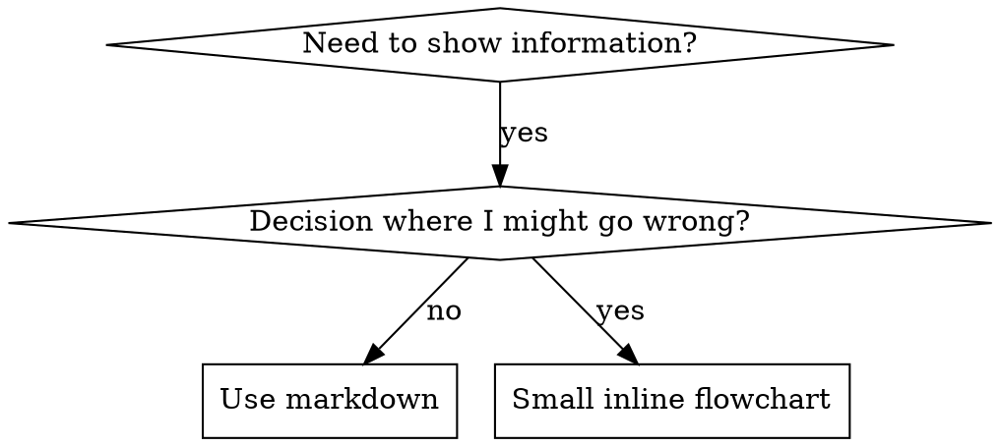

# Skill Development — Creating, Structuring & Evaluating Skills

> Consolidated from skill-development, create-agent-skills, skill-creator, customaize-agent-create-skill, customaize-agent-apply-anthropic-skill-best-practices, writing-skills. Zero-value-loss.

---

## Source: skill-development / SKILL.md


# Skill Development for Claude Code Plugins

This skill provides guidance for creating effective skills for Claude Code plugins.

## About Skills

Skills are modular, self-contained packages that extend Claude's capabilities by providing
specialized knowledge, workflows, and tools. Think of them as "onboarding guides" for specific
domains or tasks—they transform Claude from a general-purpose agent into a specialized agent
equipped with procedural knowledge that no model can fully possess.

### What Skills Provide

1. Specialized workflows - Multi-step procedures for specific domains
2. Tool integrations - Instructions for working with specific file formats or APIs
3. Domain expertise - Company-specific knowledge, schemas, business logic
4. Bundled resources - Scripts, references, and assets for complex and repetitive tasks

### Anatomy of a Skill

Every skill consists of a required SKILL.md file and optional bundled resources:

```
skill-name/
├── SKILL.md (required)
│   ├── YAML frontmatter metadata (required)
│   │   ├── name: (required)
│   │   └── description: (required)
│   └── Markdown instructions (required)
└── Bundled Resources (optional)
    ├── scripts/          - Executable code (Python/Bash/etc.)
    ├── references/       - Documentation intended to be loaded into context as needed
    └── assets/           - Files used in output (templates, icons, fonts, etc.)
```

#### SKILL.md (required)

**Metadata Quality:** The `name` and `description` in YAML frontmatter determine when Claude will use the skill. Be specific about what the skill does and when to use it. Use the third-person (e.g. "This skill should be used when..." instead of "Use this skill when...").

#### Bundled Resources (optional)

##### Scripts (`scripts/`)

Executable code (Python/Bash/etc.) for tasks that require deterministic reliability or are repeatedly rewritten.

- **When to include**: When the same code is being rewritten repeatedly or deterministic reliability is needed
- **Example**: `scripts/rotate_pdf.py` for PDF rotation tasks
- **Benefits**: Token efficient, deterministic, may be executed without loading into context
- **Note**: Scripts may still need to be read by Claude for patching or environment-specific adjustments

##### References (`references/`)

Documentation and reference material intended to be loaded as needed into context to inform Claude's process and thinking.

- **When to include**: For documentation that Claude should reference while working
- **Examples**: `references/finance.md` for financial schemas, `references/mnda.md` for company NDA template, `references/policies.md` for company policies, `references/api_docs.md` for API specifications
- **Use cases**: Database schemas, API documentation, domain knowledge, company policies, detailed workflow guides
- **Benefits**: Keeps SKILL.md lean, loaded only when Claude determines it's needed
- **Best practice**: If files are large (>10k words), include grep search patterns in SKILL.md
- **Avoid duplication**: Information should live in either SKILL.md or references files, not both. Prefer references files for detailed information unless it's truly core to the skill—this keeps SKILL.md lean while making information discoverable without hogging the context window. Keep only essential procedural instructions and workflow guidance in SKILL.md; move detailed reference material, schemas, and examples to references files.

##### Assets (`assets/`)

Files not intended to be loaded into context, but rather used within the output Claude produces.

- **When to include**: When the skill needs files that will be used in the final output
- **Examples**: `assets/logo.png` for brand assets, `assets/slides.pptx` for PowerPoint templates, `assets/frontend-template/` for HTML/React boilerplate, `assets/font.ttf` for typography
- **Use cases**: Templates, images, icons, boilerplate code, fonts, sample documents that get copied or modified
- **Benefits**: Separates output resources from documentation, enables Claude to use files without loading them into context

### Progressive Disclosure Design Principle

Skills use a three-level loading system to manage context efficiently:

1. **Metadata (name + description)** - Always in context (~100 words)
2. **SKILL.md body** - When skill triggers (<5k words)
3. **Bundled resources** - As needed by Claude (Unlimited*)

*Unlimited because scripts can be executed without reading into context window.

## Skill Creation Process

To create a skill, follow the "Skill Creation Process" in order, skipping steps only if there is a clear reason why they are not applicable.

### Step 1: Understanding the Skill with Concrete Examples

Skip this step only when the skill's usage patterns are already clearly understood. It remains valuable even when working with an existing skill.

To create an effective skill, clearly understand concrete examples of how the skill will be used. This understanding can come from either direct user examples or generated examples that are validated with user feedback.

For example, when building an image-editor skill, relevant questions include:

- "What functionality should the image-editor skill support? Editing, rotating, anything else?"
- "Can you give some examples of how this skill would be used?"
- "I can imagine users asking for things like 'Remove the red-eye from this image' or 'Rotate this image'. Are there other ways you imagine this skill being used?"
- "What would a user say that should trigger this skill?"

To avoid overwhelming users, avoid asking too many questions in a single message. Start with the most important questions and follow up as needed for better effectiveness.

Conclude this step when there is a clear sense of the functionality the skill should support.

### Step 2: Planning the Reusable Skill Contents

To turn concrete examples into an effective skill, analyze each example by:

1. Considering how to execute on the example from scratch
2. Identifying what scripts, references, and assets would be helpful when executing these workflows repeatedly

Example: When building a `pdf-editor` skill to handle queries like "Help me rotate this PDF," the analysis shows:

1. Rotating a PDF requires re-writing the same code each time
2. A `scripts/rotate_pdf.py` script would be helpful to store in the skill

Example: When designing a `frontend-webapp-builder` skill for queries like "Build me a todo app" or "Build me a dashboard to track my steps," the analysis shows:

1. Writing a frontend webapp requires the same boilerplate HTML/React each time
2. An `assets/hello-world/` template containing the boilerplate HTML/React project files would be helpful to store in the skill

Example: When building a `big-query` skill to handle queries like "How many users have logged in today?" the analysis shows:

1. Querying BigQuery requires re-discovering the table schemas and relationships each time
2. A `references/schema.md` file documenting the table schemas would be helpful to store in the skill

**For Claude Code plugins:** When building a hooks skill, the analysis shows:
1. Developers repeatedly need to validate hooks.json and test hook scripts
2. `scripts/validate-hook-schema.sh` and `scripts/test-hook.sh` utilities would be helpful
3. `references/patterns.md` for detailed hook patterns to avoid bloating SKILL.md

To establish the skill's contents, analyze each concrete example to create a list of the reusable resources to include: scripts, references, and assets.

### Step 3: Create Skill Structure

For Claude Code plugins, create the skill directory structure:

```bash
mkdir -p plugin-name/skills/skill-name/{references,examples,scripts}
touch plugin-name/skills/skill-name/SKILL.md
```

**Note:** Unlike the generic skill-creator which uses `init_skill.py`, plugin skills are created directly in the plugin's `skills/` directory with a simpler manual structure.

### Step 4: Edit the Skill

When editing the (newly-created or existing) skill, remember that the skill is being created for another instance of Claude to use. Focus on including information that would be beneficial and non-obvious to Claude. Consider what procedural knowledge, domain-specific details, or reusable assets would help another Claude instance execute these tasks more effectively.

#### Start with Reusable Skill Contents

To begin implementation, start with the reusable resources identified above: `scripts/`, `references/`, and `assets/` files. Note that this step may require user input. For example, when implementing a `brand-guidelines` skill, the user may need to provide brand assets or templates to store in `assets/`, or documentation to store in `references/`.

Also, delete any example files and directories not needed for the skill. Create only the directories you actually need (references/, examples/, scripts/).

#### Update SKILL.md

**Writing Style:** Write the entire skill using **imperative/infinitive form** (verb-first instructions), not second person. Use objective, instructional language (e.g., "To accomplish X, do Y" rather than "You should do X" or "If you need to do X"). This maintains consistency and clarity for AI consumption.

**Description (Frontmatter):** Use third-person format with specific trigger phrases:

```yaml
```

**Good description examples:**
```yaml
description: This skill should be used when the user asks to "create a hook", "add a PreToolUse hook", "validate tool use", "implement prompt-based hooks", or mentions hook events (PreToolUse, PostToolUse, Stop).
```

**Bad description examples:**
```yaml
description: Use this skill when working with hooks.  # Wrong person, vague
description: Load when user needs hook help.  # Not third person
description: Provides hook guidance.  # No trigger phrases
```

To complete SKILL.md body, answer the following questions:

1. What is the purpose of the skill, in a few sentences?
2. When should the skill be used? (Include this in frontmatter description with specific triggers)
3. In practice, how should Claude use the skill? All reusable skill contents developed above should be referenced so that Claude knows how to use them.

**Keep SKILL.md lean:** Target 1,500-2,000 words for the body. Move detailed content to references/:
- Detailed patterns → `references/patterns.md`
- Advanced techniques → `references/advanced.md`
- Migration guides → `references/migration.md`
- API references → `references/api-reference.md`

**Reference resources in SKILL.md:**
```markdown
## Additional Resources

### Reference Files

For detailed patterns and techniques, consult:
- **`references/patterns.md`** - Common patterns
- **`references/advanced.md`** - Advanced use cases

### Example Files

Working examples in `examples/`:
- **`example-script.sh`** - Working example
```

### Step 5: Validate and Test

**For plugin skills, validation is different from generic skills:**

1. **Check structure**: Skill directory in `plugin-name/skills/skill-name/`
2. **Validate SKILL.md**: Has frontmatter with name and description
3. **Check trigger phrases**: Description includes specific user queries
4. **Verify writing style**: Body uses imperative/infinitive form, not second person
5. **Test progressive disclosure**: SKILL.md is lean (~1,500-2,000 words), detailed content in references/
6. **Check references**: All referenced files exist
7. **Validate examples**: Examples are complete and correct
8. **Test scripts**: Scripts are executable and work correctly

**Use the skill-reviewer agent:**
```
Ask: "Review my skill and check if it follows best practices"
```

The skill-reviewer agent will check description quality, content organization, and progressive disclosure.

### Step 6: Iterate

After testing the skill, users may request improvements. Often this happens right after using the skill, with fresh context of how the skill performed.

**Iteration workflow:**
1. Use the skill on real tasks
2. Notice struggles or inefficiencies
3. Identify how SKILL.md or bundled resources should be updated
4. Implement changes and test again

**Common improvements:**
- Strengthen trigger phrases in description
- Move long sections from SKILL.md to references/
- Add missing examples or scripts
- Clarify ambiguous instructions
- Add edge case handling

## Plugin-Specific Considerations

### Skill Location in Plugins

Plugin skills live in the plugin's `skills/` directory:

```
my-plugin/
├── .claude-plugin/
│   └── plugin.json
├── commands/
├── agents/
└── skills/
    └── my-skill/
        ├── SKILL.md
        ├── references/
        ├── examples/
        └── scripts/
```

### Auto-Discovery

Claude Code automatically discovers skills:
- Scans `skills/` directory
- Finds subdirectories containing `SKILL.md`
- Loads skill metadata (name + description) always
- Loads SKILL.md body when skill triggers
- Loads references/examples when needed

### No Packaging Needed

Plugin skills are distributed as part of the plugin, not as separate ZIP files. Users get skills when they install the plugin.

### Testing in Plugins

Test skills by installing plugin locally:

```bash
# Test with --plugin-dir
cc --plugin-dir /path/to/plugin

# Ask questions that should trigger the skill
# Verify skill loads correctly
```

## Examples from Plugin-Dev

Study the skills in this plugin as examples of best practices:

**hook-development skill:**
- Excellent trigger phrases: "create a hook", "add a PreToolUse hook", etc.
- Lean SKILL.md (1,651 words)
- 3 references/ files for detailed content
- 3 examples/ of working hooks
- 3 scripts/ utilities

**agent-development skill:**
- Strong triggers: "create an agent", "agent frontmatter", etc.
- Focused SKILL.md (1,438 words)
- References include the AI generation prompt from Claude Code
- Complete agent examples

**plugin-settings skill:**
- Specific triggers: "plugin settings", ".local.md files", "YAML frontmatter"
- References show real implementations (multi-agent-swarm, ralph-loop)
- Working parsing scripts

Each demonstrates progressive disclosure and strong triggering.

## Progressive Disclosure in Practice

### What Goes in SKILL.md

**Include (always loaded when skill triggers):**
- Core concepts and overview
- Essential procedures and workflows
- Quick reference tables
- Pointers to references/examples/scripts
- Most common use cases

**Keep under 3,000 words, ideally 1,500-2,000 words**

### What Goes in references/

**Move to references/ (loaded as needed):**
- Detailed patterns and advanced techniques
- Comprehensive API documentation
- Migration guides
- Edge cases and troubleshooting
- Extensive examples and walkthroughs

**Each reference file can be large (2,000-5,000+ words)**

### What Goes in examples/

**Working code examples:**
- Complete, runnable scripts
- Configuration files
- Template files
- Real-world usage examples

**Users can copy and adapt these directly**

### What Goes in scripts/

**Utility scripts:**
- Validation tools
- Testing helpers
- Parsing utilities
- Automation scripts

**Should be executable and documented**

## Writing Style Requirements

### Imperative/Infinitive Form

Write using verb-first instructions, not second person:

**Correct (imperative):**
```
To create a hook, define the event type.
Configure the MCP server with authentication.
Validate settings before use.
```

**Incorrect (second person):**
```
You should create a hook by defining the event type.
You need to configure the MCP server.
You must validate settings before use.
```

### Third-Person in Description

The frontmatter description must use third person:

**Correct:**
```yaml
description: This skill should be used when the user asks to "create X", "configure Y"...
```

**Incorrect:**
```yaml
description: Use this skill when you want to create X...
description: Load this skill when user asks...
```

### Objective, Instructional Language

Focus on what to do, not who should do it:

**Correct:**
```
Parse the frontmatter using sed.
Extract fields with grep.
Validate values before use.
```

**Incorrect:**
```
You can parse the frontmatter...
Claude should extract fields...
The user might validate values...
```

## Validation Checklist

Before finalizing a skill:

**Structure:**
- [ ] SKILL.md file exists with valid YAML frontmatter
- [ ] Frontmatter has `name` and `description` fields
- [ ] Markdown body is present and substantial
- [ ] Referenced files actually exist

**Description Quality:**
- [ ] Uses third person ("This skill should be used when...")
- [ ] Includes specific trigger phrases users would say
- [ ] Lists concrete scenarios ("create X", "configure Y")
- [ ] Not vague or generic

**Content Quality:**
- [ ] SKILL.md body uses imperative/infinitive form
- [ ] Body is focused and lean (1,500-2,000 words ideal, <5k max)
- [ ] Detailed content moved to references/
- [ ] Examples are complete and working
- [ ] Scripts are executable and documented

**Progressive Disclosure:**
- [ ] Core concepts in SKILL.md
- [ ] Detailed docs in references/
- [ ] Working code in examples/
- [ ] Utilities in scripts/
- [ ] SKILL.md references these resources

**Testing:**
- [ ] Skill triggers on expected user queries
- [ ] Content is helpful for intended tasks
- [ ] No duplicated information across files
- [ ] References load when needed

## Common Mistakes to Avoid

### Mistake 1: Weak Trigger Description

❌ **Bad:**
```yaml
description: Provides guidance for working with hooks.
```

**Why bad:** Vague, no specific trigger phrases, not third person

✅ **Good:**
```yaml
description: This skill should be used when the user asks to "create a hook", "add a PreToolUse hook", "validate tool use", or mentions hook events. Provides comprehensive hooks API guidance.
```

**Why good:** Third person, specific phrases, concrete scenarios

### Mistake 2: Too Much in SKILL.md

❌ **Bad:**
```
skill-name/
└── SKILL.md  (8,000 words - everything in one file)
```

**Why bad:** Bloats context when skill loads, detailed content always loaded

✅ **Good:**
```
skill-name/
├── SKILL.md  (1,800 words - core essentials)
└── references/
    ├── patterns.md (2,500 words)
    └── advanced.md (3,700 words)
```

**Why good:** Progressive disclosure, detailed content loaded only when needed

### Mistake 3: Second Person Writing

❌ **Bad:**
```markdown
You should start by reading the configuration file.
You need to validate the input.
You can use the grep tool to search.
```

**Why bad:** Second person, not imperative form

✅ **Good:**
```markdown
Start by reading the configuration file.
Validate the input before processing.
Use the grep tool to search for patterns.
```

**Why good:** Imperative form, direct instructions

### Mistake 4: Missing Resource References

❌ **Bad:**
```markdown
# SKILL.md

[Core content]

[No mention of references/ or examples/]
```

**Why bad:** Claude doesn't know references exist

✅ **Good:**
```markdown
# SKILL.md

[Core content]

## Additional Resources

### Reference Files
- **`references/patterns.md`** - Detailed patterns
- **`references/advanced.md`** - Advanced techniques

### Examples
- **`examples/script.sh`** - Working example
```

**Why good:** Claude knows where to find additional information

## Quick Reference

### Minimal Skill

```
skill-name/
└── SKILL.md
```

Good for: Simple knowledge, no complex resources needed

### Standard Skill (Recommended)

```
skill-name/
├── SKILL.md
├── references/
│   └── detailed-guide.md
└── examples/
    └── working-example.sh
```

Good for: Most plugin skills with detailed documentation

### Complete Skill

```
skill-name/
├── SKILL.md
├── references/
│   ├── patterns.md
│   └── advanced.md
├── examples/
│   ├── example1.sh
│   └── example2.json
└── scripts/
    └── validate.sh
```

Good for: Complex domains with validation utilities

## Best Practices Summary

✅ **DO:**
- Use third-person in description ("This skill should be used when...")
- Include specific trigger phrases ("create X", "configure Y")
- Keep SKILL.md lean (1,500-2,000 words)
- Use progressive disclosure (move details to references/)
- Write in imperative/infinitive form
- Reference supporting files clearly
- Provide working examples
- Create utility scripts for common operations
- Study plugin-dev's skills as templates

❌ **DON'T:**
- Use second person anywhere
- Have vague trigger conditions
- Put everything in SKILL.md (>3,000 words without references/)
- Write in second person ("You should...")
- Leave resources unreferenced
- Include broken or incomplete examples
- Skip validation

## Additional Resources

### Study These Skills

Plugin-dev's skills demonstrate best practices:
- `../hook-development/` - Progressive disclosure, utilities
- `../agent-development/` - AI-assisted creation, references
- `../mcp-integration/` - Comprehensive references
- `../plugin-settings/` - Real-world examples
- `../command-development/` - Clear critical concepts
- `../plugin-structure/` - Good organization

### Reference Files

For complete skill-creator methodology:
- **`references/skill-creator-original.md`** - Full original skill-creator content

## Implementation Workflow

To create a skill for your plugin:

1. **Understand use cases**: Identify concrete examples of skill usage
2. **Plan resources**: Determine what scripts/references/examples needed
3. **Create structure**: `mkdir -p skills/skill-name/{references,examples,scripts}`
4. **Write SKILL.md**:
   - Frontmatter with third-person description and trigger phrases
   - Lean body (1,500-2,000 words) in imperative form
   - Reference supporting files
5. **Add resources**: Create references/, examples/, scripts/ as needed
6. **Validate**: Check description, writing style, organization
7. **Test**: Verify skill loads on expected triggers
8. **Iterate**: Improve based on usage

Focus on strong trigger descriptions, progressive disclosure, and imperative writing style for effective skills that load when needed and provide targeted guidance.

---

## Source: skill-development/references / skill-creator-original.md

---
name: skill-creator
description: Guide for creating effective skills. This skill should be used when users want to create a new skill (or update an existing skill) that extends Claude's capabilities with specialized knowledge, workflows, or tool integrations.
license: Complete terms in LICENSE.txt
---

# Skill Creator

This skill provides guidance for creating effective skills.

## About Skills

Skills are modular, self-contained packages that extend Claude's capabilities by providing
specialized knowledge, workflows, and tools. Think of them as "onboarding guides" for specific
domains or tasks—they transform Claude from a general-purpose agent into a specialized agent
equipped with procedural knowledge that no model can fully possess.

### What Skills Provide

1. Specialized workflows - Multi-step procedures for specific domains
2. Tool integrations - Instructions for working with specific file formats or APIs
3. Domain expertise - Company-specific knowledge, schemas, business logic
4. Bundled resources - Scripts, references, and assets for complex and repetitive tasks

### Anatomy of a Skill

Every skill consists of a required SKILL.md file and optional bundled resources:

```
skill-name/
├── SKILL.md (required)
│   ├── YAML frontmatter metadata (required)
│   │   ├── name: (required)
│   │   └── description: (required)
│   └── Markdown instructions (required)
└── Bundled Resources (optional)
    ├── scripts/          - Executable code (Python/Bash/etc.)
    ├── references/       - Documentation intended to be loaded into context as needed
    └── assets/           - Files used in output (templates, icons, fonts, etc.)
```

#### SKILL.md (required)

**Metadata Quality:** The `name` and `description` in YAML frontmatter determine when Claude will use the skill. Be specific about what the skill does and when to use it. Use the third-person (e.g. "This skill should be used when..." instead of "Use this skill when...").

#### Bundled Resources (optional)

##### Scripts (`scripts/`)

Executable code (Python/Bash/etc.) for tasks that require deterministic reliability or are repeatedly rewritten.

- **When to include**: When the same code is being rewritten repeatedly or deterministic reliability is needed
- **Example**: `scripts/rotate_pdf.py` for PDF rotation tasks
- **Benefits**: Token efficient, deterministic, may be executed without loading into context
- **Note**: Scripts may still need to be read by Claude for patching or environment-specific adjustments

##### References (`references/`)

Documentation and reference material intended to be loaded as needed into context to inform Claude's process and thinking.

- **When to include**: For documentation that Claude should reference while working
- **Examples**: `references/finance.md` for financial schemas, `references/mnda.md` for company NDA template, `references/policies.md` for company policies, `references/api_docs.md` for API specifications
- **Use cases**: Database schemas, API documentation, domain knowledge, company policies, detailed workflow guides
- **Benefits**: Keeps SKILL.md lean, loaded only when Claude determines it's needed
- **Best practice**: If files are large (>10k words), include grep search patterns in SKILL.md
- **Avoid duplication**: Information should live in either SKILL.md or references files, not both. Prefer references files for detailed information unless it's truly core to the skill—this keeps SKILL.md lean while making information discoverable without hogging the context window. Keep only essential procedural instructions and workflow guidance in SKILL.md; move detailed reference material, schemas, and examples to references files.

##### Assets (`assets/`)

Files not intended to be loaded into context, but rather used within the output Claude produces.

- **When to include**: When the skill needs files that will be used in the final output
- **Examples**: `assets/logo.png` for brand assets, `assets/slides.pptx` for PowerPoint templates, `assets/frontend-template/` for HTML/React boilerplate, `assets/font.ttf` for typography
- **Use cases**: Templates, images, icons, boilerplate code, fonts, sample documents that get copied or modified
- **Benefits**: Separates output resources from documentation, enables Claude to use files without loading them into context

### Progressive Disclosure Design Principle

Skills use a three-level loading system to manage context efficiently:

1. **Metadata (name + description)** - Always in context (~100 words)
2. **SKILL.md body** - When skill triggers (<5k words)
3. **Bundled resources** - As needed by Claude (Unlimited*)

*Unlimited because scripts can be executed without reading into context window.

## Skill Creation Process

To create a skill, follow the "Skill Creation Process" in order, skipping steps only if there is a clear reason why they are not applicable.

### Step 1: Understanding the Skill with Concrete Examples

Skip this step only when the skill's usage patterns are already clearly understood. It remains valuable even when working with an existing skill.

To create an effective skill, clearly understand concrete examples of how the skill will be used. This understanding can come from either direct user examples or generated examples that are validated with user feedback.

For example, when building an image-editor skill, relevant questions include:

- "What functionality should the image-editor skill support? Editing, rotating, anything else?"
- "Can you give some examples of how this skill would be used?"
- "I can imagine users asking for things like 'Remove the red-eye from this image' or 'Rotate this image'. Are there other ways you imagine this skill being used?"
- "What would a user say that should trigger this skill?"

To avoid overwhelming users, avoid asking too many questions in a single message. Start with the most important questions and follow up as needed for better effectiveness.

Conclude this step when there is a clear sense of the functionality the skill should support.

### Step 2: Planning the Reusable Skill Contents

To turn concrete examples into an effective skill, analyze each example by:

1. Considering how to execute on the example from scratch
2. Identifying what scripts, references, and assets would be helpful when executing these workflows repeatedly

Example: When building a `pdf-editor` skill to handle queries like "Help me rotate this PDF," the analysis shows:

1. Rotating a PDF requires re-writing the same code each time
2. A `scripts/rotate_pdf.py` script would be helpful to store in the skill

Example: When designing a `frontend-webapp-builder` skill for queries like "Build me a todo app" or "Build me a dashboard to track my steps," the analysis shows:

1. Writing a frontend webapp requires the same boilerplate HTML/React each time
2. An `assets/hello-world/` template containing the boilerplate HTML/React project files would be helpful to store in the skill

Example: When building a `big-query` skill to handle queries like "How many users have logged in today?" the analysis shows:

1. Querying BigQuery requires re-discovering the table schemas and relationships each time
2. A `references/schema.md` file documenting the table schemas would be helpful to store in the skill

To establish the skill's contents, analyze each concrete example to create a list of the reusable resources to include: scripts, references, and assets.

### Step 3: Initializing the Skill

At this point, it is time to actually create the skill.

Skip this step only if the skill being developed already exists, and iteration or packaging is needed. In this case, continue to the next step.

When creating a new skill from scratch, always run the `init_skill.py` script. The script conveniently generates a new template skill directory that automatically includes everything a skill requires, making the skill creation process much more efficient and reliable.

Usage:

```bash
scripts/init_skill.py <skill-name> --path <output-directory>
```

The script:

- Creates the skill directory at the specified path
- Generates a SKILL.md template with proper frontmatter and TODO placeholders
- Creates example resource directories: `scripts/`, `references/`, and `assets/`
- Adds example files in each directory that can be customized or deleted

After initialization, customize or remove the generated SKILL.md and example files as needed.

### Step 4: Edit the Skill

When editing the (newly-generated or existing) skill, remember that the skill is being created for another instance of Claude to use. Focus on including information that would be beneficial and non-obvious to Claude. Consider what procedural knowledge, domain-specific details, or reusable assets would help another Claude instance execute these tasks more effectively.

#### Start with Reusable Skill Contents

To begin implementation, start with the reusable resources identified above: `scripts/`, `references/`, and `assets/` files. Note that this step may require user input. For example, when implementing a `brand-guidelines` skill, the user may need to provide brand assets or templates to store in `assets/`, or documentation to store in `references/`.

Also, delete any example files and directories not needed for the skill. The initialization script creates example files in `scripts/`, `references/`, and `assets/` to demonstrate structure, but most skills won't need all of them.

#### Update SKILL.md

**Writing Style:** Write the entire skill using **imperative/infinitive form** (verb-first instructions), not second person. Use objective, instructional language (e.g., "To accomplish X, do Y" rather than "You should do X" or "If you need to do X"). This maintains consistency and clarity for AI consumption.

To complete SKILL.md, answer the following questions:

1. What is the purpose of the skill, in a few sentences?
2. When should the skill be used?
3. In practice, how should Claude use the skill? All reusable skill contents developed above should be referenced so that Claude knows how to use them.

### Step 5: Packaging a Skill

Once the skill is ready, it should be packaged into a distributable zip file that gets shared with the user. The packaging process automatically validates the skill first to ensure it meets all requirements:

```bash
scripts/package_skill.py <path/to/skill-folder>
```

Optional output directory specification:

```bash
scripts/package_skill.py <path/to/skill-folder> ./dist
```

The packaging script will:

1. **Validate** the skill automatically, checking:
   - YAML frontmatter format and required fields
   - Skill naming conventions and directory structure
   - Description completeness and quality
   - File organization and resource references

2. **Package** the skill if validation passes, creating a zip file named after the skill (e.g., `my-skill.zip`) that includes all files and maintains the proper directory structure for distribution.

If validation fails, the script will report the errors and exit without creating a package. Fix any validation errors and run the packaging command again.

### Step 6: Iterate

After testing the skill, users may request improvements. Often this happens right after using the skill, with fresh context of how the skill performed.

**Iteration workflow:**
1. Use the skill on real tasks
2. Notice struggles or inefficiencies
3. Identify how SKILL.md or bundled resources should be updated
4. Implement changes and test again

---

## Source: create-agent-skills / SKILL.md


# Creating Skills & Commands

This skill teaches how to create effective Claude Code skills following the official specification from [code.claude.com/docs/en/skills](https://code.claude.com/docs/en/skills).

## Commands and Skills Are Now The Same Thing

Custom slash commands have been merged into skills. A file at `.claude/commands/review.md` and a skill at `.claude/skills/review/SKILL.md` both create `/review` and work the same way. Existing `.claude/commands/` files keep working. Skills add optional features: a directory for supporting files, frontmatter to control invocation, and automatic context loading.

**If a skill and a command share the same name, the skill takes precedence.**

## When To Create What

**Use a command file** (`commands/name.md`) when:
- Simple, single-file workflow
- No supporting files needed
- Task-oriented action (deploy, commit, triage)

**Use a skill directory** (`skills/name/SKILL.md`) when:
- Need supporting reference files, scripts, or templates
- Background knowledge Claude should auto-load
- Complex enough to benefit from progressive disclosure

Both use identical YAML frontmatter and markdown content format.

## Standard Markdown Format

Use YAML frontmatter + markdown body with **standard markdown headings**. Keep it clean and direct.

```markdown

# My Skill Name

## Quick Start
Immediate actionable guidance...

## Instructions
Step-by-step procedures...

## Examples
Concrete usage examples...
```

## Frontmatter Reference

All fields are optional. Only `description` is recommended.

| Field | Required | Description |
|-------|----------|-------------|
| `name` | No | Display name. Lowercase letters, numbers, hyphens (max 64 chars). Defaults to directory name. |
| `description` | Recommended | What it does AND when to use it. Claude uses this for auto-discovery. Max 1024 chars. |
| `argument-hint` | No | Hint shown during autocomplete. Example: `[issue-number]` |
| `disable-model-invocation` | No | Set `true` to prevent Claude auto-loading. Use for manual workflows like `/deploy`, `/commit`. Default: `false`. |
| `user-invocable` | No | Set `false` to hide from `/` menu. Use for background knowledge. Default: `true`. |
| `allowed-tools` | No | Tools Claude can use without permission prompts. Example: `Read, Bash(git *)` |
| `model` | No | Model to use. Options: `haiku`, `sonnet`, `opus`. |
| `context` | No | Set `fork` to run in isolated subagent context. |
| `agent` | No | Subagent type when `context: fork`. Options: `Explore`, `Plan`, `general-purpose`, or custom agent name. |

### Invocation Control

| Frontmatter | User can invoke | Claude can invoke | When loaded |
|-------------|----------------|-------------------|-------------|
| (default) | Yes | Yes | Description always in context, full content loads when invoked |
| `disable-model-invocation: true` | Yes | No | Description not in context, loads only when user invokes |
| `user-invocable: false` | No | Yes | Description always in context, loads when relevant |

**Use `disable-model-invocation: true`** for workflows with side effects: `/deploy`, `/commit`, `/triage-prs`, `/send-slack-message`. You don't want Claude deciding to deploy because your code looks ready.

**Use `user-invocable: false`** for background knowledge that isn't a meaningful user action: coding conventions, domain context, legacy system docs.

## Dynamic Features

### Arguments

Use `$ARGUMENTS` placeholder for user input. If not present in content, arguments are appended automatically.

```yaml

Fix GitHub issue $ARGUMENTS following our coding standards.
```

Access individual args: `$ARGUMENTS[0]` or shorthand `$0`, `$1`, `$2`.

### Dynamic Context Injection

Skills support dynamic context injection: prefix a backtick-wrapped shell command with an exclamation mark, and the preprocessor executes it at load time, replacing the directive with stdout. Write an exclamation mark immediately before the opening backtick of the command you want executed (for example, to inject the current git branch, write the exclamation mark followed by `git branch --show-current` wrapped in backticks).

**Important:** The preprocessor scans the entire SKILL.md as plain text — it does not parse markdown. Directives inside fenced code blocks or inline code spans are still executed. If a skill documents this syntax with literal examples, the preprocessor will attempt to run them, causing load failures. To safely document this feature, describe it in prose (as done here) or place examples in a reference file, which is loaded on-demand by Claude and not preprocessed.

For a concrete example of dynamic context injection in a skill, see [official-spec.md](references/official-spec.md) § "Dynamic Context Injection".

### Running in a Subagent

Add `context: fork` to run in isolation. The skill content becomes the subagent's prompt. It won't have conversation history.

```yaml

Research $ARGUMENTS thoroughly:
1. Find relevant files
2. Analyze the code
3. Summarize findings
```

## Progressive Disclosure

Keep SKILL.md under 500 lines. Split detailed content into reference files:

```
my-skill/
├── SKILL.md           # Entry point (required, overview + navigation)
├── reference.md       # Detailed docs (loaded when needed)
├── examples.md        # Usage examples (loaded when needed)
└── scripts/
    └── helper.py      # Utility script (executed, not loaded)
```

Link from SKILL.md: `For API details, see [reference.md](reference.md).`

Keep references **one level deep** from SKILL.md. Avoid nested chains.

## Effective Descriptions

The description enables skill discovery. Include both **what** it does and **when** to use it.

**Good:**
```yaml
description: Extract text and tables from PDF files, fill forms, merge documents. Use when working with PDF files or when the user mentions PDFs, forms, or document extraction.
```

**Bad:**
```yaml
description: Helps with documents
```

## What Would You Like To Do?

1. **Create new skill** - Build from scratch
2. **Create new command** - Build a slash command
3. **Audit existing skill** - Check against best practices
4. **Add component** - Add workflow/reference/example
5. **Get guidance** - Understand skill design

## Creating a New Skill or Command

### Step 1: Choose Type

Ask: Is this a manual workflow (deploy, commit, triage) or background knowledge (conventions, patterns)?

- **Manual workflow** → command with `disable-model-invocation: true`
- **Background knowledge** → skill without `disable-model-invocation`
- **Complex with supporting files** → skill directory

### Step 2: Create the File

**Command:**
```markdown

# Command Title

## Workflow

### Step 1: Gather Context
...

### Step 2: Execute
...

## Success Criteria
- [ ] Expected outcome 1
- [ ] Expected outcome 2
```

**Skill:**
```markdown

# Skill Title

## Quick Start
[Immediate actionable example]

## Instructions
[Core guidance]

## Examples
[Concrete input/output pairs]
```

### Step 3: Add Reference Files (If Needed)

Link from SKILL.md to detailed content:
```markdown
For API reference, see [reference.md](reference.md).
For form filling guide, see [forms.md](forms.md).
```

### Step 4: Test With Real Usage

1. Test with actual tasks, not test scenarios
2. Invoke directly with `/skill-name` to verify
3. Check auto-triggering by asking something that matches the description
4. Refine based on real behavior

## Audit Checklist

- [ ] Valid YAML frontmatter (name + description)
- [ ] Description includes trigger keywords and is specific
- [ ] Uses standard markdown headings (not XML tags)
- [ ] SKILL.md under 500 lines
- [ ] `disable-model-invocation: true` if it has side effects
- [ ] `allowed-tools` set if specific tools needed
- [ ] References one level deep, properly linked
- [ ] Examples are concrete, not abstract
- [ ] Tested with real usage

## Anti-Patterns to Avoid

- **XML tags in body** - Use standard markdown headings
- **Vague descriptions** - Be specific with trigger keywords
- **Deep nesting** - Keep references one level from SKILL.md
- **Missing invocation control** - Side-effect workflows need `disable-model-invocation: true`
- **Too many options** - Provide a default with escape hatch
- **Punting to Claude** - Scripts should handle errors explicitly

## Reference Files

For detailed guidance, see:
- [official-spec.md](references/official-spec.md) - Official skill specification
- [best-practices.md](references/best-practices.md) - Skill authoring best practices

## Sources

- [Extend Claude with skills - Official Docs](https://code.claude.com/docs/en/skills)
- [GitHub - anthropics/skills](https://github.com/anthropics/skills)

---

## Source: create-agent-skills/references / api-security.md

<overview>
When building skills that make API calls requiring credentials (API keys, tokens, secrets), follow this protocol to prevent credentials from appearing in chat.
</overview>

<the_problem>
Raw curl commands with environment variables expose credentials:

```bash
# ❌ BAD - API key visible in chat
curl -H "Authorization: Bearer $API_KEY" https://api.example.com/data
```

When Claude executes this, the full command with expanded `$API_KEY` appears in the conversation.
</the_problem>

<the_solution>
Use `~/.claude/scripts/secure-api.sh` - a wrapper that loads credentials internally.

<for_supported_services>
```bash
# ✅ GOOD - No credentials visible
~/.claude/scripts/secure-api.sh <service> <operation> [args]

# Examples:
~/.claude/scripts/secure-api.sh facebook list-campaigns
~/.claude/scripts/secure-api.sh ghl search-contact "email@example.com"
```
</for_supported_services>

<adding_new_services>
When building a new skill that requires API calls:

1. **Add operations to the wrapper** (`~/.claude/scripts/secure-api.sh`):

```bash
case "$SERVICE" in
    yourservice)
        case "$OPERATION" in
            list-items)
                curl -s -G \
                    -H "Authorization: Bearer $YOUR_API_KEY" \
                    "https://api.yourservice.com/items"
                ;;
            get-item)
                ITEM_ID=$1
                curl -s -G \
                    -H "Authorization: Bearer $YOUR_API_KEY" \
                    "https://api.yourservice.com/items/$ITEM_ID"
                ;;
            *)
                echo "Unknown operation: $OPERATION" >&2
                exit 1
                ;;
        esac
        ;;
esac
```

2. **Add profile support to the wrapper** (if service needs multiple accounts):

```bash
# In secure-api.sh, add to profile remapping section:
yourservice)
    SERVICE_UPPER="YOURSERVICE"
    YOURSERVICE_API_KEY=$(eval echo \$${SERVICE_UPPER}_${PROFILE_UPPER}_API_KEY)
    YOURSERVICE_ACCOUNT_ID=$(eval echo \$${SERVICE_UPPER}_${PROFILE_UPPER}_ACCOUNT_ID)
    ;;
```

3. **Add credential placeholders to `~/.claude/.env`** using profile naming:

```bash
# Check if entries already exist
grep -q "YOURSERVICE_MAIN_API_KEY=" ~/.claude/.env 2>/dev/null || \
  echo -e "\n# Your Service - Main profile\nYOURSERVICE_MAIN_API_KEY=\nYOURSERVICE_MAIN_ACCOUNT_ID=" >> ~/.claude/.env

echo "Added credential placeholders to ~/.claude/.env - user needs to fill them in"
```

4. **Document profile workflow in your SKILL.md**:

```markdown
## Profile Selection Workflow

**CRITICAL:** Always use profile selection to prevent using wrong account credentials.

### When user requests YourService operation:

1. **Check for saved profile:**
   ```bash
   ~/.claude/scripts/profile-state get yourservice
   ```

2. **If no profile saved, discover available profiles:**
   ```bash
   ~/.claude/scripts/list-profiles yourservice
   ```

3. **If only ONE profile:** Use it automatically and announce:
   ```
   "Using YourService profile 'main' to list items..."
   ```

4. **If MULTIPLE profiles:** Ask user which one:
   ```
   "Which YourService profile: main, clienta, or clientb?"
   ```

5. **Save user's selection:**
   ```bash
   ~/.claude/scripts/profile-state set yourservice <selected_profile>
   ```

6. **Always announce which profile before calling API:**
   ```
   "Using YourService profile 'main' to list items..."
   ```

7. **Make API call with profile:**
   ```bash
   ~/.claude/scripts/secure-api.sh yourservice:<profile> list-items
   ```

## Secure API Calls

All API calls use profile syntax:

```bash
~/.claude/scripts/secure-api.sh yourservice:<profile> <operation> [args]

# Examples:
~/.claude/scripts/secure-api.sh yourservice:main list-items
~/.claude/scripts/secure-api.sh yourservice:main get-item <ITEM_ID>
```

**Profile persists for session:** Once selected, use same profile for subsequent operations unless user explicitly changes it.
```
</adding_new_services>
</the_solution>

<pattern_guidelines>
<simple_get_requests>
```bash
curl -s -G \
    -H "Authorization: Bearer $API_KEY" \
    "https://api.example.com/endpoint"
```
</simple_get_requests>

<post_with_json_body>
```bash
ITEM_ID=$1
curl -s -X POST \
    -H "Authorization: Bearer $API_KEY" \
    -H "Content-Type: application/json" \
    -d @- \
    "https://api.example.com/items/$ITEM_ID"
```

Usage:
```bash
echo '{"name":"value"}' | ~/.claude/scripts/secure-api.sh service create-item
```
</post_with_json_body>

<post_with_form_data>
```bash
curl -s -X POST \
    -F "field1=value1" \
    -F "field2=value2" \
    -F "access_token=$API_TOKEN" \
    "https://api.example.com/endpoint"
```
</post_with_form_data>
</pattern_guidelines>

<credential_storage>
**Location:** `~/.claude/.env` (global for all skills, accessible from any directory)

**Format:**
```bash
# Service credentials
SERVICE_API_KEY=your-key-here
SERVICE_ACCOUNT_ID=account-id-here

# Another service
OTHER_API_TOKEN=token-here
OTHER_BASE_URL=https://api.other.com
```

**Loading in script:**
```bash
set -a
source ~/.claude/.env 2>/dev/null || { echo "Error: ~/.claude/.env not found" >&2; exit 1; }
set +a
```
</credential_storage>

<best_practices>
1. **Never use raw curl with `$VARIABLE` in skill examples** - always use the wrapper
2. **Add all operations to the wrapper** - don't make users figure out curl syntax
3. **Auto-create credential placeholders** - add empty fields to `~/.claude/.env` immediately when creating the skill
4. **Keep credentials in `~/.claude/.env`** - one central location, works everywhere
5. **Document each operation** - show examples in SKILL.md
6. **Handle errors gracefully** - check for missing env vars, show helpful error messages
</best_practices>

<testing>
Test the wrapper without exposing credentials:

```bash
# This command appears in chat
~/.claude/scripts/secure-api.sh facebook list-campaigns

# But API keys never appear - they're loaded inside the script
```

Verify credentials are loaded:
```bash
# Check .env exists
ls -la ~/.claude/.env

# Check specific variables (without showing values)
grep -q "YOUR_API_KEY=" ~/.claude/.env && echo "API key configured" || echo "API key missing"
```
</testing>

---

## Source: create-agent-skills/references / be-clear-and-direct.md

<golden_rule>
Show your skill to someone with minimal context and ask them to follow the instructions. If they're confused, Claude will likely be too.
</golden_rule>

<overview>
Clarity and directness are fundamental to effective skill authoring. Clear instructions reduce errors, improve execution quality, and minimize token waste.
</overview>

<guidelines>
<contextual_information>
Give Claude contextual information that frames the task:

- What the task results will be used for
- What audience the output is meant for
- What workflow the task is part of
- The end goal or what successful completion looks like

Context helps Claude make better decisions and produce more appropriate outputs.

<example>
```xml
<context>
This analysis will be presented to investors who value transparency and actionable insights. Focus on financial metrics and clear recommendations.
</context>
```
</example>
</contextual_information>

<specificity>
Be specific about what you want Claude to do. If you want code only and nothing else, say so.

**Vague**: "Help with the report"
**Specific**: "Generate a markdown report with three sections: Executive Summary, Key Findings, Recommendations"

**Vague**: "Process the data"
**Specific**: "Extract customer names and email addresses from the CSV file, removing duplicates, and save to JSON format"

Specificity eliminates ambiguity and reduces iteration cycles.
</specificity>

<sequential_steps>
Provide instructions as sequential steps. Use numbered lists or bullet points.

```xml
<workflow>
1. Extract data from source file
2. Transform to target format
3. Validate transformation
4. Save to output file
5. Verify output correctness
</workflow>
```

Sequential steps create clear expectations and reduce the chance Claude skips important operations.
</sequential_steps>
</guidelines>

<example_comparison>
<unclear_example>
```xml
<quick_start>
Please remove all personally identifiable information from these customer feedback messages: {{FEEDBACK_DATA}}
</quick_start>
```

**Problems**:
- What counts as PII?
- What should replace PII?
- What format should the output be?
- What if no PII is found?
- Should product names be redacted?
</unclear_example>

<clear_example>
```xml
<objective>
Anonymize customer feedback for quarterly review presentation.
</objective>

<quick_start>
<instructions>
1. Replace all customer names with "CUSTOMER_[ID]" (e.g., "Jane Doe" → "CUSTOMER_001")
2. Replace email addresses with "EMAIL_[ID]@example.com"
3. Redact phone numbers as "PHONE_[ID]"
4. If a message mentions a specific product (e.g., "AcmeCloud"), leave it intact
5. If no PII is found, copy the message verbatim
6. Output only the processed messages, separated by "---"
</instructions>

Data to process: {{FEEDBACK_DATA}}
</quick_start>

<success_criteria>
- All customer names replaced with IDs
- All emails and phones redacted
- Product names preserved
- Output format matches specification
</success_criteria>
```

**Why this is better**:
- States the purpose (quarterly review)
- Provides explicit step-by-step rules
- Defines output format clearly
- Specifies edge cases (product names, no PII found)
- Defines success criteria
</clear_example>
</example_comparison>

<key_differences>
The clear version:
- States the purpose (quarterly review)
- Provides explicit step-by-step rules
- Defines output format
- Specifies edge cases (product names, no PII found)
- Includes success criteria

The unclear version leaves all these decisions to Claude, increasing the chance of misalignment with expectations.
</key_differences>

<show_dont_just_tell>
<principle>
When format matters, show an example rather than just describing it.
</principle>

<telling_example>
```xml
<commit_messages>
Generate commit messages in conventional format with type, scope, and description.
</commit_messages>
```
</telling_example>

<showing_example>
```xml
<commit_message_format>
Generate commit messages following these examples:

<example number="1">
<input>Added user authentication with JWT tokens</input>
<output>
```
feat(auth): implement JWT-based authentication

Add login endpoint and token validation middleware
```
</output>
</example>

<example number="2">
<input>Fixed bug where dates displayed incorrectly in reports</input>
<output>
```
fix(reports): correct date formatting in timezone conversion

Use UTC timestamps consistently across report generation
```
</output>
</example>

Follow this style: type(scope): brief description, then detailed explanation.
</commit_message_format>
```
</showing_example>

<why_showing_works>
Examples communicate nuances that text descriptions can't:
- Exact formatting (spacing, capitalization, punctuation)
- Tone and style
- Level of detail
- Pattern across multiple cases

Claude learns patterns from examples more reliably than from descriptions.
</why_showing_works>
</show_dont_just_tell>

<avoid_ambiguity>
<principle>
Eliminate words and phrases that create ambiguity or leave decisions open.
</principle>

<ambiguous_phrases>
❌ **"Try to..."** - Implies optional
✅ **"Always..."** or **"Never..."** - Clear requirement

❌ **"Should probably..."** - Unclear obligation
✅ **"Must..."** or **"May optionally..."** - Clear obligation level

❌ **"Generally..."** - When are exceptions allowed?
✅ **"Always... except when..."** - Clear rule with explicit exceptions

❌ **"Consider..."** - Should Claude always do this or only sometimes?
✅ **"If X, then Y"** or **"Always..."** - Clear conditions
</ambiguous_phrases>

<example>
❌ **Ambiguous**:
```xml
<validation>
You should probably validate the output and try to fix any errors.
</validation>
```

✅ **Clear**:
```xml
<validation>
Always validate output before proceeding:

```bash
python scripts/validate.py output_dir/
```

If validation fails, fix errors and re-validate. Only proceed when validation passes with zero errors.
</validation>
```
</example>
</avoid_ambiguity>

<define_edge_cases>
<principle>
Anticipate edge cases and define how to handle them. Don't leave Claude guessing.
</principle>

<without_edge_cases>
```xml
<quick_start>
Extract email addresses from the text file and save to a JSON array.
</quick_start>
```

**Questions left unanswered**:
- What if no emails are found?
- What if the same email appears multiple times?
- What if emails are malformed?
- What JSON format exactly?
</without_edge_cases>

<with_edge_cases>
```xml
<quick_start>
Extract email addresses from the text file and save to a JSON array.

<edge_cases>
- **No emails found**: Save empty array `[]`
- **Duplicate emails**: Keep only unique emails
- **Malformed emails**: Skip invalid formats, log to stderr
- **Output format**: Array of strings, one email per element
</edge_cases>

<example_output>
```json
[
  "user1@example.com",
  "user2@example.com"
]
```
</example_output>
</quick_start>
```
</with_edge_cases>
</define_edge_cases>

<output_format_specification>
<principle>
When output format matters, specify it precisely. Show examples.
</principle>

<vague_format>
```xml
<output>
Generate a report with the analysis results.
</output>
```
</vague_format>

<specific_format>
```xml
<output_format>
Generate a markdown report with this exact structure:

```markdown
# Analysis Report: [Title]

## Executive Summary
[1-2 paragraphs summarizing key findings]

## Key Findings
- Finding 1 with supporting data
- Finding 2 with supporting data
- Finding 3 with supporting data

## Recommendations
1. Specific actionable recommendation
2. Specific actionable recommendation

## Appendix
[Raw data and detailed calculations]
```

**Requirements**:
- Use exactly these section headings
- Executive summary must be 1-2 paragraphs
- List 3-5 key findings
- Provide 2-4 recommendations
- Include appendix with source data
</output_format>
```
</specific_format>
</output_format_specification>

<decision_criteria>
<principle>
When Claude must make decisions, provide clear criteria.
</principle>

<no_criteria>
```xml
<workflow>
Analyze the data and decide which visualization to use.
</workflow>
```

**Problem**: What factors should guide this decision?
</no_criteria>

<with_criteria>
```xml
<workflow>
Analyze the data and select appropriate visualization:

<decision_criteria>
**Use bar chart when**:
- Comparing quantities across categories
- Fewer than 10 categories
- Exact values matter

**Use line chart when**:
- Showing trends over time
- Continuous data
- Pattern recognition matters more than exact values

**Use scatter plot when**:
- Showing relationship between two variables
- Looking for correlations
- Individual data points matter
</decision_criteria>
</workflow>
```

**Benefits**: Claude has objective criteria for making the decision rather than guessing.
</with_criteria>
</decision_criteria>

<constraints_and_requirements>
<principle>
Clearly separate "must do" from "nice to have" from "must not do".
</principle>

<unclear_requirements>
```xml
<requirements>
The report should include financial data, customer metrics, and market analysis. It would be good to have visualizations. Don't make it too long.
</requirements>
```

**Problems**:
- Are all three content types required?
- Are visualizations optional or required?
- How long is "too long"?
</unclear_requirements>

<clear_requirements>
```xml
<requirements>
<must_have>
- Financial data (revenue, costs, profit margins)
- Customer metrics (acquisition, retention, lifetime value)
- Market analysis (competition, trends, opportunities)
- Maximum 5 pages
</must_have>

<nice_to_have>
- Charts and visualizations
- Industry benchmarks
- Future projections
</nice_to_have>

<must_not>
- Include confidential customer names
- Exceed 5 pages
- Use technical jargon without definitions
</must_not>
</requirements>
```

**Benefits**: Clear priorities and constraints prevent misalignment.
</clear_requirements>
</constraints_and_requirements>

<success_criteria>
<principle>
Define what success looks like. How will Claude know it succeeded?
</principle>

<without_success_criteria>
```xml
<objective>
Process the CSV file and generate a report.
</objective>
```

**Problem**: When is this task complete? What defines success?
</without_success_criteria>

<with_success_criteria>
```xml
<objective>
Process the CSV file and generate a summary report.
</objective>

<success_criteria>
- All rows in CSV successfully parsed
- No data validation errors
- Report generated with all required sections
- Report saved to output/report.md
- Output file is valid markdown
- Process completes without errors
</success_criteria>
```

**Benefits**: Clear completion criteria eliminate ambiguity about when the task is done.
</with_success_criteria>
</success_criteria>

<testing_clarity>
<principle>
Test your instructions by asking: "Could I hand these instructions to a junior developer and expect correct results?"
</principle>

<testing_process>
1. Read your skill instructions
2. Remove context only you have (project knowledge, unstated assumptions)
3. Identify ambiguous terms or vague requirements
4. Add specificity where needed
5. Test with someone who doesn't have your context
6. Iterate based on their questions and confusion

If a human with minimal context struggles, Claude will too.
</testing_process>
</testing_clarity>

<practical_examples>
<example domain="data_processing">
❌ **Unclear**:
```xml
<quick_start>
Clean the data and remove bad entries.
</quick_start>
```

✅ **Clear**:
```xml
<quick_start>
<data_cleaning>
1. Remove rows where required fields (name, email, date) are empty
2. Standardize date format to YYYY-MM-DD
3. Remove duplicate entries based on email address
4. Validate email format (must contain @ and domain)
5. Save cleaned data to output/cleaned_data.csv
</data_cleaning>

<success_criteria>
- No empty required fields
- All dates in YYYY-MM-DD format
- No duplicate emails
- All emails valid format
- Output file created successfully
</success_criteria>
</quick_start>
```
</example>

<example domain="code_generation">
❌ **Unclear**:
```xml
<quick_start>
Write a function to process user input.
</quick_start>
```

✅ **Clear**:
```xml
<quick_start>
<function_specification>
Write a Python function with this signature:

```python
def process_user_input(raw_input: str) -> dict:
    """
    Validate and parse user input.

    Args:
        raw_input: Raw string from user (format: "name:email:age")

    Returns:
        dict with keys: name (str), email (str), age (int)

    Raises:
        ValueError: If input format is invalid
    """
```

**Requirements**:
- Split input on colon delimiter
- Validate email contains @ and domain
- Convert age to integer, raise ValueError if not numeric
- Return dictionary with specified keys
- Include docstring and type hints
</function_specification>

<success_criteria>
- Function signature matches specification
- All validation checks implemented
- Proper error handling for invalid input
- Type hints included
- Docstring included
</success_criteria>
</quick_start>
```
</example>
</practical_examples>

---

## Source: create-agent-skills/references / best-practices.md

# Skill Authoring Best Practices

Source: [platform.claude.com/docs/en/agents-and-tools/agent-skills/best-practices](https://platform.claude.com/docs/en/agents-and-tools/agent-skills/best-practices)

## Core Principles

### Concise is Key

The context window is a public good. Your Skill shares the context window with everything else Claude needs to know.

**Default assumption**: Claude is already very smart. Only add context Claude doesn't already have.

Challenge each piece of information:
- "Does Claude really need this explanation?"
- "Can I assume Claude knows this?"
- "Does this paragraph justify its token cost?"

**Good example (concise, ~50 tokens):**
```markdown
## Extract PDF text

Use pdfplumber for text extraction:

```python
import pdfplumber
with pdfplumber.open("file.pdf") as pdf:
    text = pdf.pages[0].extract_text()
```
```

**Bad example (too verbose, ~150 tokens):**
```markdown
## Extract PDF text

PDF (Portable Document Format) files are a common file format that contains
text, images, and other content. To extract text from a PDF, you'll need to
use a library. There are many libraries available...
```

### Set Appropriate Degrees of Freedom

Match specificity to task fragility and variability.

**High freedom** (multiple valid approaches):
```markdown
## Code review process

1. Analyze the code structure and organization
2. Check for potential bugs or edge cases
3. Suggest improvements for readability
4. Verify adherence to project conventions
```

**Medium freedom** (preferred pattern with variation):
```markdown
## Generate report

Use this template and customize as needed:

```python
def generate_report(data, format="markdown"):
    # Process data
    # Generate output in specified format
```
```

**Low freedom** (fragile, exact sequence required):
```markdown
## Database migration

Run exactly this script:

```bash
python scripts/migrate.py --verify --backup
```

Do not modify the command or add flags.
```

### Test With All Models

Skills act as additions to models. Test with Haiku, Sonnet, and Opus.

- **Haiku**: Does the Skill provide enough guidance?
- **Sonnet**: Is the Skill clear and efficient?
- **Opus**: Does the Skill avoid over-explaining?

## Naming Conventions

Use **gerund form** (verb + -ing) for Skill names:

**Good:**
- `processing-pdfs`
- `analyzing-spreadsheets`
- `managing-databases`
- `testing-code`
- `writing-documentation`

**Acceptable alternatives:**
- Noun phrases: `pdf-processing`, `spreadsheet-analysis`
- Action-oriented: `process-pdfs`, `analyze-spreadsheets`

**Avoid:**
- Vague: `helper`, `utils`, `tools`
- Generic: `documents`, `data`, `files`
- Reserved: `anthropic-*`, `claude-*`

## Writing Effective Descriptions

**Always write in third person.** The description is injected into the system prompt.

**Be specific and include key terms:**

```yaml
# PDF Processing skill
description: Extract text and tables from PDF files, fill forms, merge documents. Use when working with PDF files or when the user mentions PDFs, forms, or document extraction.

# Excel Analysis skill
description: Analyze Excel spreadsheets, create pivot tables, generate charts. Use when analyzing Excel files, spreadsheets, tabular data, or .xlsx files.

# Git Commit Helper skill
description: Generate descriptive commit messages by analyzing git diffs. Use when the user asks for help writing commit messages or reviewing staged changes.
```

**Avoid vague descriptions:**
```yaml
description: Helps with documents  # Too vague!
description: Processes data       # Too generic!
description: Does stuff with files # Useless!
```

## Progressive Disclosure Patterns

### Pattern 1: High-level guide with references

```markdown
---
name: pdf-processing
description: Extracts text and tables from PDF files, fills forms, merges documents.
---

# PDF Processing

## Quick start

```python
import pdfplumber
with pdfplumber.open("file.pdf") as pdf:
    text = pdf.pages[0].extract_text()
```

## Advanced features

**Form filling**: See [FORMS.md](FORMS.md)
**API reference**: See [REFERENCE.md](REFERENCE.md)
**Examples**: See [EXAMPLES.md](EXAMPLES.md)
```

### Pattern 2: Domain-specific organization

```
bigquery-skill/
├── SKILL.md (overview and navigation)
└── reference/
    ├── finance.md (revenue, billing)
    ├── sales.md (opportunities, pipeline)
    ├── product.md (API usage, features)
    └── marketing.md (campaigns, attribution)
```

### Pattern 3: Conditional details

```markdown
# DOCX Processing

## Creating documents

Use docx-js for new documents. See [DOCX-JS.md](DOCX-JS.md).

## Editing documents

For simple edits, modify the XML directly.

**For tracked changes**: See [REDLINING.md](REDLINING.md)
**For OOXML details**: See [OOXML.md](OOXML.md)
```

## Keep References One Level Deep

Claude may partially read files when they're referenced from other referenced files.

**Bad (too deep):**
```markdown
# SKILL.md
See [advanced.md](advanced.md)...

# advanced.md
See [details.md](details.md)...

# details.md
Here's the actual information...
```

**Good (one level deep):**
```markdown
# SKILL.md

**Basic usage**: [in SKILL.md]
**Advanced features**: See [advanced.md](advanced.md)
**API reference**: See [reference.md](reference.md)
**Examples**: See [examples.md](examples.md)
```

## Workflows and Feedback Loops

### Workflow with Checklist

```markdown
## Research synthesis workflow

Copy this checklist:

```
- [ ] Step 1: Read all source documents
- [ ] Step 2: Identify key themes
- [ ] Step 3: Cross-reference claims
- [ ] Step 4: Create structured summary
- [ ] Step 5: Verify citations
```

**Step 1: Read all source documents**

Review each document in `sources/`. Note main arguments.
...
```

### Feedback Loop Pattern

```markdown
## Document editing process

1. Make your edits to `word/document.xml`
2. **Validate immediately**: `python scripts/validate.py unpacked_dir/`
3. If validation fails:
   - Review the error message
   - Fix the issues
   - Run validation again
4. **Only proceed when validation passes**
5. Rebuild: `python scripts/pack.py unpacked_dir/ output.docx`
```

## Common Patterns

### Template Pattern

```markdown
## Report structure

Use this template:

```markdown
# [Analysis Title]

## Executive summary
[One-paragraph overview]

## Key findings
- Finding 1 with supporting data
- Finding 2 with supporting data

## Recommendations
1. Specific actionable recommendation
2. Specific actionable recommendation
```
```

### Examples Pattern

```markdown
## Commit message format

**Example 1:**
Input: Added user authentication with JWT tokens
Output:
```
feat(auth): implement JWT-based authentication

Add login endpoint and token validation middleware
```

**Example 2:**
Input: Fixed bug where dates displayed incorrectly
Output:
```
fix(reports): correct date formatting in timezone conversion
```
```

### Conditional Workflow Pattern

```markdown
## Document modification

1. Determine the modification type:

   **Creating new content?** → Follow "Creation workflow"
   **Editing existing?** → Follow "Editing workflow"

2. Creation workflow:
   - Use docx-js library
   - Build document from scratch

3. Editing workflow:
   - Unpack existing document
   - Modify XML directly
   - Validate after each change
```

## Content Guidelines

### Avoid Time-Sensitive Information

**Bad:**
```markdown
If you're doing this before August 2025, use the old API.
```

**Good:**
```markdown
## Current method

Use the v2 API endpoint: `api.example.com/v2/messages`

## Old patterns

<details>
<summary>Legacy v1 API (deprecated 2025-08)</summary>
The v1 API used: `api.example.com/v1/messages`
</details>
```

### Use Consistent Terminology

**Good - Consistent:**
- Always "API endpoint"
- Always "field"
- Always "extract"

**Bad - Inconsistent:**
- Mix "API endpoint", "URL", "API route", "path"
- Mix "field", "box", "element", "control"

## Anti-Patterns to Avoid

### Windows-Style Paths

- **Good**: `scripts/helper.py`, `reference/guide.md`
- **Avoid**: `scripts\helper.py`, `reference\guide.md`

### Too Many Options

**Bad:**
```markdown
You can use pypdf, or pdfplumber, or PyMuPDF, or pdf2image, or...
```

**Good:**
```markdown
Use pdfplumber for text extraction:
```python
import pdfplumber
```

For scanned PDFs requiring OCR, use pdf2image with pytesseract instead.
```

## Checklist for Effective Skills

### Core Quality
- [ ] Description is specific and includes key terms
- [ ] Description includes both what and when
- [ ] SKILL.md body under 500 lines
- [ ] Additional details in separate files
- [ ] No time-sensitive information
- [ ] Consistent terminology
- [ ] Examples are concrete
- [ ] References one level deep
- [ ] Progressive disclosure used appropriately
- [ ] Workflows have clear steps

### Code and Scripts
- [ ] Scripts handle errors explicitly
- [ ] No "voodoo constants" (all values justified)
- [ ] Required packages listed
- [ ] Scripts have clear documentation
- [ ] No Windows-style paths
- [ ] Validation steps for critical operations
- [ ] Feedback loops for quality-critical tasks

### Testing
- [ ] At least three test scenarios
- [ ] Tested with Haiku, Sonnet, and Opus
- [ ] Tested with real usage scenarios
- [ ] Team feedback incorporated

---

## Source: create-agent-skills/references / common-patterns.md

<overview>
This reference documents common patterns for skill authoring, including templates, examples, terminology consistency, and anti-patterns. All patterns use pure XML structure.
</overview>

<template_pattern>
<description>
Provide templates for output format. Match the level of strictness to your needs.
</description>

<strict_requirements>
Use when output format must be exact and consistent:

```xml
<report_structure>
ALWAYS use this exact template structure:

```markdown
# [Analysis Title]

## Executive summary
[One-paragraph overview of key findings]

## Key findings
- Finding 1 with supporting data
- Finding 2 with supporting data
- Finding 3 with supporting data

## Recommendations
1. Specific actionable recommendation
2. Specific actionable recommendation
```
</report_structure>
```

**When to use**: Compliance reports, standardized formats, automated processing
</strict_requirements>

<flexible_guidance>
Use when Claude should adapt the format based on context:

```xml
<report_structure>
Here is a sensible default format, but use your best judgment:

```markdown
# [Analysis Title]

## Executive summary
[Overview]

## Key findings
[Adapt sections based on what you discover]

## Recommendations
[Tailor to the specific context]
```

Adjust sections as needed for the specific analysis type.
</report_structure>
```

**When to use**: Exploratory analysis, context-dependent formatting, creative tasks
</flexible_guidance>
</template_pattern>

<examples_pattern>
<description>
For skills where output quality depends on seeing examples, provide input/output pairs.
</description>

<commit_messages_example>
```xml
<objective>
Generate commit messages following conventional commit format.
</objective>

<commit_message_format>
Generate commit messages following these examples:

<example number="1">
<input>Added user authentication with JWT tokens</input>
<output>
```
feat(auth): implement JWT-based authentication

Add login endpoint and token validation middleware
```
</output>
</example>

<example number="2">
<input>Fixed bug where dates displayed incorrectly in reports</input>
<output>
```
fix(reports): correct date formatting in timezone conversion

Use UTC timestamps consistently across report generation
```
</output>
</example>

Follow this style: type(scope): brief description, then detailed explanation.
</commit_message_format>
```
</commit_messages_example>

<when_to_use>
- Output format has nuances that text explanations can't capture
- Pattern recognition is easier than rule following
- Examples demonstrate edge cases
- Multi-shot learning improves quality
</when_to_use>
</examples_pattern>

<consistent_terminology>
<principle>
Choose one term and use it throughout the skill. Inconsistent terminology confuses Claude and reduces execution quality.
</principle>

<good_example>
Consistent usage:
- Always "API endpoint" (not mixing with "URL", "API route", "path")
- Always "field" (not mixing with "box", "element", "control")
- Always "extract" (not mixing with "pull", "get", "retrieve")

```xml
<objective>
Extract data from API endpoints using field mappings.
</objective>

<quick_start>
1. Identify the API endpoint
2. Map response fields to your schema
3. Extract field values
</quick_start>
```
</good_example>

<bad_example>
Inconsistent usage creates confusion:

```xml
<objective>
Pull data from API routes using element mappings.
</objective>

<quick_start>
1. Identify the URL
2. Map response boxes to your schema
3. Retrieve control values
</quick_start>
```

Claude must now interpret: Are "API routes" and "URLs" the same? Are "fields", "boxes", "elements", and "controls" the same?
</bad_example>

<implementation>
1. Choose terminology early in skill development
2. Document key terms in `<objective>` or `<context>`
3. Use find/replace to enforce consistency
4. Review reference files for consistent usage
</implementation>
</consistent_terminology>

<provide_default_with_escape_hatch>
<principle>
Provide a default approach with an escape hatch for special cases, not a list of alternatives. Too many options paralyze decision-making.
</principle>

<good_example>
Clear default with escape hatch:

```xml
<quick_start>
Use pdfplumber for text extraction:

```python
import pdfplumber
with pdfplumber.open("file.pdf") as pdf:
    text = pdf.pages[0].extract_text()
```

For scanned PDFs requiring OCR, use pdf2image with pytesseract instead.
</quick_start>
```
</good_example>

<bad_example>
Too many options creates decision paralysis:

```xml
<quick_start>
You can use any of these libraries:

- **pypdf**: Good for basic extraction
- **pdfplumber**: Better for tables
- **PyMuPDF**: Faster but more complex
- **pdf2image**: For scanned documents
- **pdfminer**: Low-level control
- **tabula-py**: Table-focused

Choose based on your needs.
</quick_start>
```

Claude must now research and compare all options before starting. This wastes tokens and time.
</bad_example>

<implementation>
1. Recommend ONE default approach
2. Explain when to use the default (implied: most of the time)
3. Add ONE escape hatch for edge cases
4. Link to advanced reference if multiple alternatives truly needed
</implementation>
</provide_default_with_escape_hatch>

<anti_patterns>
<description>
Common mistakes to avoid when authoring skills.
</description>

<pitfall name="markdown_headings_in_body">
❌ **BAD**: Using markdown headings in skill body:

```markdown
# PDF Processing

## Quick start
Extract text with pdfplumber...

## Advanced features
Form filling requires additional setup...
```

✅ **GOOD**: Using pure XML structure:

```xml
<objective>
PDF processing with text extraction, form filling, and merging capabilities.
</objective>

<quick_start>
Extract text with pdfplumber...
</quick_start>

<advanced_features>
Form filling requires additional setup...
</advanced_features>
```

**Why it matters**: XML provides semantic meaning, reliable parsing, and token efficiency.
</pitfall>

<pitfall name="vague_descriptions">
❌ **BAD**:
```yaml
description: Helps with documents
```

✅ **GOOD**:
```yaml
description: Extract text and tables from PDF files, fill forms, merge documents. Use when working with PDF files or when the user mentions PDFs, forms, or document extraction.
```

**Why it matters**: Vague descriptions prevent Claude from discovering and using the skill appropriately.
</pitfall>

<pitfall name="inconsistent_pov">
❌ **BAD**:
```yaml
description: I can help you process Excel files and generate reports
```

✅ **GOOD**:
```yaml
description: Processes Excel files and generates reports. Use when analyzing spreadsheets or .xlsx files.
```

**Why it matters**: Skills must use third person. First/second person breaks the skill metadata pattern.
</pitfall>

<pitfall name="wrong_naming_convention">
❌ **BAD**: Directory name doesn't match skill name or verb-noun convention:
- Directory: `facebook-ads`, Name: `facebook-ads-manager`
- Directory: `stripe-integration`, Name: `stripe`
- Directory: `helper-scripts`, Name: `helper`

✅ **GOOD**: Consistent verb-noun convention:
- Directory: `manage-facebook-ads`, Name: `manage-facebook-ads`
- Directory: `setup-stripe-payments`, Name: `setup-stripe-payments`
- Directory: `process-pdfs`, Name: `process-pdfs`

**Why it matters**: Consistency in naming makes skills discoverable and predictable.
</pitfall>

<pitfall name="too_many_options">
❌ **BAD**:
```xml
<quick_start>
You can use pypdf, or pdfplumber, or PyMuPDF, or pdf2image, or pdfminer, or tabula-py...
</quick_start>
```

✅ **GOOD**:
```xml
<quick_start>
Use pdfplumber for text extraction:

```python
import pdfplumber
```

For scanned PDFs requiring OCR, use pdf2image with pytesseract instead.
</quick_start>
```

**Why it matters**: Decision paralysis. Provide one default approach with escape hatch for special cases.
</pitfall>

<pitfall name="deeply_nested_references">
❌ **BAD**: References nested multiple levels:
```
SKILL.md → advanced.md → details.md → examples.md
```

✅ **GOOD**: References one level deep from SKILL.md:
```
SKILL.md → advanced.md
SKILL.md → details.md
SKILL.md → examples.md
```

**Why it matters**: Claude may only partially read deeply nested files. Keep references one level deep from SKILL.md.
</pitfall>

<pitfall name="windows_paths">
❌ **BAD**:
```xml
<reference_guides>
See scripts\validate.py for validation
</reference_guides>
```

✅ **GOOD**:
```xml
<reference_guides>
See scripts/validate.py for validation
</reference_guides>
```

**Why it matters**: Always use forward slashes for cross-platform compatibility.
</pitfall>

<pitfall name="dynamic_context_and_file_reference_execution">
**Problem**: When showing examples of dynamic context syntax (exclamation mark + backticks) or file references (@ prefix), the skill loader executes these during skill loading.

❌ **BAD** - These execute during skill load:
```xml
<examples>
Load current status with: !`git status`
Review dependencies in: @package.json
</examples>
```

✅ **GOOD** - Add space to prevent execution:
```xml
<examples>
Load current status with: ! `git status` (remove space before backtick in actual usage)
Review dependencies in: @ package.json (remove space after @ in actual usage)
</examples>
```

**When this applies**:
- Skills that teach users about dynamic context (slash commands, prompts)
- Any documentation showing the exclamation mark prefix syntax or @ file references
- Skills with example commands or file paths that shouldn't execute during loading

**Why it matters**: Without the space, these execute during skill load, causing errors or unwanted file reads.
</pitfall>

<pitfall name="missing_required_tags">
❌ **BAD**: Missing required tags:
```xml
<quick_start>
Use this tool for processing...
</quick_start>
```

✅ **GOOD**: All required tags present:
```xml
<objective>
Process data files with validation and transformation.
</objective>

<quick_start>
Use this tool for processing...
</quick_start>

<success_criteria>
- Input file successfully processed
- Output file validates without errors
- Transformation applied correctly
</success_criteria>
```

**Why it matters**: Every skill must have `<objective>`, `<quick_start>`, and `<success_criteria>` (or `<when_successful>`).
</pitfall>

<pitfall name="hybrid_xml_markdown">
❌ **BAD**: Mixing XML tags with markdown headings:
```markdown
<objective>
PDF processing capabilities
</objective>

## Quick start

Extract text with pdfplumber...

## Advanced features

Form filling...
```

✅ **GOOD**: Pure XML throughout:
```xml
<objective>
PDF processing capabilities
</objective>

<quick_start>
Extract text with pdfplumber...
</quick_start>

<advanced_features>
Form filling...
</advanced_features>
```

**Why it matters**: Consistency in structure. Either use pure XML or pure markdown (prefer XML).
</pitfall>

<pitfall name="unclosed_xml_tags">
❌ **BAD**: Forgetting to close XML tags:
```xml
<objective>
Process PDF files

<quick_start>
Use pdfplumber...
</quick_start>
```

✅ **GOOD**: Properly closed tags:
```xml
<objective>
Process PDF files
</objective>

<quick_start>
Use pdfplumber...
</quick_start>
```

**Why it matters**: Unclosed tags break XML parsing and create ambiguous boundaries.
</pitfall>
</anti_patterns>

<progressive_disclosure_pattern>
<description>
Keep SKILL.md concise by linking to detailed reference files. Claude loads reference files only when needed.
</description>

<implementation>
```xml
<objective>
Manage Facebook Ads campaigns, ad sets, and ads via the Marketing API.
</objective>

<quick_start>
<basic_operations>
See [basic-operations.md](basic-operations.md) for campaign creation and management.
</basic_operations>
</quick_start>

<advanced_features>
**Custom audiences**: See [audiences.md](audiences.md)
**Conversion tracking**: See [conversions.md](conversions.md)
**Budget optimization**: See [budgets.md](budgets.md)
**API reference**: See [api-reference.md](api-reference.md)
</advanced_features>
```

**Benefits**:
- SKILL.md stays under 500 lines
- Claude only reads relevant reference files
- Token usage scales with task complexity
- Easier to maintain and update
</implementation>
</progressive_disclosure_pattern>

<validation_pattern>
<description>
For skills with validation steps, make validation scripts verbose and specific.
</description>

<implementation>
```xml
<validation>
After making changes, validate immediately:

```bash
python scripts/validate.py output_dir/
```

If validation fails, fix errors before continuing. Validation errors include:

- **Field not found**: "Field 'signature_date' not found. Available fields: customer_name, order_total, signature_date_signed"
- **Type mismatch**: "Field 'order_total' expects number, got string"
- **Missing required field**: "Required field 'customer_name' is missing"

Only proceed when validation passes with zero errors.
</validation>
```

**Why verbose errors help**:
- Claude can fix issues without guessing
- Specific error messages reduce iteration cycles
- Available options shown in error messages
</implementation>
</validation_pattern>

<checklist_pattern>
<description>
For complex multi-step workflows, provide a checklist Claude can copy and track progress.
</description>

<implementation>
```xml
<workflow>
Copy this checklist and check off items as you complete them:

```
Task Progress:
- [ ] Step 1: Analyze the form (run analyze_form.py)
- [ ] Step 2: Create field mapping (edit fields.json)
- [ ] Step 3: Validate mapping (run validate_fields.py)
- [ ] Step 4: Fill the form (run fill_form.py)
- [ ] Step 5: Verify output (run verify_output.py)
```

<step_1>
**Analyze the form**

Run: `python scripts/analyze_form.py input.pdf`

This extracts form fields and their locations, saving to `fields.json`.
</step_1>

<step_2>
**Create field mapping**

Edit `fields.json` to add values for each field.
</step_2>

<step_3>
**Validate mapping**

Run: `python scripts/validate_fields.py fields.json`

Fix any validation errors before continuing.
</step_3>

<step_4>
**Fill the form**

Run: `python scripts/fill_form.py input.pdf fields.json output.pdf`
</step_4>

<step_5>
**Verify output**

Run: `python scripts/verify_output.py output.pdf`

If verification fails, return to Step 2.
</step_5>
</workflow>
```

**Benefits**:
- Clear progress tracking
- Prevents skipping steps
- Easy to resume after interruption
</implementation>
</checklist_pattern>

---

## Source: create-agent-skills/references / core-principles.md

<overview>
Core principles guide skill authoring decisions. These principles ensure skills are efficient, effective, and maintainable across different models and use cases.
</overview>

<xml_structure_principle>
<description>
Skills use pure XML structure for consistent parsing, efficient token usage, and improved Claude performance.
</description>

<why_xml>
<consistency>
XML enforces consistent structure across all skills. All skills use the same tag names for the same purposes:
- `<objective>` always defines what the skill does
- `<quick_start>` always provides immediate guidance
- `<success_criteria>` always defines completion

This consistency makes skills predictable and easier to maintain.
</consistency>

<parseability>
XML provides unambiguous boundaries and semantic meaning. Claude can reliably:
- Identify section boundaries (where content starts and ends)
- Understand content purpose (what role each section plays)
- Skip irrelevant sections (progressive disclosure)
- Parse programmatically (validation tools can check structure)

Markdown headings are just visual formatting. Claude must infer meaning from heading text, which is less reliable.
</parseability>

<token_efficiency>
XML tags are more efficient than markdown headings:

**Markdown headings**:
```markdown
## Quick start
## Workflow
## Advanced features
## Success criteria
```
Total: ~20 tokens, no semantic meaning to Claude

**XML tags**:
```xml
<quick_start>
<workflow>
<advanced_features>
<success_criteria>
```
Total: ~15 tokens, semantic meaning built-in

Savings compound across all skills in the ecosystem.
</token_efficiency>

<claude_performance>
Claude performs better with pure XML because:
- Unambiguous section boundaries reduce parsing errors
- Semantic tags convey intent directly (no inference needed)
- Nested tags create clear hierarchies
- Consistent structure across skills reduces cognitive load
- Progressive disclosure works more reliably

Pure XML structure is not just a style preference—it's a performance optimization.
</claude_performance>
</why_xml>

<critical_rule>
**Remove ALL markdown headings (#, ##, ###) from skill body content.** Replace with semantic XML tags. Keep markdown formatting WITHIN content (bold, italic, lists, code blocks, links).
</critical_rule>

<required_tags>
Every skill MUST have:
- `<objective>` - What the skill does and why it matters
- `<quick_start>` - Immediate, actionable guidance
- `<success_criteria>` or `<when_successful>` - How to know it worked

See [use-xml-tags.md](use-xml-tags.md) for conditional tags and intelligence rules.
</required_tags>
</xml_structure_principle>

<conciseness_principle>
<description>
The context window is shared. Your skill shares it with the system prompt, conversation history, other skills' metadata, and the actual request.
</description>

<guidance>
Only add context Claude doesn't already have. Challenge each piece of information:
- "Does Claude really need this explanation?"
- "Can I assume Claude knows this?"
- "Does this paragraph justify its token cost?"

Assume Claude is smart. Don't explain obvious concepts.
</guidance>

<concise_example>
**Concise** (~50 tokens):
```xml
<quick_start>
Extract PDF text with pdfplumber:

```python
import pdfplumber

with pdfplumber.open("file.pdf") as pdf:
    text = pdf.pages[0].extract_text()
```
</quick_start>
```

**Verbose** (~150 tokens):
```xml
<quick_start>
PDF files are a common file format used for documents. To extract text from them, we'll use a Python library called pdfplumber. First, you'll need to import the library, then open the PDF file using the open method, and finally extract the text from each page. Here's how to do it:

```python
import pdfplumber

with pdfplumber.open("file.pdf") as pdf:
    text = pdf.pages[0].extract_text()
```

This code opens the PDF and extracts text from the first page.
</quick_start>
```

The concise version assumes Claude knows what PDFs are, understands Python imports, and can read code. All those assumptions are correct.
</concise_example>

<when_to_elaborate>
Add explanation when:
- Concept is domain-specific (not general programming knowledge)
- Pattern is non-obvious or counterintuitive
- Context affects behavior in subtle ways
- Trade-offs require judgment

Don't add explanation for:
- Common programming concepts (loops, functions, imports)
- Standard library usage (reading files, making HTTP requests)
- Well-known tools (git, npm, pip)
- Obvious next steps
</when_to_elaborate>
</conciseness_principle>

<degrees_of_freedom_principle>
<description>
Match the level of specificity to the task's fragility and variability. Give Claude more freedom for creative tasks, less freedom for fragile operations.
</description>

<high_freedom>
<when>
- Multiple approaches are valid
- Decisions depend on context
- Heuristics guide the approach
- Creative solutions welcome
</when>

<example>
```xml
<objective>
Review code for quality, bugs, and maintainability.
</objective>

<workflow>
1. Analyze the code structure and organization
2. Check for potential bugs or edge cases
3. Suggest improvements for readability and maintainability
4. Verify adherence to project conventions
</workflow>

<success_criteria>
- All major issues identified
- Suggestions are actionable and specific
- Review balances praise and criticism
</success_criteria>
```

Claude has freedom to adapt the review based on what the code needs.
</example>
</high_freedom>

<medium_freedom>
<when>
- A preferred pattern exists
- Some variation is acceptable
- Configuration affects behavior
- Template can be adapted
</when>

<example>
```xml
<objective>
Generate reports with customizable format and sections.
</objective>

<report_template>
Use this template and customize as needed:

```python
def generate_report(data, format="markdown", include_charts=True):
    # Process data
    # Generate output in specified format
    # Optionally include visualizations
```
</report_template>

<success_criteria>
- Report includes all required sections
- Format matches user preference
- Data accurately represented
</success_criteria>
```

Claude can customize the template based on requirements.
</example>
</medium_freedom>

<low_freedom>
<when>
- Operations are fragile and error-prone
- Consistency is critical
- A specific sequence must be followed
- Deviation causes failures
</when>

<example>
```xml
<objective>
Run database migration with exact sequence to prevent data loss.
</objective>

<workflow>
Run exactly this script:

```bash
python scripts/migrate.py --verify --backup
```

**Do not modify the command or add additional flags.**
</workflow>

<success_criteria>
- Migration completes without errors
- Backup created before migration
- Verification confirms data integrity
</success_criteria>
```

Claude must follow the exact command with no variation.
</example>
</low_freedom>

<matching_specificity>
The key is matching specificity to fragility:

- **Fragile operations** (database migrations, payment processing, security): Low freedom, exact instructions
- **Standard operations** (API calls, file processing, data transformation): Medium freedom, preferred pattern with flexibility
- **Creative operations** (code review, content generation, analysis): High freedom, heuristics and principles

Mismatched specificity causes problems:
- Too much freedom on fragile tasks → errors and failures
- Too little freedom on creative tasks → rigid, suboptimal outputs
</matching_specificity>
</degrees_of_freedom_principle>

<model_testing_principle>
<description>
Skills act as additions to models, so effectiveness depends on the underlying model. What works for Opus might need more detail for Haiku.
</description>

<testing_across_models>
Test your skill with all models you plan to use:

<haiku_testing>
**Claude Haiku** (fast, economical)

Questions to ask:
- Does the skill provide enough guidance?
- Are examples clear and complete?
- Do implicit assumptions become explicit?
- Does Haiku need more structure?

Haiku benefits from:
- More explicit instructions
- Complete examples (no partial code)
- Clear success criteria
- Step-by-step workflows
</haiku_testing>

<sonnet_testing>
**Claude Sonnet** (balanced)

Questions to ask:
- Is the skill clear and efficient?
- Does it avoid over-explanation?
- Are workflows well-structured?
- Does progressive disclosure work?

Sonnet benefits from:
- Balanced detail level
- XML structure for clarity
- Progressive disclosure
- Concise but complete guidance
</sonnet_testing>

<opus_testing>
**Claude Opus** (powerful reasoning)

Questions to ask:
- Does the skill avoid over-explaining?
- Can Opus infer obvious steps?
- Are constraints clear?
- Is context minimal but sufficient?

Opus benefits from:
- Concise instructions
- Principles over procedures
- High degrees of freedom
- Trust in reasoning capabilities
</opus_testing>
</testing_across_models>

<balancing_across_models>
Aim for instructions that work well across all target models:

**Good balance**:
```xml
<quick_start>
Use pdfplumber for text extraction:

```python
import pdfplumber
with pdfplumber.open("file.pdf") as pdf:
    text = pdf.pages[0].extract_text()
```

For scanned PDFs requiring OCR, use pdf2image with pytesseract instead.
</quick_start>
```

This works for all models:
- Haiku gets complete working example
- Sonnet gets clear default with escape hatch
- Opus gets enough context without over-explanation

**Too minimal for Haiku**:
```xml
<quick_start>
Use pdfplumber for text extraction.
</quick_start>
```

**Too verbose for Opus**:
```xml
<quick_start>
PDF files are documents that contain text. To extract that text, we use a library called pdfplumber. First, import the library at the top of your Python file. Then, open the PDF file using the pdfplumber.open() method. This returns a PDF object. Access the pages attribute to get a list of pages. Each page has an extract_text() method that returns the text content...
</quick_start>
```
</balancing_across_models>

<iterative_improvement>
1. Start with medium detail level
2. Test with target models
3. Observe where models struggle or succeed
4. Adjust based on actual performance
5. Re-test and iterate

Don't optimize for one model. Find the balance that works across your target models.
</iterative_improvement>
</model_testing_principle>

<progressive_disclosure_principle>
<description>
SKILL.md serves as an overview. Reference files contain details. Claude loads reference files only when needed.
</description>

<token_efficiency>
Progressive disclosure keeps token usage proportional to task complexity:

- Simple task: Load SKILL.md only (~500 tokens)
- Medium task: Load SKILL.md + one reference (~1000 tokens)
- Complex task: Load SKILL.md + multiple references (~2000 tokens)

Without progressive disclosure, every task loads all content regardless of need.
</token_efficiency>

<implementation>
- Keep SKILL.md under 500 lines
- Split detailed content into reference files
- Keep references one level deep from SKILL.md
- Link to references from relevant sections
- Use descriptive reference file names

See [skill-structure.md](skill-structure.md) for progressive disclosure patterns.
</implementation>
</progressive_disclosure_principle>

<validation_principle>
<description>
Validation scripts are force multipliers. They catch errors that Claude might miss and provide actionable feedback.
</description>

<characteristics>
Good validation scripts:
- Provide verbose, specific error messages
- Show available valid options when something is invalid
- Pinpoint exact location of problems
- Suggest actionable fixes
- Are deterministic and reliable

See [workflows-and-validation.md](workflows-and-validation.md) for validation patterns.
</characteristics>
</validation_principle>

<principle_summary>
<xml_structure>
Use pure XML structure for consistency, parseability, and Claude performance. Required tags: objective, quick_start, success_criteria.
</xml_structure>

<conciseness>
Only add context Claude doesn't have. Assume Claude is smart. Challenge every piece of content.
</conciseness>

<degrees_of_freedom>
Match specificity to fragility. High freedom for creative tasks, low freedom for fragile operations, medium for standard work.
</degrees_of_freedom>

<model_testing>
Test with all target models. Balance detail level to work across Haiku, Sonnet, and Opus.
</model_testing>

<progressive_disclosure>
Keep SKILL.md concise. Split details into reference files. Load reference files only when needed.
</progressive_disclosure>

<validation>
Make validation scripts verbose and specific. Catch errors early with actionable feedback.
</validation>
</principle_summary>

---

## Source: create-agent-skills/references / executable-code.md

<when_to_use_scripts>
Even if Claude could write a script, pre-made scripts offer advantages:
- More reliable than generated code
- Save tokens (no need to include code in context)
- Save time (no code generation required)
- Ensure consistency across uses

<execution_vs_reference>
Make clear whether Claude should:
- **Execute the script** (most common): "Run `analyze_form.py` to extract fields"
- **Read it as reference** (for complex logic): "See `analyze_form.py` for the extraction algorithm"

For most utility scripts, execution is preferred.
</execution_vs_reference>

<how_scripts_work>
When Claude executes a script via bash:
1. Script code never enters context window
2. Only script output consumes tokens
3. Far more efficient than having Claude generate equivalent code
</how_scripts_work>
</when_to_use_scripts>

<file_organization>
<scripts_directory>
**Best practice**: Place all executable scripts in a `scripts/` subdirectory within the skill folder.

```
skill-name/
├── SKILL.md
├── scripts/
│   ├── main_utility.py
│   ├── helper_script.py
│   └── validator.py
└── references/
    └── api-docs.md
```

**Benefits**:
- Keeps skill root clean and organized
- Clear separation between documentation and executable code
- Consistent pattern across all skills
- Easy to reference: `python scripts/script_name.py`

**Reference pattern**: In SKILL.md, reference scripts using the `scripts/` path:

```bash
python ~/.claude/skills/skill-name/scripts/analyze.py input.har
```
</scripts_directory>
</file_organization>

<utility_scripts_pattern>
<example>
## Utility scripts

**analyze_form.py**: Extract all form fields from PDF

```bash
python scripts/analyze_form.py input.pdf > fields.json
```

Output format:
```json
{
  "field_name": { "type": "text", "x": 100, "y": 200 },
  "signature": { "type": "sig", "x": 150, "y": 500 }
}
```

**validate_boxes.py**: Check for overlapping bounding boxes

```bash
python scripts/validate_boxes.py fields.json
# Returns: "OK" or lists conflicts
```

**fill_form.py**: Apply field values to PDF

```bash
python scripts/fill_form.py input.pdf fields.json output.pdf
```
</example>
</utility_scripts_pattern>

<solve_dont_punt>
Handle error conditions rather than punting to Claude.

<example type="good">
```python
def process_file(path):
    """Process a file, creating it if it doesn't exist."""
    try:
        with open(path) as f:
            return f.read()
    except FileNotFoundError:
        print(f"File {path} not found, creating default")
        with open(path, 'w') as f:
            f.write('')
        return ''
    except PermissionError:
        print(f"Cannot access {path}, using default")
        return ''
```
</example>

<example type="bad">
```python
def process_file(path):
    # Just fail and let Claude figure it out
    return open(path).read()
```
</example>

<configuration_values>
Document configuration parameters to avoid "voodoo constants":

<example type="good">
```python
# HTTP requests typically complete within 30 seconds
REQUEST_TIMEOUT = 30

# Three retries balances reliability vs speed
MAX_RETRIES = 3
```
</example>

<example type="bad">
```python
TIMEOUT = 47  # Why 47?
RETRIES = 5   # Why 5?
```
</example>
</configuration_values>
</solve_dont_punt>

<package_dependencies>
<runtime_constraints>
Skills run in code execution environment with platform-specific limitations:
- **claude.ai**: Can install packages from npm and PyPI
- **Anthropic API**: No network access and no runtime package installation
</runtime_constraints>

<guidance>
List required packages in your SKILL.md and verify they're available.

<example type="good">
Install required package: `pip install pypdf`

Then use it:

```python
from pypdf import PdfReader
reader = PdfReader("file.pdf")
```
</example>

<example type="bad">
"Use the pdf library to process the file."
</example>
</guidance>
</package_dependencies>

<mcp_tool_references>
If your Skill uses MCP (Model Context Protocol) tools, always use fully qualified tool names.

<format>ServerName:tool_name</format>

<examples>
- Use the BigQuery:bigquery_schema tool to retrieve table schemas.
- Use the GitHub:create_issue tool to create issues.
</examples>

Without the server prefix, Claude may fail to locate the tool, especially when multiple MCP servers are available.
</mcp_tool_references>

---

## Source: create-agent-skills/references / iteration-and-testing.md

<overview>
Skills improve through iteration and testing. This reference covers evaluation-driven development, Claude A/B testing patterns, and XML structure validation during testing.
</overview>

<evaluation_driven_development>
<principle>
Create evaluations BEFORE writing extensive documentation. This ensures your skill solves real problems rather than documenting imagined ones.
</principle>

<workflow>
<step_1>
**Identify gaps**: Run Claude on representative tasks without a skill. Document specific failures or missing context.
</step_1>

<step_2>
**Create evaluations**: Build three scenarios that test these gaps.
</step_2>

<step_3>
**Establish baseline**: Measure Claude's performance without the skill.
</step_3>

<step_4>
**Write minimal instructions**: Create just enough content to address the gaps and pass evaluations.
</step_4>

<step_5>
**Iterate**: Execute evaluations, compare against baseline, and refine.
</step_5>
</workflow>

<evaluation_structure>
```json
{
  "skills": ["pdf-processing"],
  "query": "Extract all text from this PDF file and save it to output.txt",
  "files": ["test-files/document.pdf"],
  "expected_behavior": [
    "Successfully reads the PDF file using appropriate library",
    "Extracts text content from all pages without missing any",
    "Saves extracted text to output.txt in clear, readable format"
  ]
}
```
</evaluation_structure>

<why_evaluations_first>
- Prevents documenting imagined problems
- Forces clarity about what success looks like
- Provides objective measurement of skill effectiveness
- Keeps skill focused on actual needs
- Enables quantitative improvement tracking
</why_evaluations_first>
</evaluation_driven_development>

<iterative_development_with_claude>
<principle>
The most effective skill development uses Claude itself. Work with "Claude A" (expert who helps refine) to create skills used by "Claude B" (agent executing tasks).
</principle>

<creating_skills>
<workflow>
<step_1>
**Complete task without skill**: Work through problem with Claude A, noting what context you repeatedly provide.
</step_1>

<step_2>
**Ask Claude A to create skill**: "Create a skill that captures this pattern we just used"
</step_2>

<step_3>
**Review for conciseness**: Remove unnecessary explanations.
</step_3>

<step_4>
**Improve architecture**: Organize content with progressive disclosure.
</step_4>

<step_5>
**Test with Claude B**: Use fresh instance to test on real tasks.
</step_5>

<step_6>
**Iterate based on observation**: Return to Claude A with specific issues observed.
</step_6>
</workflow>

<insight>
Claude models understand skill format natively. Simply ask Claude to create a skill and it will generate properly structured SKILL.md content.
</insight>
</creating_skills>

<improving_skills>
<workflow>
<step_1>
**Use skill in real workflows**: Give Claude B actual tasks.
</step_1>

<step_2>
**Observe behavior**: Where does it struggle, succeed, or make unexpected choices?
</step_2>

<step_3>
**Return to Claude A**: Share observations and current SKILL.md.
</step_3>

<step_4>
**Review suggestions**: Claude A might suggest reorganization, stronger language, or workflow restructuring.
</step_4>

<step_5>
**Apply and test**: Update skill and test again.
</step_5>

<step_6>
**Repeat**: Continue based on real usage, not assumptions.
</step_6>
</workflow>

<what_to_watch_for>
- **Unexpected exploration paths**: Structure might not be intuitive
- **Missed connections**: Links might need to be more explicit
- **Overreliance on sections**: Consider moving frequently-read content to main SKILL.md
- **Ignored content**: Poorly signaled or unnecessary files
- **Critical metadata**: The name and description in your skill's metadata are critical for discovery
</what_to_watch_for>
</improving_skills>
</iterative_development_with_claude>

<model_testing>
<principle>
Test with all models you plan to use. Different models have different strengths and need different levels of detail.
</principle>

<haiku_testing>
**Claude Haiku** (fast, economical)

Questions to ask:
- Does the skill provide enough guidance?
- Are examples clear and complete?
- Do implicit assumptions become explicit?
- Does Haiku need more structure?

Haiku benefits from:
- More explicit instructions
- Complete examples (no partial code)
- Clear success criteria
- Step-by-step workflows
</haiku_testing>

<sonnet_testing>
**Claude Sonnet** (balanced)

Questions to ask:
- Is the skill clear and efficient?
- Does it avoid over-explanation?
- Are workflows well-structured?
- Does progressive disclosure work?

Sonnet benefits from:
- Balanced detail level
- XML structure for clarity
- Progressive disclosure
- Concise but complete guidance
</sonnet_testing>

<opus_testing>
**Claude Opus** (powerful reasoning)

Questions to ask:
- Does the skill avoid over-explaining?
- Can Opus infer obvious steps?
- Are constraints clear?
- Is context minimal but sufficient?

Opus benefits from:
- Concise instructions
- Principles over procedures
- High degrees of freedom
- Trust in reasoning capabilities
</opus_testing>

<balancing_across_models>
What works for Opus might need more detail for Haiku. Aim for instructions that work well across all target models. Find the balance that serves your target audience.

See [core-principles.md](core-principles.md) for model testing examples.
</balancing_across_models>
</model_testing>

<xml_structure_validation>
<principle>
During testing, validate that your skill's XML structure is correct and complete.
</principle>

<validation_checklist>
After updating a skill, verify:

<required_tags_present>
- ✅ `<objective>` tag exists and defines what skill does
- ✅ `<quick_start>` tag exists with immediate guidance
- ✅ `<success_criteria>` or `<when_successful>` tag exists
</required_tags_present>

<no_markdown_headings>
- ✅ No `#`, `##`, or `###` headings in skill body
- ✅ All sections use XML tags instead
- ✅ Markdown formatting within tags is preserved (bold, italic, lists, code blocks)
</no_markdown_headings>

<proper_xml_nesting>
- ✅ All XML tags properly closed
- ✅ Nested tags have correct hierarchy
- ✅ No unclosed tags
</proper_xml_nesting>

<conditional_tags_appropriate>
- ✅ Conditional tags match skill complexity
- ✅ Simple skills use required tags only
- ✅ Complex skills add appropriate conditional tags
- ✅ No over-engineering or under-specifying
</conditional_tags_appropriate>

<reference_files_check>
- ✅ Reference files also use pure XML structure
- ✅ Links to reference files are correct
- ✅ References are one level deep from SKILL.md
</reference_files_check>
</validation_checklist>

<testing_xml_during_iteration>
When iterating on a skill:

1. Make changes to XML structure
2. **Validate XML structure** (check tags, nesting, completeness)
3. Test with Claude on representative tasks
4. Observe if XML structure aids or hinders Claude's understanding
5. Iterate structure based on actual performance
</testing_xml_during_iteration>
</xml_structure_validation>

<observation_based_iteration>
<principle>
Iterate based on what you observe, not what you assume. Real usage reveals issues assumptions miss.
</principle>

<observation_categories>
<what_claude_reads>
Which sections does Claude actually read? Which are ignored? This reveals:
- Relevance of content
- Effectiveness of progressive disclosure
- Whether section names are clear
</what_claude_reads>

<where_claude_struggles>
Which tasks cause confusion or errors? This reveals:
- Missing context
- Unclear instructions
- Insufficient examples
- Ambiguous requirements
</where_claude_struggles>

<where_claude_succeeds>
Which tasks go smoothly? This reveals:
- Effective patterns
- Good examples
- Clear instructions
- Appropriate detail level
</where_claude_succeeds>

<unexpected_behaviors>
What does Claude do that surprises you? This reveals:
- Unstated assumptions
- Ambiguous phrasing
- Missing constraints
- Alternative interpretations
</unexpected_behaviors>
</observation_categories>

<iteration_pattern>
1. **Observe**: Run Claude on real tasks with current skill
2. **Document**: Note specific issues, not general feelings
3. **Hypothesize**: Why did this issue occur?
4. **Fix**: Make targeted changes to address specific issues
5. **Test**: Verify fix works on same scenario
6. **Validate**: Ensure fix doesn't break other scenarios
7. **Repeat**: Continue with next observed issue
</iteration_pattern>
</observation_based_iteration>

<progressive_refinement>
<principle>
Skills don't need to be perfect initially. Start minimal, observe usage, add what's missing.
</principle>

<initial_version>
Start with:
- Valid YAML frontmatter
- Required XML tags: objective, quick_start, success_criteria
- Minimal working example
- Basic success criteria

Skip initially:
- Extensive examples
- Edge case documentation
- Advanced features
- Detailed reference files
</initial_version>

<iteration_additions>
Add through iteration:
- Examples when patterns aren't clear from description
- Edge cases when observed in real usage
- Advanced features when users need them
- Reference files when SKILL.md approaches 500 lines
- Validation scripts when errors are common
</iteration_additions>

<benefits>
- Faster to initial working version
- Additions solve real needs, not imagined ones
- Keeps skills focused and concise
- Progressive disclosure emerges naturally
- Documentation stays aligned with actual usage
</benefits>
</progressive_refinement>

<testing_discovery>
<principle>
Test that Claude can discover and use your skill when appropriate.
</principle>

<discovery_testing>
<test_description>
Test if Claude loads your skill when it should:

1. Start fresh conversation (Claude B)
2. Ask question that should trigger skill
3. Check if skill was loaded
4. Verify skill was used appropriately
</test_description>

<description_quality>
If skill isn't discovered:
- Check description includes trigger keywords
- Verify description is specific, not vague
- Ensure description explains when to use skill
- Test with different phrasings of the same request

The description is Claude's primary discovery mechanism.
</description_quality>
</discovery_testing>
</testing_discovery>

<common_iteration_patterns>
<pattern name="too_verbose">
**Observation**: Skill works but uses lots of tokens

**Fix**:
- Remove obvious explanations
- Assume Claude knows common concepts
- Use examples instead of lengthy descriptions
- Move advanced content to reference files
</pattern>

<pattern name="too_minimal">
**Observation**: Claude makes incorrect assumptions or misses steps

**Fix**:
- Add explicit instructions where assumptions fail
- Provide complete working examples
- Define edge cases
- Add validation steps
</pattern>

<pattern name="poor_discovery">
**Observation**: Skill exists but Claude doesn't load it when needed

**Fix**:
- Improve description with specific triggers
- Add relevant keywords
- Test description against actual user queries
- Make description more specific about use cases
</pattern>

<pattern name="unclear_structure">
**Observation**: Claude reads wrong sections or misses relevant content

**Fix**:
- Use clearer XML tag names
- Reorganize content hierarchy
- Move frequently-needed content earlier
- Add explicit links to relevant sections
</pattern>

<pattern name="incomplete_examples">
**Observation**: Claude produces outputs that don't match expected pattern

**Fix**:
- Add more examples showing pattern
- Make examples more complete
- Show edge cases in examples
- Add anti-pattern examples (what not to do)
</pattern>
</common_iteration_patterns>

<iteration_velocity>
<principle>
Small, frequent iterations beat large, infrequent rewrites.
</principle>

<fast_iteration>
**Good approach**:
1. Make one targeted change
2. Test on specific scenario
3. Verify improvement
4. Commit change
5. Move to next issue

Total time: Minutes per iteration
Iterations per day: 10-20
Learning rate: High
</fast_iteration>

<slow_iteration>
**Problematic approach**:
1. Accumulate many issues
2. Make large refactor
3. Test everything at once
4. Debug multiple issues simultaneously
5. Hard to know what fixed what

Total time: Hours per iteration
Iterations per day: 1-2
Learning rate: Low
</slow_iteration>

<benefits_of_fast_iteration>
- Isolate cause and effect
- Build pattern recognition faster
- Less wasted work from wrong directions
- Easier to revert if needed
- Maintains momentum
</benefits_of_fast_iteration>
</iteration_velocity>

<success_metrics>
<principle>
Define how you'll measure if the skill is working. Quantify success.
</principle>

<objective_metrics>
- **Success rate**: Percentage of tasks completed correctly
- **Token usage**: Average tokens consumed per task
- **Iteration count**: How many tries to get correct output
- **Error rate**: Percentage of tasks with errors
- **Discovery rate**: How often skill loads when it should
</objective_metrics>

<subjective_metrics>
- **Output quality**: Does output meet requirements?
- **Appropriate detail**: Too verbose or too minimal?
- **Claude confidence**: Does Claude seem uncertain?
- **User satisfaction**: Does skill solve the actual problem?
</subjective_metrics>

<tracking_improvement>
Compare metrics before and after changes:
- Baseline: Measure without skill
- Initial: Measure with first version
- Iteration N: Measure after each change

Track which changes improve which metrics. Double down on effective patterns.
</tracking_improvement>
</success_metrics>

---

## Source: create-agent-skills/references / official-spec.md

# Official Skill Specification (2026)

Source: [code.claude.com/docs/en/skills](https://code.claude.com/docs/en/skills)

## Commands and Skills Are Merged

Custom slash commands have been merged into skills. A file at `.claude/commands/review.md` and a skill at `.claude/skills/review/SKILL.md` both create `/review` and work the same way. Existing `.claude/commands/` files keep working. Skills add optional features: a directory for supporting files, frontmatter to control invocation, and automatic context loading.

If a skill and a command share the same name, the skill takes precedence.

## SKILL.md File Structure

Every skill requires a `SKILL.md` file with YAML frontmatter followed by standard markdown instructions.

```markdown
---
name: your-skill-name
description: What it does and when to use it
---

# Your Skill Name

## Instructions
Clear, step-by-step guidance.

## Examples
Concrete examples of using this skill.
```

## Complete Frontmatter Reference

All fields are optional. Only `description` is recommended.

| Field | Required | Description |
|-------|----------|-------------|
| `name` | No | Display name. Lowercase letters, numbers, hyphens only (max 64 chars). Defaults to directory name if omitted. |
| `description` | Recommended | What it does AND when to use it (max 1024 chars). Claude uses this to decide when to apply the skill. |
| `argument-hint` | No | Hint shown during autocomplete. Example: `[issue-number]` or `[filename] [format]` |
| `disable-model-invocation` | No | Set `true` to prevent Claude from auto-loading. Use for manual workflows. Default: `false` |
| `user-invocable` | No | Set `false` to hide from `/` menu. Use for background knowledge. Default: `true` |
| `allowed-tools` | No | Tools Claude can use without permission prompts. Example: `Read, Bash(git *)` |
| `model` | No | Model to use: `haiku`, `sonnet`, or `opus` |
| `context` | No | Set `fork` to run in isolated subagent context |
| `agent` | No | Subagent type when `context: fork`. Options: `Explore`, `Plan`, `general-purpose`, or custom agent name |
| `hooks` | No | Hooks scoped to this skill's lifecycle |

## Invocation Control

| Frontmatter | User can invoke | Claude can invoke | When loaded into context |
|-------------|----------------|-------------------|--------------------------|
| (default) | Yes | Yes | Description always in context, full skill loads when invoked |
| `disable-model-invocation: true` | Yes | No | Description not in context, full skill loads when you invoke |
| `user-invocable: false` | No | Yes | Description always in context, full skill loads when invoked |

## Skill Locations & Priority

```
Enterprise (highest priority) → Personal → Project → Plugin (lowest priority)
```

| Type | Path | Applies to |
|------|------|-----------|
| Enterprise | See managed settings | All users in organization |
| Personal | `~/.claude/skills/<name>/SKILL.md` | You, across all projects |
| Project | `.claude/skills/<name>/SKILL.md` | Anyone working in repository |
| Plugin | `<plugin>/skills/<name>/SKILL.md` | Where plugin is enabled |

Plugin skills use a `plugin-name:skill-name` namespace, so they cannot conflict with other levels.

## How Skills Work

1. **Discovery**: Claude loads only name and description at startup (2% of context window budget)
2. **Activation**: When your request matches a skill's description, Claude loads the full content
3. **Execution**: Claude follows the skill's instructions

## String Substitutions

| Variable | Description |
|----------|-------------|
| `$ARGUMENTS` | All arguments passed when invoking |
| `$ARGUMENTS[N]` | Specific argument by 0-based index |
| `$N` | Shorthand for `$ARGUMENTS[N]` |
| `${CLAUDE_SESSION_ID}` | Current session ID |

## Dynamic Context Injection

The `` !`command` `` syntax runs shell commands before content is sent to Claude:

```markdown
## Context
- Current branch: !`git branch --show-current`
- PR diff: !`gh pr diff`
```

Commands execute immediately and their output replaces the placeholder. Claude only sees the final result.

## Progressive Disclosure

```
my-skill/
├── SKILL.md           # Entry point (required)
├── reference.md       # Detailed docs (loaded when needed)
├── examples.md        # Usage examples (loaded when needed)
└── scripts/
    └── helper.py      # Utility script (executed, not loaded)
```

Keep SKILL.md under 500 lines. Link to supporting files:
```markdown
For API details, see [reference.md](reference.md).
```

## Running in a Subagent

Add `context: fork` to run in isolation:

```yaml
---
name: deep-research
description: Research a topic thoroughly
context: fork
agent: Explore
---

Research $ARGUMENTS thoroughly...
```

The skill content becomes the subagent's prompt. It won't have access to conversation history.

## Distribution

- **Project skills**: Commit `.claude/skills/` to version control
- **Plugins**: Add `skills/` directory to plugin
- **Enterprise**: Deploy organization-wide through managed settings

---

## Source: create-agent-skills/references / recommended-structure.md

# Recommended Skill Structure

The optimal structure for complex skills separates routing, workflows, and knowledge.

<structure>
```
skill-name/
├── SKILL.md              # Router + essential principles (unavoidable)
├── workflows/            # Step-by-step procedures (how)
│   ├── workflow-a.md
│   ├── workflow-b.md
│   └── ...
└── references/           # Domain knowledge (what)
    ├── reference-a.md
    ├── reference-b.md
    └── ...
```
</structure>

<why_this_works>
## Problems This Solves

**Problem 1: Context gets skipped**
When important principles are in a separate file, Claude may not read them.
**Solution:** Put essential principles directly in SKILL.md. They load automatically.

**Problem 2: Wrong context loaded**
A "build" task loads debugging references. A "debug" task loads build references.
**Solution:** Intake question determines intent → routes to specific workflow → workflow specifies which references to read.

**Problem 3: Monolithic skills are overwhelming**
500+ lines of mixed content makes it hard to find relevant parts.
**Solution:** Small router (SKILL.md) + focused workflows + reference library.

**Problem 4: Procedures mixed with knowledge**
"How to do X" mixed with "What X means" creates confusion.
**Solution:** Workflows are procedures (steps). References are knowledge (patterns, examples).
</why_this_works>

<skill_md_template>
## SKILL.md Template

```markdown
---
name: skill-name
description: What it does and when to use it.
---

<essential_principles>
## How This Skill Works

[Inline principles that apply to ALL workflows. Cannot be skipped.]

### Principle 1: [Name]
[Brief explanation]

### Principle 2: [Name]
[Brief explanation]
</essential_principles>

<intake>
**Ask the user:**

What would you like to do?
1. [Option A]
2. [Option B]
3. [Option C]
4. Something else

**Wait for response before proceeding.**
</intake>

<routing>
| Response | Workflow |
|----------|----------|
| 1, "keyword", "keyword" | `workflows/option-a.md` |
| 2, "keyword", "keyword" | `workflows/option-b.md` |
| 3, "keyword", "keyword" | `workflows/option-c.md` |
| 4, other | Clarify, then select |

**After reading the workflow, follow it exactly.**
</routing>

<reference_index>
All domain knowledge in `references/`:

**Category A:** file-a.md, file-b.md
**Category B:** file-c.md, file-d.md
</reference_index>

<workflows_index>
| Workflow | Purpose |
|----------|---------|
| option-a.md | [What it does] |
| option-b.md | [What it does] |
| option-c.md | [What it does] |
</workflows_index>
```
</skill_md_template>

<workflow_template>
## Workflow Template

```markdown
# Workflow: [Name]

<required_reading>
**Read these reference files NOW:**
1. references/relevant-file.md
2. references/another-file.md
</required_reading>

<process>
## Step 1: [Name]
[What to do]

## Step 2: [Name]
[What to do]

## Step 3: [Name]
[What to do]
</process>

<success_criteria>
This workflow is complete when:
- [ ] Criterion 1
- [ ] Criterion 2
- [ ] Criterion 3
</success_criteria>
```
</workflow_template>

<when_to_use_this_pattern>
## When to Use This Pattern

**Use router + workflows + references when:**
- Multiple distinct workflows (build vs debug vs ship)
- Different workflows need different references
- Essential principles must not be skipped
- Skill has grown beyond 200 lines

**Use simple single-file skill when:**
- One workflow
- Small reference set
- Under 200 lines total
- No essential principles to enforce
</when_to_use_this_pattern>

<key_insight>
## The Key Insight

**SKILL.md is always loaded. Use this guarantee.**

Put unavoidable content in SKILL.md:
- Essential principles
- Intake question
- Routing logic

Put workflow-specific content in workflows/:
- Step-by-step procedures
- Required references for that workflow
- Success criteria for that workflow

Put reusable knowledge in references/:
- Patterns and examples
- Technical details
- Domain expertise
</key_insight>

---

## Source: create-agent-skills/references / skill-structure.md

# Skill Structure Reference

Skills have three structural components: YAML frontmatter (metadata), standard markdown body (content), and progressive disclosure (file organization).

## Body Format

Use **standard markdown headings** for structure. Keep markdown formatting within content (bold, italic, lists, code blocks, links).

```markdown
---
name: my-skill
description: What it does and when to use it
---

# Skill Name

## Quick Start
Immediate actionable guidance...

## Instructions
Step-by-step procedures...

## Examples
Concrete usage examples...

## Guidelines
Rules and constraints...
```

## Recommended Sections

Every skill should have:

- **Quick Start** - Immediate, actionable guidance (minimal working example)
- **Instructions** - Core step-by-step guidance
- **Success Criteria** - How to know it worked

Add based on complexity:

- **Context** - Background/situational information
- **Workflow** - Multi-step procedures
- **Examples** - Concrete input/output pairs
- **Advanced Features** - Deep-dive topics (link to reference files)
- **Anti-Patterns** - Common mistakes to avoid
- **Guidelines** - Rules and constraints

## YAML Frontmatter

### Required/Recommended Fields

```yaml
---
name: skill-name-here
description: What it does and when to use it (specific triggers included)
---
```

### Name Field

**Validation rules:**
- Maximum 64 characters
- Lowercase letters, numbers, hyphens only
- Must match directory name
- No reserved words: "anthropic", "claude"

**Examples:**
- `triage-prs`
- `deploy-production`
- `review-code`
- `setup-stripe-payments`

**Avoid:** `helper`, `utils`, `tools`, generic names

### Description Field

**Validation rules:**
- Maximum 1024 characters
- Include what it does AND when to use it
- Third person voice

**Good:**
```yaml
description: Extract text and tables from PDF files, fill forms, merge documents. Use when working with PDF files or when the user mentions PDFs, forms, or document extraction.
```

**Bad:**
```yaml
description: Helps with documents
```

### Optional Fields

| Field | Description |
|-------|-------------|
| `argument-hint` | Usage hints. Example: `[issue-number]` |
| `disable-model-invocation` | `true` to prevent auto-loading. Use for side-effect workflows. |
| `user-invocable` | `false` to hide from `/` menu. Use for background knowledge. |
| `allowed-tools` | Tools without permission prompts. Example: `Read, Bash(git *)` |
| `model` | `haiku`, `sonnet`, or `opus` |
| `context` | `fork` for isolated subagent execution |
| `agent` | Subagent type: `Explore`, `Plan`, `general-purpose`, or custom |

## Naming Conventions

Use descriptive names that indicate purpose:

| Pattern | Examples |
|---------|----------|
| Action-oriented | `triage-prs`, `deploy-production`, `review-code` |
| Domain-specific | `setup-stripe-payments`, `manage-facebook-ads` |
| Descriptive | `git-worktree`, `frontend-design`, `dhh-rails-style` |

## Progressive Disclosure

Keep SKILL.md under 500 lines. Split into reference files:

```
my-skill/
├── SKILL.md           # Entry point (required, overview + navigation)
├── reference.md       # Detailed docs (loaded when needed)
├── examples.md        # Usage examples (loaded when needed)
└── scripts/
    └── helper.py      # Utility script (executed, not loaded)
```

**Rules:**
- Keep references one level deep from SKILL.md
- Add table of contents to reference files over 100 lines
- Use forward slashes in paths: `scripts/helper.py`
- Name files descriptively: `form_validation_rules.md` not `doc2.md`

## Validation Checklist

Before finalizing:

- [ ] YAML frontmatter valid (name matches directory, description specific)
- [ ] Uses standard markdown headings (not XML tags)
- [ ] Has Quick Start, Instructions, and Success Criteria sections
- [ ] `disable-model-invocation: true` if skill has side effects
- [ ] SKILL.md under 500 lines
- [ ] Reference files linked properly from SKILL.md
- [ ] File paths use forward slashes
- [ ] Tested with real usage

## Anti-Patterns

- **XML tags in body** - Use standard markdown headings
- **Vague descriptions** - Be specific with trigger keywords
- **Deep nesting** - Keep references one level from SKILL.md
- **Missing invocation control** - Side-effect workflows need `disable-model-invocation: true`
- **Inconsistent naming** - Directory name must match `name` field
- **Windows paths** - Always use forward slashes

---

## Source: create-agent-skills/references / using-scripts.md

# Using Scripts in Skills

<purpose>
Scripts are executable code that Claude runs as-is rather than regenerating each time. They ensure reliable, error-free execution of repeated operations.
</purpose>

<when_to_use>
Use scripts when:
- The same code runs across multiple skill invocations
- Operations are error-prone when rewritten from scratch
- Complex shell commands or API interactions are involved
- Consistency matters more than flexibility

Common script types:
- **Deployment** - Deploy to Vercel, publish packages, push releases
- **Setup** - Initialize projects, install dependencies, configure environments
- **API calls** - Authenticated requests, webhook handlers, data fetches
- **Data processing** - Transform files, batch operations, migrations
- **Build processes** - Compile, bundle, test runners
</when_to_use>

<script_structure>
Scripts live in `scripts/` within the skill directory:

```
skill-name/
├── SKILL.md
├── workflows/
├── references/
├── templates/
└── scripts/
    ├── deploy.sh
    ├── setup.py
    └── fetch-data.ts
```

A well-structured script includes:
1. Clear purpose comment at top
2. Input validation
3. Error handling
4. Idempotent operations where possible
5. Clear output/feedback
</script_structure>

<script_example>
```bash
#!/bin/bash
# deploy.sh - Deploy project to Vercel
# Usage: ./deploy.sh [environment]
# Environments: preview (default), production

set -euo pipefail

ENVIRONMENT="${1:-preview}"

# Validate environment
if [[ "$ENVIRONMENT" != "preview" && "$ENVIRONMENT" != "production" ]]; then
    echo "Error: Environment must be 'preview' or 'production'"
    exit 1
fi

echo "Deploying to $ENVIRONMENT..."

if [[ "$ENVIRONMENT" == "production" ]]; then
    vercel --prod
else
    vercel
fi

echo "Deployment complete."
```
</script_example>

<workflow_integration>
Workflows reference scripts like this:

```xml
<process>
## Step 5: Deploy

1. Ensure all tests pass
2. Run `scripts/deploy.sh production`
3. Verify deployment succeeded
4. Update user with deployment URL
</process>
```

The workflow tells Claude WHEN to run the script. The script handles HOW the operation executes.
</workflow_integration>

<best_practices>
**Do:**
- Make scripts idempotent (safe to run multiple times)
- Include clear usage comments
- Validate inputs before executing
- Provide meaningful error messages
- Use `set -euo pipefail` in bash scripts

**Don't:**
- Hardcode secrets or credentials (use environment variables)
- Create scripts for one-off operations
- Skip error handling
- Make scripts do too many unrelated things
- Forget to make scripts executable (`chmod +x`)
</best_practices>

<security_considerations>
- Never embed API keys, tokens, or secrets in scripts
- Use environment variables for sensitive configuration
- Validate and sanitize any user-provided inputs
- Be cautious with scripts that delete or modify data
- Consider adding `--dry-run` options for destructive operations
</security_considerations>

---

## Source: create-agent-skills/references / using-templates.md

# Using Templates in Skills

<purpose>
Templates are reusable output structures that Claude copies and fills in. They ensure consistent, high-quality outputs without regenerating structure each time.
</purpose>

<when_to_use>
Use templates when:
- Output should have consistent structure across invocations
- The structure matters more than creative generation
- Filling placeholders is more reliable than blank-page generation
- Users expect predictable, professional-looking outputs

Common template types:
- **Plans** - Project plans, implementation plans, migration plans
- **Specifications** - Technical specs, feature specs, API specs
- **Documents** - Reports, proposals, summaries
- **Configurations** - Config files, settings, environment setups
- **Scaffolds** - File structures, boilerplate code
</when_to_use>

<template_structure>
Templates live in `templates/` within the skill directory:

```
skill-name/
├── SKILL.md
├── workflows/
├── references/
└── templates/
    ├── plan-template.md
    ├── spec-template.md
    └── report-template.md
```

A template file contains:
1. Clear section markers
2. Placeholder indicators (use `{{placeholder}}` or `[PLACEHOLDER]`)
3. Inline guidance for what goes where
4. Example content where helpful
</template_structure>

<template_example>
```markdown
# {{PROJECT_NAME}} Implementation Plan

## Overview
{{1-2 sentence summary of what this plan covers}}

## Goals
- {{Primary goal}}
- {{Secondary goals...}}

## Scope
**In scope:**
- {{What's included}}

**Out of scope:**
- {{What's explicitly excluded}}

## Phases

### Phase 1: {{Phase name}}
**Duration:** {{Estimated duration}}
**Deliverables:**
- {{Deliverable 1}}
- {{Deliverable 2}}

### Phase 2: {{Phase name}}
...

## Success Criteria
- [ ] {{Measurable criterion 1}}
- [ ] {{Measurable criterion 2}}

## Risks
| Risk | Likelihood | Impact | Mitigation |
|------|------------|--------|------------|
| {{Risk}} | {{H/M/L}} | {{H/M/L}} | {{Strategy}} |
```
</template_example>

<workflow_integration>
Workflows reference templates like this:

```xml
<process>
## Step 3: Generate Plan

1. Read `templates/plan-template.md`
2. Copy the template structure
3. Fill each placeholder based on gathered requirements
4. Review for completeness
</process>
```

The workflow tells Claude WHEN to use the template. The template provides WHAT structure to produce.
</workflow_integration>

<best_practices>
**Do:**
- Keep templates focused on structure, not content
- Use clear placeholder syntax consistently
- Include brief inline guidance where sections might be ambiguous
- Make templates complete but minimal

**Don't:**
- Put excessive example content that might be copied verbatim
- Create templates for outputs that genuinely need creative generation
- Over-constrain with too many required sections
- Forget to update templates when requirements change
</best_practices>

---

## Source: create-agent-skills/references / workflows-and-validation.md

<overview>
This reference covers patterns for complex workflows, validation loops, and feedback cycles in skill authoring. All patterns use pure XML structure.
</overview>

<complex_workflows>
<principle>
Break complex operations into clear, sequential steps. For particularly complex workflows, provide a checklist.
</principle>

<pdf_forms_example>
```xml
<objective>
Fill PDF forms with validated data from JSON field mappings.
</objective>

<workflow>
Copy this checklist and check off items as you complete them:

```
Task Progress:
- [ ] Step 1: Analyze the form (run analyze_form.py)
- [ ] Step 2: Create field mapping (edit fields.json)
- [ ] Step 3: Validate mapping (run validate_fields.py)
- [ ] Step 4: Fill the form (run fill_form.py)
- [ ] Step 5: Verify output (run verify_output.py)
```

<step_1>
**Analyze the form**

Run: `python scripts/analyze_form.py input.pdf`

This extracts form fields and their locations, saving to `fields.json`.
</step_1>

<step_2>
**Create field mapping**

Edit `fields.json` to add values for each field.
</step_2>

<step_3>
**Validate mapping**

Run: `python scripts/validate_fields.py fields.json`

Fix any validation errors before continuing.
</step_3>

<step_4>
**Fill the form**

Run: `python scripts/fill_form.py input.pdf fields.json output.pdf`
</step_4>

<step_5>
**Verify output**

Run: `python scripts/verify_output.py output.pdf`

If verification fails, return to Step 2.
</step_5>
</workflow>
```
</pdf_forms_example>

<when_to_use>
Use checklist pattern when:
- Workflow has 5+ sequential steps
- Steps must be completed in order
- Progress tracking helps prevent errors
- Easy resumption after interruption is valuable
</when_to_use>
</complex_workflows>

<feedback_loops>
<validate_fix_repeat_pattern>
<principle>
Run validator → fix errors → repeat. This pattern greatly improves output quality.
</principle>

<document_editing_example>
```xml
<objective>
Edit OOXML documents with XML validation at each step.
</objective>

<editing_process>
<step_1>
Make your edits to `word/document.xml`
</step_1>

<step_2>
**Validate immediately**: `python ooxml/scripts/validate.py unpacked_dir/`
</step_2>

<step_3>
If validation fails:
- Review the error message carefully
- Fix the issues in the XML
- Run validation again
</step_3>

<step_4>
**Only proceed when validation passes**
</step_4>

<step_5>
Rebuild: `python ooxml/scripts/pack.py unpacked_dir/ output.docx`
</step_5>

<step_6>
Test the output document
</step_6>
</editing_process>

<validation>
Never skip validation. Catching errors early prevents corrupted output files.
</validation>
```
</document_editing_example>

<why_it_works>
- Catches errors early before changes are applied
- Machine-verifiable with objective verification
- Plan can be iterated without touching originals
- Reduces total iteration cycles
</why_it_works>
</validate_fix_repeat_pattern>

<plan_validate_execute_pattern>
<principle>
When Claude performs complex, open-ended tasks, create a plan in a structured format, validate it, then execute.

Workflow: analyze → **create plan file** → **validate plan** → execute → verify
</principle>

<batch_update_example>
```xml
<objective>
Apply batch updates to spreadsheet with plan validation.
</objective>

<workflow>
<plan_phase>
<step_1>
Analyze the spreadsheet and requirements
</step_1>

<step_2>
Create `changes.json` with all planned updates
</step_2>
</plan_phase>

<validation_phase>
<step_3>
Validate the plan: `python scripts/validate_changes.py changes.json`
</step_3>

<step_4>
If validation fails:
- Review error messages
- Fix issues in changes.json
- Validate again
</step_4>

<step_5>
Only proceed when validation passes
</step_5>
</validation_phase>

<execution_phase>
<step_6>
Apply changes: `python scripts/apply_changes.py changes.json`
</step_6>

<step_7>
Verify output
</step_7>
</execution_phase>
</workflow>

<success_criteria>
- Plan validation passes with zero errors
- All changes applied successfully
- Output verification confirms expected results
</success_criteria>
```
</batch_update_example>

<implementation_tip>
Make validation scripts verbose with specific error messages:

**Good error message**:
"Field 'signature_date' not found. Available fields: customer_name, order_total, signature_date_signed"

**Bad error message**:
"Invalid field"

Specific errors help Claude fix issues without guessing.
</implementation_tip>

<when_to_use>
Use plan-validate-execute when:
- Operations are complex and error-prone
- Changes are irreversible or difficult to undo
- Planning can be validated independently
- Catching errors early saves significant time
</when_to_use>
</plan_validate_execute_pattern>
</feedback_loops>

<conditional_workflows>
<principle>
Guide Claude through decision points with clear branching logic.
</principle>

<document_modification_example>
```xml
<objective>
Modify DOCX files using appropriate method based on task type.
</objective>

<workflow>
<decision_point_1>
Determine the modification type:

**Creating new content?** → Follow "Creation workflow"
**Editing existing content?** → Follow "Editing workflow"
</decision_point_1>

<creation_workflow>
<objective>Build documents from scratch</objective>

<steps>
1. Use docx-js library
2. Build document from scratch
3. Export to .docx format
</steps>
</creation_workflow>

<editing_workflow>
<objective>Modify existing documents</objective>

<steps>
1. Unpack existing document
2. Modify XML directly
3. Validate after each change
4. Repack when complete
</steps>
</editing_workflow>
</workflow>

<success_criteria>
- Correct workflow chosen based on task type
- All steps in chosen workflow completed
- Output file validated and verified
</success_criteria>
```
</document_modification_example>

<when_to_use>
Use conditional workflows when:
- Different task types require different approaches
- Decision points are clear and well-defined
- Workflows are mutually exclusive
- Guiding Claude to correct path improves outcomes
</when_to_use>
</conditional_workflows>

<validation_scripts>
<principles>
Validation scripts are force multipliers. They catch errors that Claude might miss and provide actionable feedback for fixing issues.
</principles>

<characteristics_of_good_validation>
<verbose_errors>
**Good**: "Field 'signature_date' not found. Available fields: customer_name, order_total, signature_date_signed"

**Bad**: "Invalid field"

Verbose errors help Claude fix issues in one iteration instead of multiple rounds of guessing.
</verbose_errors>

<specific_feedback>
**Good**: "Line 47: Expected closing tag `</paragraph>` but found `</section>`"

**Bad**: "XML syntax error"

Specific feedback pinpoints exact location and nature of the problem.
</specific_feedback>

<actionable_suggestions>
**Good**: "Required field 'customer_name' is missing. Add: {\"customer_name\": \"value\"}"

**Bad**: "Missing required field"

Actionable suggestions show Claude exactly what to fix.
</actionable_suggestions>

<available_options>
When validation fails, show available valid options:

**Good**: "Invalid status 'pending_review'. Valid statuses: active, paused, archived"

**Bad**: "Invalid status"

Showing valid options eliminates guesswork.
</available_options>
</characteristics_of_good_validation>

<implementation_pattern>
```xml
<validation>
After making changes, validate immediately:

```bash
python scripts/validate.py output_dir/
```

If validation fails, fix errors before continuing. Validation errors include:

- **Field not found**: "Field 'signature_date' not found. Available fields: customer_name, order_total, signature_date_signed"
- **Type mismatch**: "Field 'order_total' expects number, got string"
- **Missing required field**: "Required field 'customer_name' is missing"
- **Invalid value**: "Invalid status 'pending_review'. Valid statuses: active, paused, archived"

Only proceed when validation passes with zero errors.
</validation>
```
</implementation_pattern>

<benefits>
- Catches errors before they propagate
- Reduces iteration cycles
- Provides learning feedback
- Makes debugging deterministic
- Enables confident execution
</benefits>
</validation_scripts>

<iterative_refinement>
<principle>
Many workflows benefit from iteration: generate → validate → refine → validate → finalize.
</principle>

<implementation_example>
```xml
<objective>
Generate reports with iterative quality improvement.
</objective>

<workflow>
<iteration_1>
**Generate initial draft**

Create report based on data and requirements.
</iteration_1>

<iteration_2>
**Validate draft**

Run: `python scripts/validate_report.py draft.md`

Fix any structural issues, missing sections, or data errors.
</iteration_2>

<iteration_3>
**Refine content**

Improve clarity, add supporting data, enhance visualizations.
</iteration_3>

<iteration_4>
**Final validation**

Run: `python scripts/validate_report.py final.md`

Ensure all quality criteria met.
</iteration_4>

<iteration_5>
**Finalize**

Export to final format and deliver.
</iteration_5>
</workflow>

<success_criteria>
- Final validation passes with zero errors
- All quality criteria met
- Report ready for delivery
</success_criteria>
```
</implementation_example>

<when_to_use>
Use iterative refinement when:
- Quality improves with multiple passes
- Validation provides actionable feedback
- Time permits iteration
- Perfect output matters more than speed
</when_to_use>
</iterative_refinement>

<checkpoint_pattern>
<principle>
For long workflows, add checkpoints where Claude can pause and verify progress before continuing.
</principle>

<implementation_example>
```xml
<workflow>
<phase_1>
**Data collection** (Steps 1-3)

1. Extract data from source
2. Transform to target format
3. **CHECKPOINT**: Verify data completeness

Only continue if checkpoint passes.
</phase_1>

<phase_2>
**Data processing** (Steps 4-6)

4. Apply business rules
5. Validate transformations
6. **CHECKPOINT**: Verify processing accuracy

Only continue if checkpoint passes.
</phase_2>

<phase_3>
**Output generation** (Steps 7-9)

7. Generate output files
8. Validate output format
9. **CHECKPOINT**: Verify final output

Proceed to delivery only if checkpoint passes.
</phase_3>
</workflow>

<checkpoint_validation>
At each checkpoint:
1. Run validation script
2. Review output for correctness
3. Verify no errors or warnings
4. Only proceed when validation passes
</checkpoint_validation>
```
</implementation_example>

<benefits>
- Prevents cascading errors
- Easier to diagnose issues
- Clear progress indicators
- Natural pause points for review
- Reduces wasted work from early errors
</benefits>
</checkpoint_pattern>

<error_recovery>
<principle>
Design workflows with clear error recovery paths. Claude should know what to do when things go wrong.
</principle>

<implementation_example>
```xml
<workflow>
<normal_path>
1. Process input file
2. Validate output
3. Save results
</normal_path>

<error_recovery>
**If validation fails in step 2:**
- Review validation errors
- Check if input file is corrupted → Return to step 1 with different input
- Check if processing logic failed → Fix logic, return to step 1
- Check if output format wrong → Fix format, return to step 2

**If save fails in step 3:**
- Check disk space
- Check file permissions
- Check file path validity
- Retry save with corrected conditions
</error_recovery>

<escalation>
**If error persists after 3 attempts:**
- Document the error with full context
- Save partial results if available
- Report issue to user with diagnostic information
</escalation>
</workflow>
```
</implementation_example>

<when_to_use>
Include error recovery when:
- Workflows interact with external systems
- File operations could fail
- Network calls could timeout
- User input could be invalid
- Errors are recoverable
</when_to_use>
</error_recovery>

---

## Source: skill-creator / SKILL.md


# Skill Creator

A skill for creating new skills and iteratively improving them.

At a high level, the process of creating a skill goes like this:

- Decide what you want the skill to do and roughly how it should do it
- Write a draft of the skill
- Create a few test prompts and run claude-with-access-to-the-skill on them
- Help the user evaluate the results both qualitatively and quantitatively
  - While the runs happen in the background, draft some quantitative evals if there aren't any (if there are some, you can either use as is or modify if you feel something needs to change about them). Then explain them to the user (or if they already existed, explain the ones that already exist)
  - Use the `eval-viewer/generate_review.py` script to show the user the results for them to look at, and also let them look at the quantitative metrics
- Rewrite the skill based on feedback from the user's evaluation of the results (and also if there are any glaring flaws that become apparent from the quantitative benchmarks)
- Repeat until you're satisfied
- Expand the test set and try again at larger scale

Your job when using this skill is to figure out where the user is in this process and then jump in and help them progress through these stages. So for instance, maybe they're like "I want to make a skill for X". You can help narrow down what they mean, write a draft, write the test cases, figure out how they want to evaluate, run all the prompts, and repeat.

On the other hand, maybe they already have a draft of the skill. In this case you can go straight to the eval/iterate part of the loop.

Of course, you should always be flexible and if the user is like "I don't need to run a bunch of evaluations, just vibe with me", you can do that instead.

Then after the skill is done (but again, the order is flexible), you can also run the skill description improver, which we have a whole separate script for, to optimize the triggering of the skill.

Cool? Cool.

## Communicating with the user

The skill creator is liable to be used by people across a wide range of familiarity with coding jargon. If you haven't heard (and how could you, it's only very recently that it started), there's a trend now where the power of Claude is inspiring plumbers to open up their terminals, parents and grandparents to google "how to install npm". On the other hand, the bulk of users are probably fairly computer-literate.

So please pay attention to context cues to understand how to phrase your communication! In the default case, just to give you some idea:

- "evaluation" and "benchmark" are borderline, but OK
- for "JSON" and "assertion" you want to see serious cues from the user that they know what those things are before using them without explaining them

It's OK to briefly explain terms if you're in doubt, and feel free to clarify terms with a short definition if you're unsure if the user will get it.


## Improving the skill

This is the heart of the loop. You've run the test cases, the user has reviewed the results, and now you need to make the skill better based on their feedback.

### How to think about improvements

1. **Generalize from the feedback.** The big picture thing that's happening here is that we're trying to create skills that can be used a million times (maybe literally, maybe even more who knows) across many different prompts. Here you and the user are iterating on only a few examples over and over again because it helps move faster. The user knows these examples in and out and it's quick for them to assess new outputs. But if the skill you and the user are codeveloping works only for those examples, it's useless. Rather than put in fiddly overfitty changes, or oppressively constrictive MUSTs, if there's some stubborn issue, you might try branching out and using different metaphors, or recommending different patterns of working. It's relatively cheap to try and maybe you'll land on something great.

2. **Keep the prompt lean.** Remove things that aren't pulling their weight. Make sure to read the transcripts, not just the final outputs — if it looks like the skill is making the model waste a bunch of time doing things that are unproductive, you can try getting rid of the parts of the skill that are making it do that and seeing what happens.

3. **Explain the why.** Try hard to explain the **why** behind everything you're asking the model to do. Today's LLMs are *smart*. They have good theory of mind and when given a good harness can go beyond rote instructions and really make things happen. Even if the feedback from the user is terse or frustrated, try to actually understand the task and why the user is writing what they wrote, and what they actually wrote, and then transmit this understanding into the instructions. If you find yourself writing ALWAYS or NEVER in all caps, or using super rigid structures, that's a yellow flag — if possible, reframe and explain the reasoning so that the model understands why the thing you're asking for is important. That's a more humane, powerful, and effective approach.

4. **Look for repeated work across test cases.** Read the transcripts from the test runs and notice if the subagents all independently wrote similar helper scripts or took the same multi-step approach to something. If all 3 test cases resulted in the subagent writing a `create_docx.py` or a `build_chart.py`, that's a strong signal the skill should bundle that script. Write it once, put it in `scripts/`, and tell the skill to use it. This saves every future invocation from reinventing the wheel.

This task is pretty important (we are trying to create billions a year in economic value here!) and your thinking time is not the blocker; take your time and really mull things over. I'd suggest writing a draft revision and then looking at it anew and making improvements. Really do your best to get into the head of the user and understand what they want and need.

### The iteration loop

After improving the skill:

1. Apply your improvements to the skill
2. Rerun all test cases into a new `iteration-<N+1>/` directory, including baseline runs. If you're creating a new skill, the baseline is always `without_skill` (no skill) — that stays the same across iterations. If you're improving an existing skill, use your judgment on what makes sense as the baseline: the original version the user came in with, or the previous iteration.
3. Launch the reviewer with `--previous-workspace` pointing at the previous iteration
4. Wait for the user to review and tell you they're done
5. Read the new feedback, improve again, repeat

Keep going until:
- The user says they're happy
- The feedback is all empty (everything looks good)
- You're not making meaningful progress


## Description Optimization

The description field in SKILL.md frontmatter is the primary mechanism that determines whether Claude invokes a skill. After creating or improving a skill, offer to optimize the description for better triggering accuracy.

### Step 1: Generate trigger eval queries

Create 20 eval queries — a mix of should-trigger and should-not-trigger. Save as JSON:

```json
[
  {"query": "the user prompt", "should_trigger": true},
  {"query": "another prompt", "should_trigger": false}
]
```

The queries must be realistic and something a Claude Code or Claude.ai user would actually type. Not abstract requests, but requests that are concrete and specific and have a good amount of detail. For instance, file paths, personal context about the user's job or situation, column names and values, company names, URLs. A little bit of backstory. Some might be in lowercase or contain abbreviations or typos or casual speech. Use a mix of different lengths, and focus on edge cases rather than making them clear-cut (the user will get a chance to sign off on them).

Bad: `"Format this data"`, `"Extract text from PDF"`, `"Create a chart"`

Good: `"ok so my boss just sent me this xlsx file (its in my downloads, called something like 'Q4 sales final FINAL v2.xlsx') and she wants me to add a column that shows the profit margin as a percentage. The revenue is in column C and costs are in column D i think"`

For the **should-trigger** queries (8-10), think about coverage. You want different phrasings of the same intent — some formal, some casual. Include cases where the user doesn't explicitly name the skill or file type but clearly needs it. Throw in some uncommon use cases and cases where this skill competes with another but should win.

For the **should-not-trigger** queries (8-10), the most valuable ones are the near-misses — queries that share keywords or concepts with the skill but actually need something different. Think adjacent domains, ambiguous phrasing where a naive keyword match would trigger but shouldn't, and cases where the query touches on something the skill does but in a context where another tool is more appropriate.

The key thing to avoid: don't make should-not-trigger queries obviously irrelevant. "Write a fibonacci function" as a negative test for a PDF skill is too easy — it doesn't test anything. The negative cases should be genuinely tricky.

### Step 2: Review with user

Present the eval set to the user for review using the HTML template:

1. Read the template from `assets/eval_review.html`
2. Replace the placeholders:
   - `__EVAL_DATA_PLACEHOLDER__` → the JSON array of eval items (no quotes around it — it's a JS variable assignment)
   - `__SKILL_NAME_PLACEHOLDER__` → the skill's name
   - `__SKILL_DESCRIPTION_PLACEHOLDER__` → the skill's current description
3. Write to a temp file (e.g., `/tmp/eval_review_<skill-name>.html`) and open it: `open /tmp/eval_review_<skill-name>.html`
4. The user can edit queries, toggle should-trigger, add/remove entries, then click "Export Eval Set"
5. The file downloads to `~/Downloads/eval_set.json` — check the Downloads folder for the most recent version in case there are multiple (e.g., `eval_set (1).json`)

This step matters — bad eval queries lead to bad descriptions.

### Step 3: Run the optimization loop

Tell the user: "This will take some time — I'll run the optimization loop in the background and check on it periodically."

Save the eval set to the workspace, then run in the background:

```bash
python -m scripts.run_loop \
  --eval-set <path-to-trigger-eval.json> \
  --skill-path <path-to-skill> \
  --model <model-id-powering-this-session> \
  --max-iterations 5 \
  --verbose
```

Use the model ID from your system prompt (the one powering the current session) so the triggering test matches what the user actually experiences.

While it runs, periodically tail the output to give the user updates on which iteration it's on and what the scores look like.

This handles the full optimization loop automatically. It splits the eval set into 60% train and 40% held-out test, evaluates the current description (running each query 3 times to get a reliable trigger rate), then calls Claude to propose improvements based on what failed. It re-evaluates each new description on both train and test, iterating up to 5 times. When it's done, it opens an HTML report in the browser showing the results per iteration and returns JSON with `best_description` — selected by test score rather than train score to avoid overfitting.

### How skill triggering works

Understanding the triggering mechanism helps design better eval queries. Skills appear in Claude's `available_skills` list with their name + description, and Claude decides whether to consult a skill based on that description. The important thing to know is that Claude only consults skills for tasks it can't easily handle on its own — simple, one-step queries like "read this PDF" may not trigger a skill even if the description matches perfectly, because Claude can handle them directly with basic tools. Complex, multi-step, or specialized queries reliably trigger skills when the description matches.

This means your eval queries should be substantive enough that Claude would actually benefit from consulting a skill. Simple queries like "read file X" are poor test cases — they won't trigger skills regardless of description quality.

### Step 4: Apply the result

Take `best_description` from the JSON output and update the skill's SKILL.md frontmatter. Show the user before/after and report the scores.


## Claude.ai-specific instructions

In Claude.ai, the core workflow is the same (draft → test → review → improve → repeat), but because Claude.ai doesn't have subagents, some mechanics change. Here's what to adapt:

**Running test cases**: No subagents means no parallel execution. For each test case, read the skill's SKILL.md, then follow its instructions to accomplish the test prompt yourself. Do them one at a time. This is less rigorous than independent subagents (you wrote the skill and you're also running it, so you have full context), but it's a useful sanity check — and the human review step compensates. Skip the baseline runs — just use the skill to complete the task as requested.

**Reviewing results**: If you can't open a browser (e.g., Claude.ai's VM has no display, or you're on a remote server), skip the browser reviewer entirely. Instead, present results directly in the conversation. For each test case, show the prompt and the output. If the output is a file the user needs to see (like a .docx or .xlsx), save it to the filesystem and tell them where it is so they can download and inspect it. Ask for feedback inline: "How does this look? Anything you'd change?"

**Benchmarking**: Skip the quantitative benchmarking — it relies on baseline comparisons which aren't meaningful without subagents. Focus on qualitative feedback from the user.

**The iteration loop**: Same as before — improve the skill, rerun the test cases, ask for feedback — just without the browser reviewer in the middle. You can still organize results into iteration directories on the filesystem if you have one.

**Description optimization**: This section requires the `claude` CLI tool (specifically `claude -p`) which is only available in Claude Code. Skip it if you're on Claude.ai.

**Blind comparison**: Requires subagents. Skip it.

**Packaging**: The `package_skill.py` script works anywhere with Python and a filesystem. On Claude.ai, you can run it and the user can download the resulting `.skill` file.

**Updating an existing skill**: The user might be asking you to update an existing skill, not create a new one. In this case:
- **Preserve the original name.** Note the skill's directory name and `name` frontmatter field -- use them unchanged. E.g., if the installed skill is `research-helper`, output `research-helper.skill` (not `research-helper-v2`).
- **Copy to a writeable location before editing.** The installed skill path may be read-only. Copy to `/tmp/skill-name/`, edit there, and package from the copy.
- **If packaging manually, stage in `/tmp/` first**, then copy to the output directory -- direct writes may fail due to permissions.


## Reference files

The agents/ directory contains instructions for specialized subagents. Read them when you need to spawn the relevant subagent.

- `agents/grader.md` — How to evaluate assertions against outputs
- `agents/comparator.md` — How to do blind A/B comparison between two outputs
- `agents/analyzer.md` — How to analyze why one version beat another

The references/ directory has additional documentation:
- `references/schemas.md` — JSON structures for evals.json, grading.json, etc.


---

## Source: skill-creator/references / schemas.md

# JSON Schemas

This document defines the JSON schemas used by skill-creator.

---

## evals.json

Defines the evals for a skill. Located at `evals/evals.json` within the skill directory.

```json
{
  "skill_name": "example-skill",
  "evals": [
    {
      "id": 1,
      "prompt": "User's example prompt",
      "expected_output": "Description of expected result",
      "files": ["evals/files/sample1.pdf"],
      "expectations": [
        "The output includes X",
        "The skill used script Y"
      ]
    }
  ]
}
```

**Fields:**
- `skill_name`: Name matching the skill's frontmatter
- `evals[].id`: Unique integer identifier
- `evals[].prompt`: The task to execute
- `evals[].expected_output`: Human-readable description of success
- `evals[].files`: Optional list of input file paths (relative to skill root)
- `evals[].expectations`: List of verifiable statements

---

## history.json

Tracks version progression in Improve mode. Located at workspace root.

```json
{
  "started_at": "2026-01-15T10:30:00Z",
  "skill_name": "pdf",
  "current_best": "v2",
  "iterations": [
    {
      "version": "v0",
      "parent": null,
      "expectation_pass_rate": 0.65,
      "grading_result": "baseline",
      "is_current_best": false
    },
    {
      "version": "v1",
      "parent": "v0",
      "expectation_pass_rate": 0.75,
      "grading_result": "won",
      "is_current_best": false
    },
    {
      "version": "v2",
      "parent": "v1",
      "expectation_pass_rate": 0.85,
      "grading_result": "won",
      "is_current_best": true
    }
  ]
}
```

**Fields:**
- `started_at`: ISO timestamp of when improvement started
- `skill_name`: Name of the skill being improved
- `current_best`: Version identifier of the best performer
- `iterations[].version`: Version identifier (v0, v1, ...)
- `iterations[].parent`: Parent version this was derived from
- `iterations[].expectation_pass_rate`: Pass rate from grading
- `iterations[].grading_result`: "baseline", "won", "lost", or "tie"
- `iterations[].is_current_best`: Whether this is the current best version

---

## grading.json

Output from the grader agent. Located at `<run-dir>/grading.json`.

```json
{
  "expectations": [
    {
      "text": "The output includes the name 'John Smith'",
      "passed": true,
      "evidence": "Found in transcript Step 3: 'Extracted names: John Smith, Sarah Johnson'"
    },
    {
      "text": "The spreadsheet has a SUM formula in cell B10",
      "passed": false,
      "evidence": "No spreadsheet was created. The output was a text file."
    }
  ],
  "summary": {
    "passed": 2,
    "failed": 1,
    "total": 3,
    "pass_rate": 0.67
  },
  "execution_metrics": {
    "tool_calls": {
      "Read": 5,
      "Write": 2,
      "Bash": 8
    },
    "total_tool_calls": 15,
    "total_steps": 6,
    "errors_encountered": 0,
    "output_chars": 12450,
    "transcript_chars": 3200
  },
  "timing": {
    "executor_duration_seconds": 165.0,
    "grader_duration_seconds": 26.0,
    "total_duration_seconds": 191.0
  },
  "claims": [
    {
      "claim": "The form has 12 fillable fields",
      "type": "factual",
      "verified": true,
      "evidence": "Counted 12 fields in field_info.json"
    }
  ],
  "user_notes_summary": {
    "uncertainties": ["Used 2023 data, may be stale"],
    "needs_review": [],
    "workarounds": ["Fell back to text overlay for non-fillable fields"]
  },
  "eval_feedback": {
    "suggestions": [
      {
        "assertion": "The output includes the name 'John Smith'",
        "reason": "A hallucinated document that mentions the name would also pass"
      }
    ],
    "overall": "Assertions check presence but not correctness."
  }
}
```

**Fields:**
- `expectations[]`: Graded expectations with evidence
- `summary`: Aggregate pass/fail counts
- `execution_metrics`: Tool usage and output size (from executor's metrics.json)
- `timing`: Wall clock timing (from timing.json)
- `claims`: Extracted and verified claims from the output
- `user_notes_summary`: Issues flagged by the executor
- `eval_feedback`: (optional) Improvement suggestions for the evals, only present when the grader identifies issues worth raising

---

## metrics.json

Output from the executor agent. Located at `<run-dir>/outputs/metrics.json`.

```json
{
  "tool_calls": {
    "Read": 5,
    "Write": 2,
    "Bash": 8,
    "Edit": 1,
    "Glob": 2,
    "Grep": 0
  },
  "total_tool_calls": 18,
  "total_steps": 6,
  "files_created": ["filled_form.pdf", "field_values.json"],
  "errors_encountered": 0,
  "output_chars": 12450,
  "transcript_chars": 3200
}
```

**Fields:**
- `tool_calls`: Count per tool type
- `total_tool_calls`: Sum of all tool calls
- `total_steps`: Number of major execution steps
- `files_created`: List of output files created
- `errors_encountered`: Number of errors during execution
- `output_chars`: Total character count of output files
- `transcript_chars`: Character count of transcript

---

## timing.json

Wall clock timing for a run. Located at `<run-dir>/timing.json`.

**How to capture:** When a subagent task completes, the task notification includes `total_tokens` and `duration_ms`. Save these immediately — they are not persisted anywhere else and cannot be recovered after the fact.

```json
{
  "total_tokens": 84852,
  "duration_ms": 23332,
  "total_duration_seconds": 23.3,
  "executor_start": "2026-01-15T10:30:00Z",
  "executor_end": "2026-01-15T10:32:45Z",
  "executor_duration_seconds": 165.0,
  "grader_start": "2026-01-15T10:32:46Z",
  "grader_end": "2026-01-15T10:33:12Z",
  "grader_duration_seconds": 26.0
}
```

---

## benchmark.json

Output from Benchmark mode. Located at `benchmarks/<timestamp>/benchmark.json`.

```json
{
  "metadata": {
    "skill_name": "pdf",
    "skill_path": "/path/to/pdf",
    "executor_model": "claude-sonnet-4-20250514",
    "analyzer_model": "most-capable-model",
    "timestamp": "2026-01-15T10:30:00Z",
    "evals_run": [1, 2, 3],
    "runs_per_configuration": 3
  },

  "runs": [
    {
      "eval_id": 1,
      "eval_name": "Ocean",
      "configuration": "with_skill",
      "run_number": 1,
      "result": {
        "pass_rate": 0.85,
        "passed": 6,
        "failed": 1,
        "total": 7,
        "time_seconds": 42.5,
        "tokens": 3800,
        "tool_calls": 18,
        "errors": 0
      },
      "expectations": [
        {"text": "...", "passed": true, "evidence": "..."}
      ],
      "notes": [
        "Used 2023 data, may be stale",
        "Fell back to text overlay for non-fillable fields"
      ]
    }
  ],

  "run_summary": {
    "with_skill": {
      "pass_rate": {"mean": 0.85, "stddev": 0.05, "min": 0.80, "max": 0.90},
      "time_seconds": {"mean": 45.0, "stddev": 12.0, "min": 32.0, "max": 58.0},
      "tokens": {"mean": 3800, "stddev": 400, "min": 3200, "max": 4100}
    },
    "without_skill": {
      "pass_rate": {"mean": 0.35, "stddev": 0.08, "min": 0.28, "max": 0.45},
      "time_seconds": {"mean": 32.0, "stddev": 8.0, "min": 24.0, "max": 42.0},
      "tokens": {"mean": 2100, "stddev": 300, "min": 1800, "max": 2500}
    },
    "delta": {
      "pass_rate": "+0.50",
      "time_seconds": "+13.0",
      "tokens": "+1700"
    }
  },

  "notes": [
    "Assertion 'Output is a PDF file' passes 100% in both configurations - may not differentiate skill value",
    "Eval 3 shows high variance (50% ± 40%) - may be flaky or model-dependent",
    "Without-skill runs consistently fail on table extraction expectations",
    "Skill adds 13s average execution time but improves pass rate by 50%"
  ]
}
```

**Fields:**
- `metadata`: Information about the benchmark run
  - `skill_name`: Name of the skill
  - `timestamp`: When the benchmark was run
  - `evals_run`: List of eval names or IDs
  - `runs_per_configuration`: Number of runs per config (e.g. 3)
- `runs[]`: Individual run results
  - `eval_id`: Numeric eval identifier
  - `eval_name`: Human-readable eval name (used as section header in the viewer)
  - `configuration`: Must be `"with_skill"` or `"without_skill"` (the viewer uses this exact string for grouping and color coding)
  - `run_number`: Integer run number (1, 2, 3...)
  - `result`: Nested object with `pass_rate`, `passed`, `total`, `time_seconds`, `tokens`, `errors`
- `run_summary`: Statistical aggregates per configuration
  - `with_skill` / `without_skill`: Each contains `pass_rate`, `time_seconds`, `tokens` objects with `mean` and `stddev` fields
  - `delta`: Difference strings like `"+0.50"`, `"+13.0"`, `"+1700"`
- `notes`: Freeform observations from the analyzer

**Important:** The viewer reads these field names exactly. Using `config` instead of `configuration`, or putting `pass_rate` at the top level of a run instead of nested under `result`, will cause the viewer to show empty/zero values. Always reference this schema when generating benchmark.json manually.

---

## comparison.json

Output from blind comparator. Located at `<grading-dir>/comparison-N.json`.

```json
{
  "winner": "A",
  "reasoning": "Output A provides a complete solution with proper formatting and all required fields. Output B is missing the date field and has formatting inconsistencies.",
  "rubric": {
    "A": {
      "content": {
        "correctness": 5,
        "completeness": 5,
        "accuracy": 4
      },
      "structure": {
        "organization": 4,
        "formatting": 5,
        "usability": 4
      },
      "content_score": 4.7,
      "structure_score": 4.3,
      "overall_score": 9.0
    },
    "B": {
      "content": {
        "correctness": 3,
        "completeness": 2,
        "accuracy": 3
      },
      "structure": {
        "organization": 3,
        "formatting": 2,
        "usability": 3
      },
      "content_score": 2.7,
      "structure_score": 2.7,
      "overall_score": 5.4
    }
  },
  "output_quality": {
    "A": {
      "score": 9,
      "strengths": ["Complete solution", "Well-formatted", "All fields present"],
      "weaknesses": ["Minor style inconsistency in header"]
    },
    "B": {
      "score": 5,
      "strengths": ["Readable output", "Correct basic structure"],
      "weaknesses": ["Missing date field", "Formatting inconsistencies", "Partial data extraction"]
    }
  },
  "expectation_results": {
    "A": {
      "passed": 4,
      "total": 5,
      "pass_rate": 0.80,
      "details": [
        {"text": "Output includes name", "passed": true}
      ]
    },
    "B": {
      "passed": 3,
      "total": 5,
      "pass_rate": 0.60,
      "details": [
        {"text": "Output includes name", "passed": true}
      ]
    }
  }
}
```

---

## analysis.json

Output from post-hoc analyzer. Located at `<grading-dir>/analysis.json`.

```json
{
  "comparison_summary": {
    "winner": "A",
    "winner_skill": "path/to/winner/skill",
    "loser_skill": "path/to/loser/skill",
    "comparator_reasoning": "Brief summary of why comparator chose winner"
  },
  "winner_strengths": [
    "Clear step-by-step instructions for handling multi-page documents",
    "Included validation script that caught formatting errors"
  ],
  "loser_weaknesses": [
    "Vague instruction 'process the document appropriately' led to inconsistent behavior",
    "No script for validation, agent had to improvise"
  ],
  "instruction_following": {
    "winner": {
      "score": 9,
      "issues": ["Minor: skipped optional logging step"]
    },
    "loser": {
      "score": 6,
      "issues": [
        "Did not use the skill's formatting template",
        "Invented own approach instead of following step 3"
      ]
    }
  },
  "improvement_suggestions": [
    {
      "priority": "high",
      "category": "instructions",
      "suggestion": "Replace 'process the document appropriately' with explicit steps",
      "expected_impact": "Would eliminate ambiguity that caused inconsistent behavior"
    }
  ],
  "transcript_insights": {
    "winner_execution_pattern": "Read skill -> Followed 5-step process -> Used validation script",
    "loser_execution_pattern": "Read skill -> Unclear on approach -> Tried 3 different methods"
  }
}
```

---

## Source: customaize-agent-create-skill / SKILL.md


# Create Skill Command

This command provides guidance for creating effective skills.

## Overview

**Writing skills IS Test-Driven Development applied to process documentation.**

**Personal skills live in agent-specific directories (`~/.claude/skills` for Claude Code, `~/.codex/skills` for Codex)**

You write test cases (pressure scenarios with subagents), watch them fail (baseline behavior), write the skill (documentation), watch tests pass (agents comply), and refactor (close loopholes).

**Core principle:** If you didn't watch an agent fail without the skill, you don't know if the skill teaches the right thing.

**REQUIRED BACKGROUND:** You MUST understand Test-Driven Development before using this skill. That skill defines the fundamental RED-GREEN-REFACTOR cycle. This skill adapts TDD to documentation.

**Official guidance:** The Anthropic's official skill authoring best practices provided at the `/customaize-agent:apply-anthropic-skill-best-practices` command, they enhance  `customize-agent:prompt-engineering` skill. Use skill and the document, as they not copy but add to each other. These document provides additional patterns and guidelines that complement the TDD-focused approach in this skill.

## About Skills

Skills are modular, self-contained packages that extend Claude's capabilities by providing
specialized knowledge, workflows, and tools. Think of them as "onboarding guides" for specific
domains or tasks—they transform Claude from a general-purpose agent into a specialized agent
equipped with procedural knowledge that no model can fully possess.

## What is a Skill?

A **skill** is a reference guide for proven techniques, patterns, or tools. Skills help future Claude instances find and apply effective approaches.

**Skills are:** Reusable techniques, patterns, tools, reference guides

**Skills are NOT:** Narratives about how you solved a problem once

### What Skills Provide

1. Specialized workflows - Multi-step procedures for specific domains
2. Tool integrations - Instructions for working with specific file formats or APIs
3. Domain expertise - Company-specific knowledge, schemas, business logic
4. Bundled resources - Scripts, references, and assets for complex and repetitive tasks

## TDD Mapping for Skills

| TDD Concept | Skill Creation |
|-------------|----------------|
| **Test case** | Pressure scenario with subagent |
| **Production code** | Skill document (SKILL.md) |
| **Test fails (RED)** | Agent violates rule without skill (baseline) |
| **Test passes (GREEN)** | Agent complies with skill present |
| **Refactor** | Close loopholes while maintaining compliance |
| **Write test first** | Run baseline scenario BEFORE writing skill |
| **Watch it fail** | Document exact rationalizations agent uses |
| **Minimal code** | Write skill addressing those specific violations |
| **Watch it pass** | Verify agent now complies |
| **Refactor cycle** | Find new rationalizations → plug → re-verify |

The entire skill creation process follows RED-GREEN-REFACTOR.

## When to Create a Skill

**Create when:**

- Technique wasn't intuitively obvious to you
- You'd reference this again across projects
- Pattern applies broadly (not project-specific)
- Others would benefit

**Don't create for:**

- One-off solutions
- Standard practices well-documented elsewhere
- Project-specific conventions (put in CLAUDE.md)

## Skill Types

### Technique

Concrete method with steps to follow (condition-based-waiting, root-cause-tracing)

### Pattern

Way of thinking about problems (flatten-with-flags, test-invariants)

### Reference

API docs, syntax guides, tool documentation (office docs)

## Directory Structure

```
skills/
  skill-name/
    SKILL.md              # Main reference (required)
    supporting-file.*     # Only if needed
```

**Flat namespace** - all skills in one searchable namespace

**Separate files for:**

1. **Heavy reference** (100+ lines) - API docs, comprehensive syntax
2. **Reusable tools** - Scripts, utilities, templates

**Keep inline:**

- Principles and concepts
- Code patterns (< 50 lines)
- Everything else

## Anatomy of a Skill

Every skill consists of a required SKILL.md file and optional bundled resources:

```
skill-name/
├── SKILL.md (required)
│   ├── YAML frontmatter metadata (required)
│   │   ├── name: (required)
│   │   └── description: (required)
│   └── Markdown instructions (required)
└── Bundled Resources (optional)
    ├── scripts/          - Executable code (Python/Bash/etc.)
    ├── references/       - Documentation intended to be loaded into context as needed
    └── assets/           - Files used in output (templates, icons, fonts, etc.)
```

## SKILL.md (required)

**Metadata Quality:** The `name` and `description` in YAML frontmatter determine when Claude will use the skill. Be specific about what the skill does and when to use it. Use the third-person (e.g. "This skill should be used when..." instead of "Use this skill when...").

### SKILL.md Structure

**Frontmatter (YAML):**

- Only two fields supported: `name` and `description`
- Max 1024 characters total
- `name`: Use letters, numbers, and hyphens only (no parentheses, special chars)
- `description`: Third-person, includes BOTH what it does AND when to use it
  - Start with "Use when..." to focus on triggering conditions
  - Include specific symptoms, situations, and contexts
  - Keep under 500 characters if possible

```markdown

# Skill Name

## Overview
What is this? Core principle in 1-2 sentences.

## When to Use
[Small inline flowchart IF decision non-obvious]

Bullet list with SYMPTOMS and use cases
When NOT to use

## Core Pattern (for techniques/patterns)
Before/after code comparison

## Quick Reference
Table or bullets for scanning common operations

## Implementation
Inline code for simple patterns
Link to file for heavy reference or reusable tools

## Common Mistakes
What goes wrong + fixes

## Real-World Impact (optional)
Concrete results
```

#### Bundled Resources (optional)

##### Scripts (`scripts/`)

Executable code (Python/Bash/etc.) for tasks that require deterministic reliability or are repeatedly rewritten.

- **When to include**: When the same code is being rewritten repeatedly or deterministic reliability is needed
- **Example**: `scripts/rotate_pdf.py` for PDF rotation tasks
- **Benefits**: Token efficient, deterministic, may be executed without loading into context
- **Note**: Scripts may still need to be read by Claude for patching or environment-specific adjustments

##### References (`references/`)

Documentation and reference material intended to be loaded as needed into context to inform Claude's process and thinking.

- **When to include**: For documentation that Claude should reference while working
- **Examples**: `references/finance.md` for financial schemas, `references/mnda.md` for company NDA template, `references/policies.md` for company policies, `references/api_docs.md` for API specifications
- **Use cases**: Database schemas, API documentation, domain knowledge, company policies, detailed workflow guides
- **Benefits**: Keeps SKILL.md lean, loaded only when Claude determines it's needed
- **Best practice**: If files are large (>10k words), include grep search patterns in SKILL.md
- **Avoid duplication**: Information should live in either SKILL.md or references files, not both. Prefer references files for detailed information unless it's truly core to the skill—this keeps SKILL.md lean while making information discoverable without hogging the context window. Keep only essential procedural instructions and workflow guidance in SKILL.md; move detailed reference material, schemas, and examples to references files.

##### Assets (`assets/`)

Files not intended to be loaded into context, but rather used within the output Claude produces.

- **When to include**: When the skill needs files that will be used in the final output
- **Examples**: `assets/logo.png` for brand assets, `assets/slides.pptx` for PowerPoint templates, `assets/frontend-template/` for HTML/React boilerplate, `assets/font.ttf` for typography
- **Use cases**: Templates, images, icons, boilerplate code, fonts, sample documents that get copied or modified
- **Benefits**: Separates output resources from documentation, enables Claude to use files without loading them into context

### Progressive Disclosure Design Principle

Skills use a three-level loading system to manage context efficiently:

1. **Metadata (name + description)** - Always in context (~100 words)
2. **SKILL.md body** - When skill triggers (<5k words)
3. **Bundled resources** - As needed by Claude (Unlimited*)

*Unlimited because scripts can be executed without reading into context window.

## Claude Search Optimization (CSO)

**Critical for discovery:** Future Claude needs to FIND your skill

### 1. Rich Description Field

**Purpose:** Claude reads description to decide which skills to load for a given task. Make it answer: "Should I read this skill right now?"

**Format:** Start with "Use when..." to focus on triggering conditions, then explain what it does

**Content:**

- Use concrete triggers, symptoms, and situations that signal this skill applies
- Describe the *problem* (race conditions, inconsistent behavior) not *language-specific symptoms* (setTimeout, sleep)
- Keep triggers technology-agnostic unless the skill itself is technology-specific
- If skill is technology-specific, make that explicit in the trigger
- Write in third person (injected into system prompt)

```yaml
# ❌ BAD: Too abstract, vague, doesn't include when to use
description: For async testing

# ❌ BAD: First person
description: I can help you with async tests when they're flaky

# ❌ BAD: Mentions technology but skill isn't specific to it
description: Use when tests use setTimeout/sleep and are flaky

# ✅ GOOD: Starts with "Use when", describes problem, then what it does
description: Use when tests have race conditions, timing dependencies, or pass/fail inconsistently - replaces arbitrary timeouts with condition polling for reliable async tests

# ✅ GOOD: Technology-specific skill with explicit trigger
description: Use when using React Router and handling authentication redirects - provides patterns for protected routes and auth state management
```

### 2. Keyword Coverage

Use words Claude would search for:

- Error messages: "Hook timed out", "ENOTEMPTY", "race condition"
- Symptoms: "flaky", "hanging", "zombie", "pollution"
- Synonyms: "timeout/hang/freeze", "cleanup/teardown/afterEach"
- Tools: Actual commands, library names, file types

### 3. Descriptive Naming

**Use active voice, verb-first:**

- ✅ `creating-skills` not `skill-creation`
- ✅ `testing-skills-with-subagents` not `subagent-skill-testing`

### 4. Token Efficiency (Critical)

**Problem:** getting-started and frequently-referenced skills load into EVERY conversation. Every token counts.

**Target word counts:**

- getting-started workflows: <150 words each
- Frequently-loaded skills: <200 words total
- Other skills: <500 words (still be concise)

**Techniques:**

**Move details to tool help:**

```bash
# ❌ BAD: Document all flags in SKILL.md
search-conversations supports --text, --both, --after DATE, --before DATE, --limit N

# ✅ GOOD: Reference --help
search-conversations supports multiple modes and filters. Run --help for details.
```

**Use cross-references:**

```markdown
# ❌ BAD: Repeat workflow details
When searching, dispatch subagent with template...
[20 lines of repeated instructions]

# ✅ GOOD: Reference other skill
Always use subagents (50-100x context savings). REQUIRED: Use [other-skill-name] for workflow.
```

**Compress examples:**

```markdown
# ❌ BAD: Verbose example (42 words)
your human partner: "How did we handle authentication errors in React Router before?"
You: I'll search past conversations for React Router authentication patterns.
[Dispatch subagent with search query: "React Router authentication error handling 401"]

# ✅ GOOD: Minimal example (20 words)
Partner: "How did we handle auth errors in React Router?"
You: Searching...
[Dispatch subagent → synthesis]
```

**Eliminate redundancy:**

- Don't repeat what's in cross-referenced skills
- Don't explain what's obvious from command
- Don't include multiple examples of same pattern

**Verification:**

```bash
wc -w skills/path/SKILL.md
# getting-started workflows: aim for <150 each
# Other frequently-loaded: aim for <200 total
```

**Name by what you DO or core insight:**

- ✅ `condition-based-waiting` > `async-test-helpers`
- ✅ `using-skills` not `skill-usage`
- ✅ `flatten-with-flags` > `data-structure-refactoring`
- ✅ `root-cause-tracing` > `debugging-techniques`

**Gerunds (-ing) work well for processes:**

- `creating-skills`, `testing-skills`, `debugging-with-logs`
- Active, describes the action you're taking

### 4. Cross-Referencing Other Skills

**When writing documentation that references other skills:**

Use skill name only, with explicit requirement markers:

- ✅ Good: `**REQUIRED SUB-SKILL:** Use superpowers:test-driven-development`
- ✅ Good: `**REQUIRED BACKGROUND:** You MUST understand superpowers:systematic-debugging`
- ❌ Bad: `See skills/testing/test-driven-development` (unclear if required)
- ❌ Bad: `@skills/testing/test-driven-development/SKILL.md` (force-loads, burns context)

**Why no @ links:** `@` syntax force-loads files immediately, consuming 200k+ context before you need them.

## Flowchart Usage



**Use flowcharts ONLY for:**

- Non-obvious decision points
- Process loops where you might stop too early
- "When to use A vs B" decisions

**Never use flowcharts for:**

- Reference material → Tables, lists
- Code examples → Markdown blocks
- Linear instructions → Numbered lists
- Labels without semantic meaning (step1, helper2)

See [graphviz-conventions.dot](https://github.com/obra/superpowers/blob/main/skills/writing-skills/graphviz-conventions.dot) for graphviz style rules.

## Code Examples

**One excellent example beats many mediocre ones**

Choose most relevant language:

- Testing techniques → TypeScript/JavaScript
- System debugging → Shell/Python
- Data processing → Python

**Good example:**

- Complete and runnable
- Well-commented explaining WHY
- From real scenario
- Shows pattern clearly
- Ready to adapt (not generic template)

**Don't:**

- Implement in 5+ languages
- Create fill-in-the-blank templates
- Write contrived examples

You're good at porting - one great example is enough.

## File Organization

### Self-Contained Skill

```
defense-in-depth/
  SKILL.md    # Everything inline
```

When: All content fits, no heavy reference needed

### Skill with Reusable Tool

```
condition-based-waiting/
  SKILL.md    # Overview + patterns
  example.ts  # Working helpers to adapt
```

When: Tool is reusable code, not just narrative

### Skill with Heavy Reference

```
pptx/
  SKILL.md       # Overview + workflows
  pptxgenjs.md   # 600 lines API reference
  ooxml.md       # 500 lines XML structure
  scripts/       # Executable tools
```

When: Reference material too large for inline

## The Iron Law (Same as TDD)

## Testing All Skill Types

Different skill types need different test approaches:

### Discipline-Enforcing Skills (rules/requirements)

**Examples:** TDD, verification-before-completion, designing-before-coding

**Test with:**

- Academic questions: Do they understand the rules?
- Pressure scenarios: Do they comply under stress?
- Multiple pressures combined: time + sunk cost + exhaustion
- Identify rationalizations and add explicit counters

**Success criteria:** Agent follows rule under maximum pressure

### Technique Skills (how-to guides)

**Examples:** condition-based-waiting, root-cause-tracing, defensive-programming

**Test with:**

- Application scenarios: Can they apply the technique correctly?
- Variation scenarios: Do they handle edge cases?
- Missing information tests: Do instructions have gaps?

**Success criteria:** Agent successfully applies technique to new scenario

### Pattern Skills (mental models)

**Examples:** reducing-complexity, information-hiding concepts

**Test with:**

- Recognition scenarios: Do they recognize when pattern applies?
- Application scenarios: Can they use the mental model?
- Counter-examples: Do they know when NOT to apply?

**Success criteria:** Agent correctly identifies when/how to apply pattern

### Reference Skills (documentation/APIs)

**Examples:** API documentation, command references, library guides

**Test with:**

- Retrieval scenarios: Can they find the right information?
- Application scenarios: Can they use what they found correctly?
- Gap testing: Are common use cases covered?

**Success criteria:** Agent finds and correctly applies reference information

## Bulletproofing Skills Against Rationalization

Skills that enforce discipline (like TDD) need to resist rationalization. Agents are smart and will find loopholes when under pressure.

**Psychology note:** Understanding WHY persuasion techniques work helps you apply them systematically. See persuasion-principles.md for research foundation (Cialdini, 2021; Meincke et al., 2025) on authority, commitment, scarcity, social proof, and unity principles.

### Close Every Loophole Explicitly

Don't just state the rule - forbid specific workarounds:

<Bad>
```markdown
Write code before test? Delete it.
```
</Bad>

<Good>
```markdown
Write code before test? Delete it. Start over.

**No exceptions:**

- Don't keep it as "reference"
- Don't "adapt" it while writing tests
- Don't look at it
- Delete means delete

```
</Good>

### Address "Spirit vs Letter" Arguments

Add foundational principle early:

```markdown
**Violating the letter of the rules is violating the spirit of the rules.**
```

This cuts off entire class of "I'm following the spirit" rationalizations.

### Build Rationalization Table

Capture rationalizations from baseline testing (see Testing section below). Every excuse agents make goes in the table:

```markdown
| Excuse | Reality |
|--------|---------|
| "Too simple to test" | Simple code breaks. Test takes 30 seconds. |
| "I'll test after" | Tests passing immediately prove nothing. |
| "Tests after achieve same goals" | Tests-after = "what does this do?" Tests-first = "what should this do?" |
```

### Create Red Flags List

Make it easy for agents to self-check when rationalizing:

```markdown
## Red Flags - STOP and Start Over

- Code before test
- "I already manually tested it"
- "Tests after achieve the same purpose"
- "It's about spirit not ritual"
- "This is different because..."

**All of these mean: Delete code. Start over with TDD.**
```

### Update CSO for Violation Symptoms

Add to description: symptoms of when you're ABOUT to violate the rule:

```yaml
description: use when implementing any feature or bugfix, before writing implementation code
```

## RED-GREEN-REFACTOR for Skills

Follow the TDD cycle:

### RED: Write Failing Test (Baseline)

Run pressure scenario with subagent WITHOUT the skill. Document exact behavior:

- What choices did they make?
- What rationalizations did they use (verbatim)?
- Which pressures triggered violations?

This is "watch the test fail" - you must see what agents naturally do before writing the skill.

### GREEN: Write Minimal Skill

Write skill that addresses those specific rationalizations. Don't add extra content for hypothetical cases.

Run same scenarios WITH skill. Agent should now comply.

### REFACTOR: Close Loopholes

Agent found new rationalization? Add explicit counter. Re-test until bulletproof.

**REQUIRED SUB-SKILL:** Use superpowers:testing-skills-with-subagents for the complete testing methodology:

- How to write pressure scenarios
- Pressure types (time, sunk cost, authority, exhaustion)
- Plugging holes systematically
- Meta-testing techniques

## Anti-Patterns

### ❌ Narrative Example

"In session 2025-10-03, we found empty projectDir caused..."
**Why bad:** Too specific, not reusable

### ❌ Multi-Language Dilution

example-js.js, example-py.py, example-go.go
**Why bad:** Mediocre quality, maintenance burden

### ❌ Code in Flowcharts

```dot
step1 [label="import fs"];
step2 [label="read file"];
```

**Why bad:** Can't copy-paste, hard to read

### ❌ Generic Labels

helper1, helper2, step3, pattern4
**Why bad:** Labels should have semantic meaning

## STOP: Before Moving to Next Skill

**After writing ANY skill, you MUST STOP and complete the deployment process.**

**Do NOT:**

- Create multiple skills in batch without testing each
- Move to next skill before current one is verified
- Skip testing because "batching is more efficient"

**The deployment checklist below is MANDATORY for EACH skill.**

Deploying untested skills = deploying untested code. It's a violation of quality standards.

## Skill Creation Checklist (TDD Adapted)

**IMPORTANT: Use TodoWrite to create todos for EACH checklist item below.**

**RED Phase - Write Failing Test:**

- [ ] Create pressure scenarios (3+ combined pressures for discipline skills)
- [ ] Run scenarios WITHOUT skill - document baseline behavior verbatim
- [ ] Identify patterns in rationalizations/failures

**GREEN Phase - Write Minimal Skill:**

- [ ] Name uses only letters, numbers, hyphens (no parentheses/special chars)
- [ ] YAML frontmatter with only name and description (max 1024 chars)
- [ ] Description starts with "Use when..." and includes specific triggers/symptoms
- [ ] Description written in third person
- [ ] Keywords throughout for search (errors, symptoms, tools)
- [ ] Clear overview with core principle
- [ ] Address specific baseline failures identified in RED
- [ ] Code inline OR link to separate file
- [ ] One excellent example (not multi-language)
- [ ] Run scenarios WITH skill - verify agents now comply

**REFACTOR Phase - Close Loopholes:**

- [ ] Identify NEW rationalizations from testing
- [ ] Add explicit counters (if discipline skill)
- [ ] Build rationalization table from all test iterations
- [ ] Create red flags list
- [ ] Re-test until bulletproof

**Quality Checks:**

- [ ] Small flowchart only if decision non-obvious
- [ ] Quick reference table
- [ ] Common mistakes section
- [ ] No narrative storytelling
- [ ] Supporting files only for tools or heavy reference

**Deployment:**

- [ ] Commit skill to git and push to your fork (if configured)
- [ ] Consider contributing back via PR (if broadly useful)

## Discovery Workflow

How future Claude finds your skill:

1. **Encounters problem** ("tests are flaky")
3. **Finds SKILL** (description matches)
4. **Scans overview** (is this relevant?)
5. **Reads patterns** (quick reference table)
6. **Loads example** (only when implementing)

**Optimize for this flow** - put searchable terms early and often.

## The Bottom Line

**Creating skills IS TDD for process documentation.**

Same Iron Law: No skill without failing test first.
Same cycle: RED (baseline) → GREEN (write skill) → REFACTOR (close loopholes).
Same benefits: Better quality, fewer surprises, bulletproof results.

If you follow TDD for code, follow it for skills. It's the same discipline applied to documentation.

## Skill Creation Process

To create a skill, follow the "Skill Creation Process" in order, skipping steps only if there is a clear reason why they are not applicable.

### Step 1: Understanding the Skill with Concrete Examples

Skip this step only when the skill's usage patterns are already clearly understood. It remains valuable even when working with an existing skill.

To create an effective skill, clearly understand concrete examples of how the skill will be used. This understanding can come from either direct user examples or generated examples that are validated with user feedback.

For example, when building an image-editor skill, relevant questions include:

- "What functionality should the image-editor skill support? Editing, rotating, anything else?"
- "Can you give some examples of how this skill would be used?"
- "I can imagine users asking for things like 'Remove the red-eye from this image' or 'Rotate this image'. Are there other ways you imagine this skill being used?"
- "What would a user say that should trigger this skill?"

To avoid overwhelming users, avoid asking too many questions in a single message. Start with the most important questions and follow up as needed for better effectiveness.

Conclude this step when there is a clear sense of the functionality the skill should support.

### Step 2: Planning the Reusable Skill Contents

To turn concrete examples into an effective skill, analyze each example by:

1. Considering how to execute on the example from scratch
2. Identifying what scripts, references, and assets would be helpful when executing these workflows repeatedly

Example: When building a `pdf-editor` skill to handle queries like "Help me rotate this PDF," the analysis shows:

1. Rotating a PDF requires re-writing the same code each time
2. A `scripts/rotate_pdf.py` script would be helpful to store in the skill

Example: When designing a `frontend-webapp-builder` skill for queries like "Build me a todo app" or "Build me a dashboard to track my steps," the analysis shows:

1. Writing a frontend webapp requires the same boilerplate HTML/React each time
2. An `assets/hello-world/` template containing the boilerplate HTML/React project files would be helpful to store in the skill

Example: When building a `big-query` skill to handle queries like "How many users have logged in today?" the analysis shows:

1. Querying BigQuery requires re-discovering the table schemas and relationships each time
2. A `references/schema.md` file documenting the table schemas would be helpful to store in the skill

To establish the skill's contents, analyze each concrete example to create a list of the reusable resources to include: scripts, references, and assets.

### Step 3: Creating the Skill Directory

Skip this step if the skill already exists and only needs iteration.

Create the skill directory and required files:

1. Create the skill folder: `mkdir -p skills/<skill-name>`
2. Create `SKILL.md` with YAML frontmatter:

```markdown

# Skill Name

## Critical Guidlines
[Core principle in 1-2 sentences. Each start wit "You MUST ..."]

## How to Use
[Think in steps, use problem decomposition, etc.]

## Guide
[Procedures, patterns]

## Examples
[Examples of how to use the skill, include agent input and output]

## Troubleshooting
[Common mistakes and how to avoid them]

## Resources
[Scripts, references, assets]
```

3. Add resource subdirectories only if needed:
   - `scripts/` — reusable executable code
   - `references/` — documentation loaded on demand
   - `assets/` — files used in output (templates, images)

### Step 4: Edit the Skill

When editing the (newly-generated or existing) skill, remember that the skill is being created for another instance of Claude to use. Focus on including information that would be beneficial and non-obvious to Claude. Consider what procedural knowledge, domain-specific details, or reusable assets would help another Claude instance execute these tasks more effectively.

#### Start with Reusable Skill Contents

To begin implementation, start with the reusable resources identified above: `scripts/`, `references/`, and `assets/` files. Note that this step may require user input. For example, when implementing a `brand-guidelines` skill, the user may need to provide brand assets or templates to store in `assets/`, or documentation to store in `references/`.

Remove any resource subdirectories not needed for the skill. Most skills need only SKILL.md.

#### Update SKILL.md

**Writing Style:** Write the entire skill using **imperative/infinitive form** (verb-first instructions), not second person. Use objective, instructional language (e.g., "To accomplish X, do Y" rather than "You should do X" or "If you need to do X"). This maintains consistency and clarity for AI consumption.

To complete SKILL.md, answer the following questions:

1. What is the purpose of the skill, in a few sentences?
2. When should the skill be used?
3. In practice, how should Claude use the skill? All reusable skill contents developed above should be referenced so that Claude knows how to use them.

### Step 5: Validating the Skill

Before deploying, verify the skill meets requirements:

1. **Frontmatter** — YAML contains only `name` and `description` (max 1024 chars total)
2. **Name** — uses only letters, numbers, and hyphens
3. **Description** — starts with "Use when...", written in third person, includes specific triggers
4. **Structure** — `SKILL.md` exists at `skills/<skill-name>/SKILL.md`
5. **Resources** — any referenced scripts, references, or assets exist at their declared paths

### Step 6: Iterate

After testing the skill, users may request improvements. Often this happens right after using the skill, with fresh context of how the skill performed.

**Iteration workflow:**

1. Use the skill on real tasks
2. Notice struggles or inefficiencies
3. Identify how SKILL.md or bundled resources should be updated
4. Implement changes and test again

---

## Source: customaize-agent-apply-anthropic-skill-best-practices / SKILL.md


# Anthropic's official skill authoring best practices

Apply Anthropic's official skill authoring best practices to your skill.

Good Skills are concise, well-structured, and tested with real usage. This guide provides practical authoring decisions to help you write Skills that Claude can discover and use effectively.

## Core principles

### Skill Metadata

Not every token in your Skill has an immediate cost. At startup, only the metadata (name and description) from all Skills is pre-loaded. Claude reads SKILL.md only when the Skill becomes relevant, and reads additional files only as needed. However, being concise in SKILL.md still matters: once Claude loads it, every token competes with conversation history and other context.

### Test with all models you plan to use

Skills act as additions to models, so effectiveness depends on the underlying model. Test your Skill with all the models you plan to use it with.

**Testing considerations by model**:

- **Claude Haiku** (fast, economical): Does the Skill provide enough guidance?
- **Claude Sonnet** (balanced): Is the Skill clear and efficient?
- **Claude Opus** (powerful reasoning): Does the Skill avoid over-explaining?

What works perfectly for Opus might need more detail for Haiku. If you plan to use your Skill across multiple models, aim for instructions that work well with all of them.

## Skill structure

<Note>
  **YAML Frontmatter**: The SKILL.md frontmatter supports two fields:

- `name` - Human-readable name of the Skill (64 characters maximum)
- `description` - One-line description of what the Skill does and when to use it (1024 characters maximum)

  For complete Skill structure details, see the [Skills overview](docs.claude.com/en/docs/agents-and-tools/agent-skills/overview#skill-structure).
</Note>

### Naming conventions

Use consistent naming patterns to make Skills easier to reference and discuss. We recommend using **gerund form** (verb + -ing) for Skill names, as this clearly describes the activity or capability the Skill provides.

**Good naming examples (gerund form)**:

- "Processing PDFs"
- "Analyzing spreadsheets"
- "Managing databases"
- "Testing code"
- "Writing documentation"

**Acceptable alternatives**:

- Noun phrases: "PDF Processing", "Spreadsheet Analysis"
- Action-oriented: "Process PDFs", "Analyze Spreadsheets"

**Avoid**:

- Vague names: "Helper", "Utils", "Tools"
- Overly generic: "Documents", "Data", "Files"
- Inconsistent patterns within your skill collection

Consistent naming makes it easier to:

- Reference Skills in documentation and conversations
- Understand what a Skill does at a glance
- Organize and search through multiple Skills
- Maintain a professional, cohesive skill library

### Writing effective descriptions

The `description` field enables Skill discovery and should include both what the Skill does and when to use it.

<Warning>
  **Always write in third person**. The description is injected into the system prompt, and inconsistent point-of-view can cause discovery problems.

- **Good:** "Processes Excel files and generates reports"
- **Avoid:** "I can help you process Excel files"
- **Avoid:** "You can use this to process Excel files"
</Warning>

**Be specific and include key terms**. Include both what the Skill does and specific triggers/contexts for when to use it.

Each Skill has exactly one description field. The description is critical for skill selection: Claude uses it to choose the right Skill from potentially 100+ available Skills. Your description must provide enough detail for Claude to know when to select this Skill, while the rest of SKILL.md provides the implementation details.

Effective examples:

**PDF Processing skill:**

```yaml  theme={null}
description: Extract text and tables from PDF files, fill forms, merge documents. Use when working with PDF files or when the user mentions PDFs, forms, or document extraction.
```

**Excel Analysis skill:**

```yaml  theme={null}
description: Analyze Excel spreadsheets, create pivot tables, generate charts. Use when analyzing Excel files, spreadsheets, tabular data, or .xlsx files.
```

**Git Commit Helper skill:**

```yaml  theme={null}
description: Generate descriptive commit messages by analyzing git diffs. Use when the user asks for help writing commit messages or reviewing staged changes.
```

Avoid vague descriptions like these:

```yaml  theme={null}
description: Helps with documents
```

```yaml  theme={null}
description: Processes data
```

```yaml  theme={null}
description: Does stuff with files
```

### Progressive disclosure patterns

SKILL.md serves as an overview that points Claude to detailed materials as needed, like a table of contents in an onboarding guide. For an explanation of how progressive disclosure works, see [How Skills work](docs.claude.com/en/docs/agents-and-tools/agent-skills/overview#how-skills-work) in the overview.

**Practical guidance:**

- Keep SKILL.md body under 500 lines for optimal performance
- Split content into separate files when approaching this limit
- Use the patterns below to organize instructions, code, and resources effectively

#### Visual overview: From simple to complex

A basic Skill starts with just a SKILL.md file containing metadata and instructions:


As your Skill grows, you can bundle additional content that Claude loads only when needed:


The complete Skill directory structure might look like this:

```
pdf/
├── SKILL.md              # Main instructions (loaded when triggered)
├── FORMS.md              # Form-filling guide (loaded as needed)
├── reference.md          # API reference (loaded as needed)
├── examples.md           # Usage examples (loaded as needed)
└── scripts/
    ├── analyze_form.py   # Utility script (executed, not loaded)
    ├── fill_form.py      # Form filling script
    └── validate.py       # Validation script
```

#### Pattern 1: High-level guide with references

````markdown  theme={null}

# PDF Processing

## Quick start

Extract text with pdfplumber:
```python
import pdfplumber
with pdfplumber.open("file.pdf") as pdf:
    text = pdf.pages[0].extract_text()
```

## Advanced features

**Form filling**: See [FORMS.md](FORMS.md) for complete guide
**API reference**: See [REFERENCE.md](REFERENCE.md) for all methods
**Examples**: See [EXAMPLES.md](EXAMPLES.md) for common patterns
````

Claude loads FORMS.md, REFERENCE.md, or EXAMPLES.md only when needed.

#### Pattern 2: Domain-specific organization

For Skills with multiple domains, organize content by domain to avoid loading irrelevant context. When a user asks about sales metrics, Claude only needs to read sales-related schemas, not finance or marketing data. This keeps token usage low and context focused.

```
bigquery-skill/
├── SKILL.md (overview and navigation)
└── reference/
    ├── finance.md (revenue, billing metrics)
    ├── sales.md (opportunities, pipeline)
    ├── product.md (API usage, features)
    └── marketing.md (campaigns, attribution)
```

````markdown SKILL.md theme={null}
# BigQuery Data Analysis

## Available datasets

**Finance**: Revenue, ARR, billing → See [reference/finance.md](reference/finance.md)
**Sales**: Opportunities, pipeline, accounts → See [reference/sales.md](reference/sales.md)
**Product**: API usage, features, adoption → See [reference/product.md](reference/product.md)
**Marketing**: Campaigns, attribution, email → See [reference/marketing.md](reference/marketing.md)

## Quick search

Find specific metrics using grep:

```bash
grep -i "revenue" reference/finance.md
grep -i "pipeline" reference/sales.md
grep -i "api usage" reference/product.md
```
````

#### Pattern 3: Conditional details

Show basic content, link to advanced content:

```markdown  theme={null}
# DOCX Processing

## Creating documents

Use docx-js for new documents. See [DOCX-JS.md](DOCX-JS.md).

## Editing documents

For simple edits, modify the XML directly.

**For tracked changes**: See [REDLINING.md](REDLINING.md)
**For OOXML details**: See [OOXML.md](OOXML.md)
```

Claude reads REDLINING.md or OOXML.md only when the user needs those features.

### Avoid deeply nested references

Claude may partially read files when they're referenced from other referenced files. When encountering nested references, Claude might use commands like `head -100` to preview content rather than reading entire files, resulting in incomplete information.

**Keep references one level deep from SKILL.md**. All reference files should link directly from SKILL.md to ensure Claude reads complete files when needed.

**Bad example: Too deep**:

```markdown  theme={null}
# SKILL.md
See [advanced.md](advanced.md)...

# advanced.md
See [details.md](details.md)...

# details.md
Here's the actual information...
```

**Good example: One level deep**:

```markdown  theme={null}
# SKILL.md

**Basic usage**: [instructions in SKILL.md]
**Advanced features**: See [advanced.md](advanced.md)
**API reference**: See [reference.md](reference.md)
**Examples**: See [examples.md](examples.md)
```

### Structure longer reference files with table of contents

For reference files longer than 100 lines, include a table of contents at the top. This ensures Claude can see the full scope of available information even when previewing with partial reads.

**Example**:

```markdown  theme={null}
# API Reference

## Contents
- Authentication and setup
- Core methods (create, read, update, delete)
- Advanced features (batch operations, webhooks)
- Error handling patterns
- Code examples

## Authentication and setup
...

## Core methods
...
```

Claude can then read the complete file or jump to specific sections as needed.

For details on how this filesystem-based architecture enables progressive disclosure, see the [Runtime environment](#runtime-environment) section in the Advanced section below.

## Workflows and feedback loops

### Use workflows for complex tasks

Break complex operations into clear, sequential steps. For particularly complex workflows, provide a checklist that Claude can copy into its response and check off as it progresses.

**Example 1: Research synthesis workflow** (for Skills without code):

````markdown  theme={null}
## Research synthesis workflow

Copy this checklist and track your progress:

```
Research Progress:
- [ ] Step 1: Read all source documents
- [ ] Step 2: Identify key themes
- [ ] Step 3: Cross-reference claims
- [ ] Step 4: Create structured summary
- [ ] Step 5: Verify citations
```

**Step 1: Read all source documents**

Review each document in the `sources/` directory. Note the main arguments and supporting evidence.

**Step 2: Identify key themes**

Look for patterns across sources. What themes appear repeatedly? Where do sources agree or disagree?

**Step 3: Cross-reference claims**

For each major claim, verify it appears in the source material. Note which source supports each point.

**Step 4: Create structured summary**

Organize findings by theme. Include:
- Main claim
- Supporting evidence from sources
- Conflicting viewpoints (if any)

**Step 5: Verify citations**

Check that every claim references the correct source document. If citations are incomplete, return to Step 3.
````

This example shows how workflows apply to analysis tasks that don't require code. The checklist pattern works for any complex, multi-step process.

**Example 2: PDF form filling workflow** (for Skills with code):

````markdown  theme={null}
## PDF form filling workflow

Copy this checklist and check off items as you complete them:

```
Task Progress:
- [ ] Step 1: Analyze the form (run analyze_form.py)
- [ ] Step 2: Create field mapping (edit fields.json)
- [ ] Step 3: Validate mapping (run validate_fields.py)
- [ ] Step 4: Fill the form (run fill_form.py)
- [ ] Step 5: Verify output (run verify_output.py)
```

**Step 1: Analyze the form**

Run: `python scripts/analyze_form.py input.pdf`

This extracts form fields and their locations, saving to `fields.json`.

**Step 2: Create field mapping**

Edit `fields.json` to add values for each field.

**Step 3: Validate mapping**

Run: `python scripts/validate_fields.py fields.json`

Fix any validation errors before continuing.

**Step 4: Fill the form**

Run: `python scripts/fill_form.py input.pdf fields.json output.pdf`

**Step 5: Verify output**

Run: `python scripts/verify_output.py output.pdf`

If verification fails, return to Step 2.
````

Clear steps prevent Claude from skipping critical validation. The checklist helps both Claude and you track progress through multi-step workflows.

### Implement feedback loops

**Common pattern**: Run validator → fix errors → repeat

This pattern greatly improves output quality.

**Example 1: Style guide compliance** (for Skills without code):

```markdown  theme={null}
## Content review process

1. Draft your content following the guidelines in STYLE_GUIDE.md
2. Review against the checklist:
   - Check terminology consistency
   - Verify examples follow the standard format
   - Confirm all required sections are present
3. If issues found:
   - Note each issue with specific section reference
   - Revise the content
   - Review the checklist again
4. Only proceed when all requirements are met
5. Finalize and save the document
```

This shows the validation loop pattern using reference documents instead of scripts. The "validator" is STYLE\_GUIDE.md, and Claude performs the check by reading and comparing.

**Example 2: Document editing process** (for Skills with code):

```markdown  theme={null}
## Document editing process

1. Make your edits to `word/document.xml`
2. **Validate immediately**: `python ooxml/scripts/validate.py unpacked_dir/`
3. If validation fails:
   - Review the error message carefully
   - Fix the issues in the XML
   - Run validation again
4. **Only proceed when validation passes**
5. Rebuild: `python ooxml/scripts/pack.py unpacked_dir/ output.docx`
6. Test the output document
```

The validation loop catches errors early.

## Content guidelines

### Avoid time-sensitive information

Don't include information that will become outdated:

**Bad example: Time-sensitive** (will become wrong):

```markdown  theme={null}
If you're doing this before August 2025, use the old API.
After August 2025, use the new API.
```

**Good example** (use "old patterns" section):

```markdown  theme={null}
## Current method

Use the v2 API endpoint: `api.example.com/v2/messages`

## Old patterns

<details>
<summary>Legacy v1 API (deprecated 2025-08)</summary>

The v1 API used: `api.example.com/v1/messages`

This endpoint is no longer supported.
</details>
```

The old patterns section provides historical context without cluttering the main content.

### Use consistent terminology

Choose one term and use it throughout the Skill:

**Good - Consistent**:

- Always "API endpoint"
- Always "field"
- Always "extract"

**Bad - Inconsistent**:

- Mix "API endpoint", "URL", "API route", "path"
- Mix "field", "box", "element", "control"
- Mix "extract", "pull", "get", "retrieve"

Consistency helps Claude understand and follow instructions.

## Common patterns

### Template pattern

Provide templates for output format. Match the level of strictness to your needs.

**For strict requirements** (like API responses or data formats):

````markdown  theme={null}
## Report structure

ALWAYS use this exact template structure:

```markdown
# [Analysis Title]

## Executive summary
[One-paragraph overview of key findings]

## Key findings
- Finding 1 with supporting data
- Finding 2 with supporting data
- Finding 3 with supporting data

## Recommendations
1. Specific actionable recommendation
2. Specific actionable recommendation
```
````

**For flexible guidance** (when adaptation is useful):

````markdown  theme={null}
## Report structure

Here is a sensible default format, but use your best judgment based on the analysis:

```markdown
# [Analysis Title]

## Executive summary
[Overview]

## Key findings
[Adapt sections based on what you discover]

## Recommendations
[Tailor to the specific context]
```

Adjust sections as needed for the specific analysis type.
````

### Examples pattern

For Skills where output quality depends on seeing examples, provide input/output pairs just like in regular prompting:

````markdown  theme={null}
## Commit message format

Generate commit messages following these examples:

**Example 1:**
Input: Added user authentication with JWT tokens
Output:
```
feat(auth): implement JWT-based authentication

Add login endpoint and token validation middleware
```

**Example 2:**
Input: Fixed bug where dates displayed incorrectly in reports
Output:
```
fix(reports): correct date formatting in timezone conversion

Use UTC timestamps consistently across report generation
```

**Example 3:**
Input: Updated dependencies and refactored error handling
Output:
```
chore: update dependencies and refactor error handling

- Upgrade lodash to 4.17.21
- Standardize error response format across endpoints
```

Follow this style: type(scope): brief description, then detailed explanation.
````

Examples help Claude understand the desired style and level of detail more clearly than descriptions alone.

### Conditional workflow pattern

Guide Claude through decision points:

```markdown  theme={null}
## Document modification workflow

1. Determine the modification type:

   **Creating new content?** → Follow "Creation workflow" below
   **Editing existing content?** → Follow "Editing workflow" below

2. Creation workflow:
   - Use docx-js library
   - Build document from scratch
   - Export to .docx format

3. Editing workflow:
   - Unpack existing document
   - Modify XML directly
   - Validate after each change
   - Repack when complete
```

<Tip>
  If workflows become large or complicated with many steps, consider pushing them into separate files and tell Claude to read the appropriate file based on the task at hand.
</Tip>

## Evaluation and iteration

### Build evaluations first

**Create evaluations BEFORE writing extensive documentation.** This ensures your Skill solves real problems rather than documenting imagined ones.

**Evaluation-driven development:**

1. **Identify gaps**: Run Claude on representative tasks without a Skill. Document specific failures or missing context
2. **Create evaluations**: Build three scenarios that test these gaps
3. **Establish baseline**: Measure Claude's performance without the Skill
4. **Write minimal instructions**: Create just enough content to address the gaps and pass evaluations
5. **Iterate**: Execute evaluations, compare against baseline, and refine

This approach ensures you're solving actual problems rather than anticipating requirements that may never materialize.

**Evaluation structure**:

```json  theme={null}
{
  "skills": ["pdf-processing"],
  "query": "Extract all text from this PDF file and save it to output.txt",
  "files": ["test-files/document.pdf"],
  "expected_behavior": [
    "Successfully reads the PDF file using an appropriate PDF processing library or command-line tool",
    "Extracts text content from all pages in the document without missing any pages",
    "Saves the extracted text to a file named output.txt in a clear, readable format"
  ]
}
```

<Note>
  This example demonstrates a data-driven evaluation with a simple testing rubric. We do not currently provide a built-in way to run these evaluations. Users can create their own evaluation system. Evaluations are your source of truth for measuring Skill effectiveness.
</Note>

### Develop Skills iteratively with Claude

The most effective Skill development process involves Claude itself. Work with one instance of Claude ("Claude A") to create a Skill that will be used by other instances ("Claude B"). Claude A helps you design and refine instructions, while Claude B tests them in real tasks. This works because Claude models understand both how to write effective agent instructions and what information agents need.

**Creating a new Skill:**

1. **Complete a task without a Skill**: Work through a problem with Claude A using normal prompting. As you work, you'll naturally provide context, explain preferences, and share procedural knowledge. Notice what information you repeatedly provide.

2. **Identify the reusable pattern**: After completing the task, identify what context you provided that would be useful for similar future tasks.

   **Example**: If you worked through a BigQuery analysis, you might have provided table names, field definitions, filtering rules (like "always exclude test accounts"), and common query patterns.

3. **Ask Claude A to create a Skill**: "Create a Skill that captures this BigQuery analysis pattern we just used. Include the table schemas, naming conventions, and the rule about filtering test accounts."

   <Tip>
     Claude models understand the Skill format and structure natively. You don't need special system prompts or a "writing skills" skill to get Claude to help create Skills. Simply ask Claude to create a Skill and it will generate properly structured SKILL.md content with appropriate frontmatter and body content.
   </Tip>

4. **Review for conciseness**: Check that Claude A hasn't added unnecessary explanations. Ask: "Remove the explanation about what win rate means - Claude already knows that."

5. **Improve information architecture**: Ask Claude A to organize the content more effectively. For example: "Organize this so the table schema is in a separate reference file. We might add more tables later."

6. **Test on similar tasks**: Use the Skill with Claude B (a fresh instance with the Skill loaded) on related use cases. Observe whether Claude B finds the right information, applies rules correctly, and handles the task successfully.

7. **Iterate based on observation**: If Claude B struggles or misses something, return to Claude A with specifics: "When Claude used this Skill, it forgot to filter by date for Q4. Should we add a section about date filtering patterns?"

**Iterating on existing Skills:**

The same hierarchical pattern continues when improving Skills. You alternate between:

- **Working with Claude A** (the expert who helps refine the Skill)
- **Testing with Claude B** (the agent using the Skill to perform real work)
- **Observing Claude B's behavior** and bringing insights back to Claude A

1. **Use the Skill in real workflows**: Give Claude B (with the Skill loaded) actual tasks, not test scenarios

2. **Observe Claude B's behavior**: Note where it struggles, succeeds, or makes unexpected choices

   **Example observation**: "When I asked Claude B for a regional sales report, it wrote the query but forgot to filter out test accounts, even though the Skill mentions this rule."

3. **Return to Claude A for improvements**: Share the current SKILL.md and describe what you observed. Ask: "I noticed Claude B forgot to filter test accounts when I asked for a regional report. The Skill mentions filtering, but maybe it's not prominent enough?"

4. **Review Claude A's suggestions**: Claude A might suggest reorganizing to make rules more prominent, using stronger language like "MUST filter" instead of "always filter", or restructuring the workflow section.

5. **Apply and test changes**: Update the Skill with Claude A's refinements, then test again with Claude B on similar requests

6. **Repeat based on usage**: Continue this observe-refine-test cycle as you encounter new scenarios. Each iteration improves the Skill based on real agent behavior, not assumptions.

**Gathering team feedback:**

1. Share Skills with teammates and observe their usage
2. Ask: Does the Skill activate when expected? Are instructions clear? What's missing?
3. Incorporate feedback to address blind spots in your own usage patterns

**Why this approach works**: Claude A understands agent needs, you provide domain expertise, Claude B reveals gaps through real usage, and iterative refinement improves Skills based on observed behavior rather than assumptions.

### Observe how Claude navigates Skills

As you iterate on Skills, pay attention to how Claude actually uses them in practice. Watch for:

- **Unexpected exploration paths**: Does Claude read files in an order you didn't anticipate? This might indicate your structure isn't as intuitive as you thought
- **Missed connections**: Does Claude fail to follow references to important files? Your links might need to be more explicit or prominent
- **Overreliance on certain sections**: If Claude repeatedly reads the same file, consider whether that content should be in the main SKILL.md instead
- **Ignored content**: If Claude never accesses a bundled file, it might be unnecessary or poorly signaled in the main instructions

Iterate based on these observations rather than assumptions. The 'name' and 'description' in your Skill's metadata are particularly critical. Claude uses these when deciding whether to trigger the Skill in response to the current task. Make sure they clearly describe what the Skill does and when it should be used.

## Anti-patterns to avoid

### Avoid Windows-style paths

Always use forward slashes in file paths, even on Windows:

- ✓ **Good**: `scripts/helper.py`, `reference/guide.md`
- ✗ **Avoid**: `scripts\helper.py`, `reference\guide.md`

Unix-style paths work across all platforms, while Windows-style paths cause errors on Unix systems.

### Avoid offering too many options

Don't present multiple approaches unless necessary:

````markdown  theme={null}
**Bad example: Too many choices** (confusing):
"You can use pypdf, or pdfplumber, or PyMuPDF, or pdf2image, or..."

**Good example: Provide a default** (with escape hatch):
"Use pdfplumber for text extraction:
```python
import pdfplumber
```

For scanned PDFs requiring OCR, use pdf2image with pytesseract instead."
````

## Advanced: Skills with executable code

The sections below focus on Skills that include executable scripts. If your Skill uses only markdown instructions, skip to [Checklist for effective Skills](#checklist-for-effective-skills).

### Solve, don't punt

When writing scripts for Skills, handle error conditions rather than punting to Claude.

**Good example: Handle errors explicitly**:

```python  theme={null}
def process_file(path):
    """Process a file, creating it if it doesn't exist."""
    try:
        with open(path) as f:
            return f.read()
    except FileNotFoundError:
        # Create file with default content instead of failing
        print(f"File {path} not found, creating default")
        with open(path, 'w') as f:
            f.write('')
        return ''
    except PermissionError:
        # Provide alternative instead of failing
        print(f"Cannot access {path}, using default")
        return ''
```

**Bad example: Punt to Claude**:

```python  theme={null}
def process_file(path):
    # Just fail and let Claude figure it out
    return open(path).read()
```

Configuration parameters should also be justified and documented to avoid "voodoo constants" (Ousterhout's law). If you don't know the right value, how will Claude determine it?

**Good example: Self-documenting**:

```python  theme={null}
# HTTP requests typically complete within 30 seconds
# Longer timeout accounts for slow connections
REQUEST_TIMEOUT = 30

# Three retries balances reliability vs speed
# Most intermittent failures resolve by the second retry
MAX_RETRIES = 3
```

**Bad example: Magic numbers**:

```python  theme={null}
TIMEOUT = 47  # Why 47?
RETRIES = 5   # Why 5?
```

### Provide utility scripts

Even if Claude could write a script, pre-made scripts offer advantages:

**Benefits of utility scripts**:

- More reliable than generated code
- Save tokens (no need to include code in context)
- Save time (no code generation required)
- Ensure consistency across uses


The diagram above shows how executable scripts work alongside instruction files. The instruction file (forms.md) references the script, and Claude can execute it without loading its contents into context.

**Important distinction**: Make clear in your instructions whether Claude should:

- **Execute the script** (most common): "Run `analyze_form.py` to extract fields"
- **Read it as reference** (for complex logic): "See `analyze_form.py` for the field extraction algorithm"

For most utility scripts, execution is preferred because it's more reliable and efficient. See the [Runtime environment](#runtime-environment) section below for details on how script execution works.

**Example**:

````markdown  theme={null}
## Utility scripts

**analyze_form.py**: Extract all form fields from PDF

```bash
python scripts/analyze_form.py input.pdf > fields.json
```

Output format:
```json
{
  "field_name": {"type": "text", "x": 100, "y": 200},
  "signature": {"type": "sig", "x": 150, "y": 500}
}
```

**validate_boxes.py**: Check for overlapping bounding boxes

```bash
python scripts/validate_boxes.py fields.json
# Returns: "OK" or lists conflicts
```

**fill_form.py**: Apply field values to PDF

```bash
python scripts/fill_form.py input.pdf fields.json output.pdf
```
````

### Use visual analysis

When inputs can be rendered as images, have Claude analyze them:

````markdown  theme={null}
## Form layout analysis

1. Convert PDF to images:
   ```bash
   python scripts/pdf_to_images.py form.pdf
   ```

2. Analyze each page image to identify form fields
3. Claude can see field locations and types visually
````

<Note>
  In this example, you'd need to write the `pdf_to_images.py` script.
</Note>

Claude's vision capabilities help understand layouts and structures.

### Create verifiable intermediate outputs

When Claude performs complex, open-ended tasks, it can make mistakes. The "plan-validate-execute" pattern catches errors early by having Claude first create a plan in a structured format, then validate that plan with a script before executing it.

**Example**: Imagine asking Claude to update 50 form fields in a PDF based on a spreadsheet. Without validation, Claude might reference non-existent fields, create conflicting values, miss required fields, or apply updates incorrectly.

**Solution**: Use the workflow pattern shown above (PDF form filling), but add an intermediate `changes.json` file that gets validated before applying changes. The workflow becomes: analyze → **create plan file** → **validate plan** → execute → verify.

**Why this pattern works:**

- **Catches errors early**: Validation finds problems before changes are applied
- **Machine-verifiable**: Scripts provide objective verification
- **Reversible planning**: Claude can iterate on the plan without touching originals
- **Clear debugging**: Error messages point to specific problems

**When to use**: Batch operations, destructive changes, complex validation rules, high-stakes operations.

**Implementation tip**: Make validation scripts verbose with specific error messages like "Field 'signature\_date' not found. Available fields: customer\_name, order\_total, signature\_date\_signed" to help Claude fix issues.

### Package dependencies

Skills run in the code execution environment with platform-specific limitations:

- **claude.ai**: Can install packages from npm and PyPI and pull from GitHub repositories
- **Anthropic API**: Has no network access and no runtime package installation

List required packages in your SKILL.md and verify they're available in the [code execution tool documentation](docs.claude.com/en/docs/agents-and-tools/tool-use/code-execution-tool).

### Runtime environment

Skills run in a code execution environment with filesystem access, bash commands, and code execution capabilities. For the conceptual explanation of this architecture, see [The Skills architecture](docs.claude.com/en/docs/agents-and-tools/agent-skills/overview#the-skills-architecture) in the overview.

**How this affects your authoring:**

**How Claude accesses Skills:**

1. **Metadata pre-loaded**: At startup, the name and description from all Skills' YAML frontmatter are loaded into the system prompt
2. **Files read on-demand**: Claude uses bash Read tools to access SKILL.md and other files from the filesystem when needed
3. **Scripts executed efficiently**: Utility scripts can be executed via bash without loading their full contents into context. Only the script's output consumes tokens
4. **No context penalty for large files**: Reference files, data, or documentation don't consume context tokens until actually read

- **File paths matter**: Claude navigates your skill directory like a filesystem. Use forward slashes (`reference/guide.md`), not backslashes
- **Name files descriptively**: Use names that indicate content: `form_validation_rules.md`, not `doc2.md`
- **Organize for discovery**: Structure directories by domain or feature
  - Good: `reference/finance.md`, `reference/sales.md`
  - Bad: `docs/file1.md`, `docs/file2.md`
- **Bundle comprehensive resources**: Include complete API docs, extensive examples, large datasets; no context penalty until accessed
- **Prefer scripts for deterministic operations**: Write `validate_form.py` rather than asking Claude to generate validation code
- **Make execution intent clear**:
  - "Run `analyze_form.py` to extract fields" (execute)
  - "See `analyze_form.py` for the extraction algorithm" (read as reference)
- **Test file access patterns**: Verify Claude can navigate your directory structure by testing with real requests

**Example:**

```
bigquery-skill/
├── SKILL.md (overview, points to reference files)
└── reference/
    ├── finance.md (revenue metrics)
    ├── sales.md (pipeline data)
    └── product.md (usage analytics)
```

When the user asks about revenue, Claude reads SKILL.md, sees the reference to `reference/finance.md`, and invokes bash to read just that file. The sales.md and product.md files remain on the filesystem, consuming zero context tokens until needed. This filesystem-based model is what enables progressive disclosure. Claude can navigate and selectively load exactly what each task requires.

For complete details on the technical architecture, see [How Skills work](docs.claude.com/en/docs/agents-and-tools/agent-skills/overview#how-skills-work) in the Skills overview.

### MCP tool references

If your Skill uses MCP (Model Context Protocol) tools, always use fully qualified tool names to avoid "tool not found" errors.

**Format**: `ServerName:tool_name`

**Example**:

```markdown  theme={null}
Use the BigQuery:bigquery_schema tool to retrieve table schemas.
Use the GitHub:create_issue tool to create issues.
```

Where:

- `BigQuery` and `GitHub` are MCP server names
- `bigquery_schema` and `create_issue` are the tool names within those servers

Without the server prefix, Claude may fail to locate the tool, especially when multiple MCP servers are available.

### Avoid assuming tools are installed

Don't assume packages are available:

````markdown  theme={null}
**Bad example: Assumes installation**:
"Use the pdf library to process the file."

**Good example: Explicit about dependencies**:
"Install required package: `pip install pypdf`

Then use it:
```python
from pypdf import PdfReader
reader = PdfReader("file.pdf")
```"
````

## Technical notes

### YAML frontmatter requirements

The SKILL.md frontmatter includes only `name` (64 characters max) and `description` (1024 characters max) fields. See the [Skills overview](docs.claude.com/en/docs/agents-and-tools/agent-skills/overview#skill-structure) for complete structure details.

### Token budgets

Keep SKILL.md body under 500 lines for optimal performance. If your content exceeds this, split it into separate files using the progressive disclosure patterns described earlier. For architectural details, see the [Skills overview](docs.claude.com/en/docs/agents-and-tools/agent-skills/overview#how-skills-work).

## Checklist for effective Skills

Before sharing a Skill, verify:

### Core quality

- [ ] Description is specific and includes key terms
- [ ] Description includes both what the Skill does and when to use it
- [ ] SKILL.md body is under 500 lines
- [ ] Additional details are in separate files (if needed)
- [ ] No time-sensitive information (or in "old patterns" section)
- [ ] Consistent terminology throughout
- [ ] Examples are concrete, not abstract
- [ ] File references are one level deep
- [ ] Progressive disclosure used appropriately
- [ ] Workflows have clear steps

### Code and scripts

- [ ] Scripts solve problems rather than punt to Claude
- [ ] Error handling is explicit and helpful
- [ ] No "voodoo constants" (all values justified)
- [ ] Required packages listed in instructions and verified as available
- [ ] Scripts have clear documentation
- [ ] No Windows-style paths (all forward slashes)
- [ ] Validation/verification steps for critical operations
- [ ] Feedback loops included for quality-critical tasks

### Testing

- [ ] At least three evaluations created
- [ ] Tested with Haiku, Sonnet, and Opus
- [ ] Tested with real usage scenarios
- [ ] Team feedback incorporated (if applicable)

---

## Source: writing-skills / SKILL.md


# Writing Skills

## Overview

**Writing skills IS Test-Driven Development applied to process documentation.**

**Personal skills live in agent-specific directories (`~/.claude/skills` for Claude Code, `~/.agents/skills/` for Codex)** 

You write test cases (pressure scenarios with subagents), watch them fail (baseline behavior), write the skill (documentation), watch tests pass (agents comply), and refactor (close loopholes).

**Core principle:** If you didn't watch an agent fail without the skill, you don't know if the skill teaches the right thing.

**REQUIRED BACKGROUND:** You MUST understand superpowers:test-driven-development before using this skill. That skill defines the fundamental RED-GREEN-REFACTOR cycle. This skill adapts TDD to documentation.

**Official guidance:** For Anthropic's official skill authoring best practices, see anthropic-best-practices.md. This document provides additional patterns and guidelines that complement the TDD-focused approach in this skill.

## What is a Skill?

A **skill** is a reference guide for proven techniques, patterns, or tools. Skills help future Claude instances find and apply effective approaches.

**Skills are:** Reusable techniques, patterns, tools, reference guides

**Skills are NOT:** Narratives about how you solved a problem once

## TDD Mapping for Skills

| TDD Concept | Skill Creation |
|-------------|----------------|
| **Test case** | Pressure scenario with subagent |
| **Production code** | Skill document (SKILL.md) |
| **Test fails (RED)** | Agent violates rule without skill (baseline) |
| **Test passes (GREEN)** | Agent complies with skill present |
| **Refactor** | Close loopholes while maintaining compliance |
| **Write test first** | Run baseline scenario BEFORE writing skill |
| **Watch it fail** | Document exact rationalizations agent uses |
| **Minimal code** | Write skill addressing those specific violations |
| **Watch it pass** | Verify agent now complies |
| **Refactor cycle** | Find new rationalizations → plug → re-verify |

The entire skill creation process follows RED-GREEN-REFACTOR.

## When to Create a Skill

**Create when:**
- Technique wasn't intuitively obvious to you
- You'd reference this again across projects
- Pattern applies broadly (not project-specific)
- Others would benefit

**Don't create for:**
- One-off solutions
- Standard practices well-documented elsewhere
- Project-specific conventions (put in CLAUDE.md)
- Mechanical constraints (if it's enforceable with regex/validation, automate it—save documentation for judgment calls)

## Skill Types

### Technique
Concrete method with steps to follow (condition-based-waiting, root-cause-tracing)

### Pattern
Way of thinking about problems (flatten-with-flags, test-invariants)

### Reference
API docs, syntax guides, tool documentation (office docs)

## Directory Structure


```
skills/
  skill-name/
    SKILL.md              # Main reference (required)
    supporting-file.*     # Only if needed
```

**Flat namespace** - all skills in one searchable namespace

**Separate files for:**
1. **Heavy reference** (100+ lines) - API docs, comprehensive syntax
2. **Reusable tools** - Scripts, utilities, templates

**Keep inline:**
- Principles and concepts
- Code patterns (< 50 lines)
- Everything else

## SKILL.md Structure

**Frontmatter (YAML):**
- Only two fields supported: `name` and `description`
- Max 1024 characters total
- `name`: Use letters, numbers, and hyphens only (no parentheses, special chars)
- `description`: Third-person, describes ONLY when to use (NOT what it does)
  - Start with "Use when..." to focus on triggering conditions
  - Include specific symptoms, situations, and contexts
  - **NEVER summarize the skill's process or workflow** (see CSO section for why)
  - Keep under 500 characters if possible

```markdown

# Skill Name

## Overview
What is this? Core principle in 1-2 sentences.

## When to Use
[Small inline flowchart IF decision non-obvious]

Bullet list with SYMPTOMS and use cases
When NOT to use

## Core Pattern (for techniques/patterns)
Before/after code comparison

## Quick Reference
Table or bullets for scanning common operations

## Implementation
Inline code for simple patterns
Link to file for heavy reference or reusable tools

## Common Mistakes
What goes wrong + fixes

## Real-World Impact (optional)
Concrete results
```


## Claude Search Optimization (CSO)

**Critical for discovery:** Future Claude needs to FIND your skill

### 1. Rich Description Field

**Purpose:** Claude reads description to decide which skills to load for a given task. Make it answer: "Should I read this skill right now?"

**Format:** Start with "Use when..." to focus on triggering conditions

**CRITICAL: Description = When to Use, NOT What the Skill Does**

The description should ONLY describe triggering conditions. Do NOT summarize the skill's process or workflow in the description.

**Why this matters:** Testing revealed that when a description summarizes the skill's workflow, Claude may follow the description instead of reading the full skill content. A description saying "code review between tasks" caused Claude to do ONE review, even though the skill's flowchart clearly showed TWO reviews (spec compliance then code quality).

When the description was changed to just "Use when executing implementation plans with independent tasks" (no workflow summary), Claude correctly read the flowchart and followed the two-stage review process.

**The trap:** Descriptions that summarize workflow create a shortcut Claude will take. The skill body becomes documentation Claude skips.

```yaml
# ❌ BAD: Summarizes workflow - Claude may follow this instead of reading skill
description: Use when executing plans - dispatches subagent per task with code review between tasks

# ❌ BAD: Too much process detail
description: Use for TDD - write test first, watch it fail, write minimal code, refactor

# ✅ GOOD: Just triggering conditions, no workflow summary
description: Use when executing implementation plans with independent tasks in the current session

# ✅ GOOD: Triggering conditions only
description: Use when implementing any feature or bugfix, before writing implementation code
```

**Content:**
- Use concrete triggers, symptoms, and situations that signal this skill applies
- Describe the *problem* (race conditions, inconsistent behavior) not *language-specific symptoms* (setTimeout, sleep)
- Keep triggers technology-agnostic unless the skill itself is technology-specific
- If skill is technology-specific, make that explicit in the trigger
- Write in third person (injected into system prompt)
- **NEVER summarize the skill's process or workflow**

```yaml
# ❌ BAD: Too abstract, vague, doesn't include when to use
description: For async testing

# ❌ BAD: First person
description: I can help you with async tests when they're flaky

# ❌ BAD: Mentions technology but skill isn't specific to it
description: Use when tests use setTimeout/sleep and are flaky

# ✅ GOOD: Starts with "Use when", describes problem, no workflow
description: Use when tests have race conditions, timing dependencies, or pass/fail inconsistently

# ✅ GOOD: Technology-specific skill with explicit trigger
description: Use when using React Router and handling authentication redirects
```

### 2. Keyword Coverage

Use words Claude would search for:
- Error messages: "Hook timed out", "ENOTEMPTY", "race condition"
- Symptoms: "flaky", "hanging", "zombie", "pollution"
- Synonyms: "timeout/hang/freeze", "cleanup/teardown/afterEach"
- Tools: Actual commands, library names, file types

### 3. Descriptive Naming

**Use active voice, verb-first:**
- ✅ `creating-skills` not `skill-creation`
- ✅ `condition-based-waiting` not `async-test-helpers`

### 4. Token Efficiency (Critical)

**Problem:** getting-started and frequently-referenced skills load into EVERY conversation. Every token counts.

**Target word counts:**
- getting-started workflows: <150 words each
- Frequently-loaded skills: <200 words total
- Other skills: <500 words (still be concise)

**Techniques:**

**Move details to tool help:**
```bash
# ❌ BAD: Document all flags in SKILL.md
search-conversations supports --text, --both, --after DATE, --before DATE, --limit N

# ✅ GOOD: Reference --help
search-conversations supports multiple modes and filters. Run --help for details.
```

**Use cross-references:**
```markdown
# ❌ BAD: Repeat workflow details
When searching, dispatch subagent with template...
[20 lines of repeated instructions]

# ✅ GOOD: Reference other skill
Always use subagents (50-100x context savings). REQUIRED: Use [other-skill-name] for workflow.
```

**Compress examples:**
```markdown
# ❌ BAD: Verbose example (42 words)
your human partner: "How did we handle authentication errors in React Router before?"
You: I'll search past conversations for React Router authentication patterns.
[Dispatch subagent with search query: "React Router authentication error handling 401"]

# ✅ GOOD: Minimal example (20 words)
Partner: "How did we handle auth errors in React Router?"
You: Searching...
[Dispatch subagent → synthesis]
```

**Eliminate redundancy:**
- Don't repeat what's in cross-referenced skills
- Don't explain what's obvious from command
- Don't include multiple examples of same pattern

**Verification:**
```bash
wc -w skills/path/SKILL.md
# getting-started workflows: aim for <150 each
# Other frequently-loaded: aim for <200 total
```

**Name by what you DO or core insight:**
- ✅ `condition-based-waiting` > `async-test-helpers`
- ✅ `using-skills` not `skill-usage`
- ✅ `flatten-with-flags` > `data-structure-refactoring`
- ✅ `root-cause-tracing` > `debugging-techniques`

**Gerunds (-ing) work well for processes:**
- `creating-skills`, `testing-skills`, `debugging-with-logs`
- Active, describes the action you're taking

### 4. Cross-Referencing Other Skills

**When writing documentation that references other skills:**

Use skill name only, with explicit requirement markers:
- ✅ Good: `**REQUIRED SUB-SKILL:** Use superpowers:test-driven-development`
- ✅ Good: `**REQUIRED BACKGROUND:** You MUST understand superpowers:systematic-debugging`
- ❌ Bad: `See skills/testing/test-driven-development` (unclear if required)
- ❌ Bad: `@skills/testing/test-driven-development/SKILL.md` (force-loads, burns context)

**Why no @ links:** `@` syntax force-loads files immediately, consuming 200k+ context before you need them.

## Flowchart Usage


**Use flowcharts ONLY for:**
- Non-obvious decision points
- Process loops where you might stop too early
- "When to use A vs B" decisions

**Never use flowcharts for:**
- Reference material → Tables, lists
- Code examples → Markdown blocks
- Linear instructions → Numbered lists
- Labels without semantic meaning (step1, helper2)

See @graphviz-conventions.dot for graphviz style rules.

**Visualizing for your human partner:** Use `render-graphs.js` in this directory to render a skill's flowcharts to SVG:
```bash
./render-graphs.js ../some-skill           # Each diagram separately
./render-graphs.js ../some-skill --combine # All diagrams in one SVG
```

## Code Examples

**One excellent example beats many mediocre ones**

Choose most relevant language:
- Testing techniques → TypeScript/JavaScript
- System debugging → Shell/Python
- Data processing → Python

**Good example:**
- Complete and runnable
- Well-commented explaining WHY
- From real scenario
- Shows pattern clearly
- Ready to adapt (not generic template)

**Don't:**
- Implement in 5+ languages
- Create fill-in-the-blank templates
- Write contrived examples

You're good at porting - one great example is enough.

## File Organization

### Self-Contained Skill
```
defense-in-depth/
  SKILL.md    # Everything inline
```
When: All content fits, no heavy reference needed

### Skill with Reusable Tool
```
condition-based-waiting/
  SKILL.md    # Overview + patterns
  example.ts  # Working helpers to adapt
```
When: Tool is reusable code, not just narrative

### Skill with Heavy Reference
```
pptx/
  SKILL.md       # Overview + workflows
  pptxgenjs.md   # 600 lines API reference
  ooxml.md       # 500 lines XML structure
  scripts/       # Executable tools
```
When: Reference material too large for inline

## The Iron Law (Same as TDD)

```
NO SKILL WITHOUT A FAILING TEST FIRST
```

This applies to NEW skills AND EDITS to existing skills.

Write skill before testing? Delete it. Start over.
Edit skill without testing? Same violation.

**No exceptions:**
- Not for "simple additions"
- Not for "just adding a section"
- Not for "documentation updates"
- Don't keep untested changes as "reference"
- Don't "adapt" while running tests
- Delete means delete

**REQUIRED BACKGROUND:** The superpowers:test-driven-development skill explains why this matters. Same principles apply to documentation.

## Testing All Skill Types

Different skill types need different test approaches:

### Discipline-Enforcing Skills (rules/requirements)

**Examples:** TDD, verification-before-completion, designing-before-coding

**Test with:**
- Academic questions: Do they understand the rules?
- Pressure scenarios: Do they comply under stress?
- Multiple pressures combined: time + sunk cost + exhaustion
- Identify rationalizations and add explicit counters

**Success criteria:** Agent follows rule under maximum pressure

### Technique Skills (how-to guides)

**Examples:** condition-based-waiting, root-cause-tracing, defensive-programming

**Test with:**
- Application scenarios: Can they apply the technique correctly?
- Variation scenarios: Do they handle edge cases?
- Missing information tests: Do instructions have gaps?

**Success criteria:** Agent successfully applies technique to new scenario

### Pattern Skills (mental models)

**Examples:** reducing-complexity, information-hiding concepts

**Test with:**
- Recognition scenarios: Do they recognize when pattern applies?
- Application scenarios: Can they use the mental model?
- Counter-examples: Do they know when NOT to apply?

**Success criteria:** Agent correctly identifies when/how to apply pattern

### Reference Skills (documentation/APIs)

**Examples:** API documentation, command references, library guides

**Test with:**
- Retrieval scenarios: Can they find the right information?
- Application scenarios: Can they use what they found correctly?
- Gap testing: Are common use cases covered?

**Success criteria:** Agent finds and correctly applies reference information

## Common Rationalizations for Skipping Testing

| Excuse | Reality |
|--------|---------|
| "Skill is obviously clear" | Clear to you ≠ clear to other agents. Test it. |
| "It's just a reference" | References can have gaps, unclear sections. Test retrieval. |
| "Testing is overkill" | Untested skills have issues. Always. 15 min testing saves hours. |
| "I'll test if problems emerge" | Problems = agents can't use skill. Test BEFORE deploying. |
| "Too tedious to test" | Testing is less tedious than debugging bad skill in production. |
| "I'm confident it's good" | Overconfidence guarantees issues. Test anyway. |
| "Academic review is enough" | Reading ≠ using. Test application scenarios. |
| "No time to test" | Deploying untested skill wastes more time fixing it later. |

**All of these mean: Test before deploying. No exceptions.**

## Bulletproofing Skills Against Rationalization

Skills that enforce discipline (like TDD) need to resist rationalization. Agents are smart and will find loopholes when under pressure.

**Psychology note:** Understanding WHY persuasion techniques work helps you apply them systematically. See persuasion-principles.md for research foundation (Cialdini, 2021; Meincke et al., 2025) on authority, commitment, scarcity, social proof, and unity principles.

### Close Every Loophole Explicitly

Don't just state the rule - forbid specific workarounds:

<Bad>
```markdown
Write code before test? Delete it.
```
</Bad>

<Good>
```markdown
Write code before test? Delete it. Start over.

**No exceptions:**
- Don't keep it as "reference"
- Don't "adapt" it while writing tests
- Don't look at it
- Delete means delete
```
</Good>

### Address "Spirit vs Letter" Arguments

Add foundational principle early:

```markdown
**Violating the letter of the rules is violating the spirit of the rules.**
```

This cuts off entire class of "I'm following the spirit" rationalizations.

### Build Rationalization Table

Capture rationalizations from baseline testing (see Testing section below). Every excuse agents make goes in the table:

```markdown
| Excuse | Reality |
|--------|---------|
| "Too simple to test" | Simple code breaks. Test takes 30 seconds. |
| "I'll test after" | Tests passing immediately prove nothing. |
| "Tests after achieve same goals" | Tests-after = "what does this do?" Tests-first = "what should this do?" |
```

### Create Red Flags List

Make it easy for agents to self-check when rationalizing:

```markdown
## Red Flags - STOP and Start Over

- Code before test
- "I already manually tested it"
- "Tests after achieve the same purpose"
- "It's about spirit not ritual"
- "This is different because..."

**All of these mean: Delete code. Start over with TDD.**
```

### Update CSO for Violation Symptoms

Add to description: symptoms of when you're ABOUT to violate the rule:

```yaml
description: use when implementing any feature or bugfix, before writing implementation code
```

## RED-GREEN-REFACTOR for Skills

Follow the TDD cycle:

### RED: Write Failing Test (Baseline)

Run pressure scenario with subagent WITHOUT the skill. Document exact behavior:
- What choices did they make?
- What rationalizations did they use (verbatim)?
- Which pressures triggered violations?

This is "watch the test fail" - you must see what agents naturally do before writing the skill.

### GREEN: Write Minimal Skill

Write skill that addresses those specific rationalizations. Don't add extra content for hypothetical cases.

Run same scenarios WITH skill. Agent should now comply.

### REFACTOR: Close Loopholes

Agent found new rationalization? Add explicit counter. Re-test until bulletproof.

**Testing methodology:** See @testing-skills-with-subagents.md for the complete testing methodology:
- How to write pressure scenarios
- Pressure types (time, sunk cost, authority, exhaustion)
- Plugging holes systematically
- Meta-testing techniques

## Anti-Patterns

### ❌ Narrative Example
"In session 2025-10-03, we found empty projectDir caused..."
**Why bad:** Too specific, not reusable

### ❌ Multi-Language Dilution
example-js.js, example-py.py, example-go.go
**Why bad:** Mediocre quality, maintenance burden

### ❌ Code in Flowcharts
```dot
step1 [label="import fs"];
step2 [label="read file"];
```
**Why bad:** Can't copy-paste, hard to read

### ❌ Generic Labels
helper1, helper2, step3, pattern4
**Why bad:** Labels should have semantic meaning

## STOP: Before Moving to Next Skill

**After writing ANY skill, you MUST STOP and complete the deployment process.**

**Do NOT:**
- Create multiple skills in batch without testing each
- Move to next skill before current one is verified
- Skip testing because "batching is more efficient"

**The deployment checklist below is MANDATORY for EACH skill.**

Deploying untested skills = deploying untested code. It's a violation of quality standards.

## Skill Creation Checklist (TDD Adapted)

**IMPORTANT: Use TodoWrite to create todos for EACH checklist item below.**

**RED Phase - Write Failing Test:**
- [ ] Create pressure scenarios (3+ combined pressures for discipline skills)
- [ ] Run scenarios WITHOUT skill - document baseline behavior verbatim
- [ ] Identify patterns in rationalizations/failures

**GREEN Phase - Write Minimal Skill:**
- [ ] Name uses only letters, numbers, hyphens (no parentheses/special chars)
- [ ] YAML frontmatter with only name and description (max 1024 chars)
- [ ] Description starts with "Use when..." and includes specific triggers/symptoms
- [ ] Description written in third person
- [ ] Keywords throughout for search (errors, symptoms, tools)
- [ ] Clear overview with core principle
- [ ] Address specific baseline failures identified in RED
- [ ] Code inline OR link to separate file
- [ ] One excellent example (not multi-language)
- [ ] Run scenarios WITH skill - verify agents now comply

**REFACTOR Phase - Close Loopholes:**
- [ ] Identify NEW rationalizations from testing
- [ ] Add explicit counters (if discipline skill)
- [ ] Build rationalization table from all test iterations
- [ ] Create red flags list
- [ ] Re-test until bulletproof

**Quality Checks:**
- [ ] Small flowchart only if decision non-obvious
- [ ] Quick reference table
- [ ] Common mistakes section
- [ ] No narrative storytelling
- [ ] Supporting files only for tools or heavy reference

**Deployment:**
- [ ] Commit skill to git and push to your fork (if configured)
- [ ] Consider contributing back via PR (if broadly useful)

## Discovery Workflow

How future Claude finds your skill:

1. **Encounters problem** ("tests are flaky")
3. **Finds SKILL** (description matches)
4. **Scans overview** (is this relevant?)
5. **Reads patterns** (quick reference table)
6. **Loads example** (only when implementing)

**Optimize for this flow** - put searchable terms early and often.

## The Bottom Line

**Creating skills IS TDD for process documentation.**

Same Iron Law: No skill without failing test first.
Same cycle: RED (baseline) → GREEN (write skill) → REFACTOR (close loopholes).
Same benefits: Better quality, fewer surprises, bulletproof results.

If you follow TDD for code, follow it for skills. It's the same discipline applied to documentation.

---
