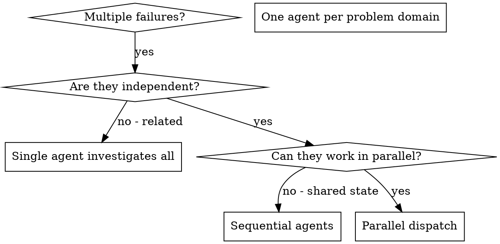
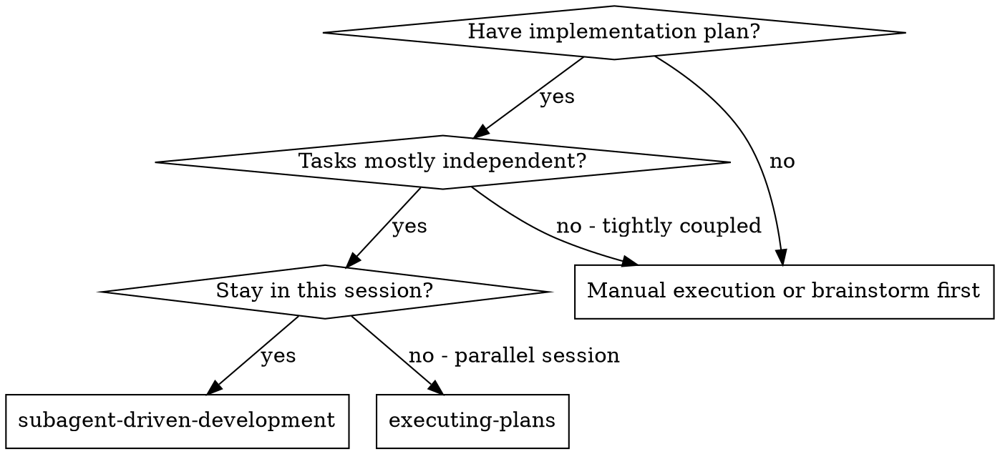
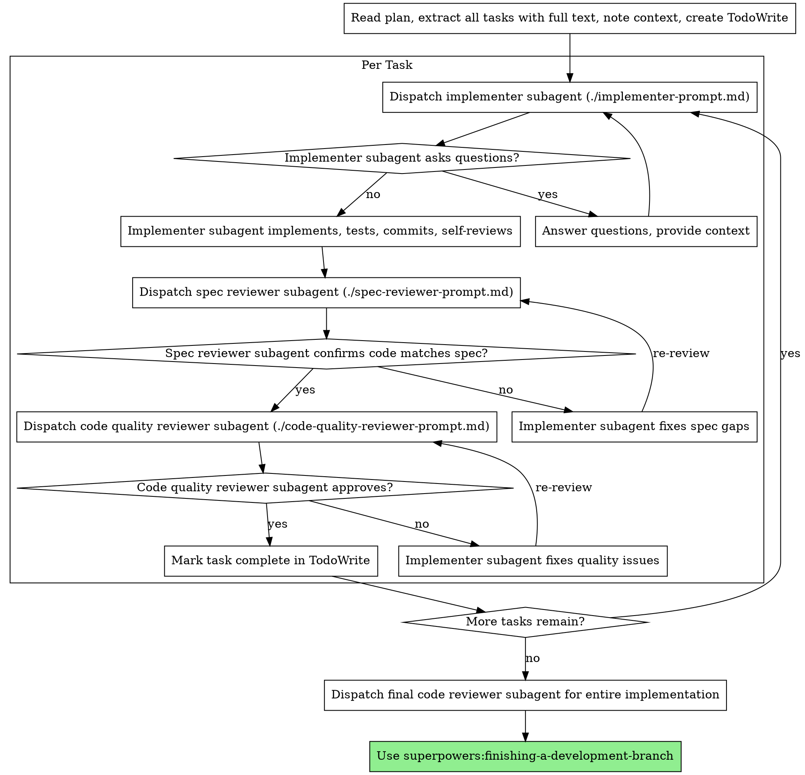

# Multi-Agent Patterns — Overview & Decision Matrix

> Consolidated from sadd-multi-agent-patterns, dispatching-parallel-agents, subagent-driven-development.
> Every line preserved verbatim per zero-value-loss protocol.

---

## Source: sadd-multi-agent-patterns


# Multi-Agent Architecture Patterns for Claude Code

Multi-agent architectures distribute work across multiple agent invocations, each with its own focused context. When designed well, this distribution enables capabilities beyond single-agent limits. When designed poorly, it introduces coordination overhead that negates benefits. The critical insight is that sub-agents exist primarily to isolate context, not to anthropomorphize role division.

## Core Concepts

Multi-agent systems address single-agent context limitations through distribution. Three dominant patterns exist: supervisor/orchestrator for centralized control, peer-to-peer/swarm for flexible handoffs, and hierarchical for layered abstraction. The critical design principle is context isolation—sub-agents exist primarily to partition context rather than to simulate organizational roles.

Effective multi-agent systems require explicit coordination protocols, consensus mechanisms that avoid sycophancy, and careful attention to failure modes including bottlenecks, divergence, and error propagation.

## Why Multi-Agent Architectures

### The Context Bottleneck

Single agents face inherent ceilings in reasoning capability, context management, and tool coordination. As tasks grow more complex, context windows fill with accumulated history, retrieved documents, and tool outputs. Performance degrades according to predictable patterns: the lost-in-middle effect, attention scarcity, and context poisoning.

Multi-agent architectures address these limitations by partitioning work across multiple context windows. Each agent operates in a clean context focused on its subtask. Results aggregate at a coordination layer without any single context bearing the full burden.

### The Parallelization Argument

Many tasks contain parallelizable subtasks that a single agent must execute sequentially. A research task might require searching multiple independent sources, analyzing different documents, or comparing competing approaches. A single agent processes these sequentially, accumulating context with each step.

Multi-agent architectures assign each subtask to a dedicated agent with a fresh context. All agents work simultaneously, then return results to a coordinator. The total real-world time approaches the duration of the longest subtask rather than the sum of all subtasks.

### The Specialization Argument

Different tasks benefit from different agent configurations: different system prompts, different tool sets, different context structures. A general-purpose agent must carry all possible configurations in context. Specialized agents carry only what they need.

Multi-agent architectures enable specialization without combinatorial explosion. The coordinator routes to specialized agents; each agent operates with lean context optimized for its domain.

## Architectural Patterns

### Pattern 1: Supervisor/Orchestrator

The supervisor pattern places a central agent in control, delegating to specialists and synthesizing results. The supervisor maintains global state and trajectory, decomposes user objectives into subtasks, and routes to appropriate workers.

```
User Request -> Supervisor -> [Specialist A, Specialist B, Specialist C] -> Aggregation -> Final Output
```

**When to use:** Complex tasks with clear decomposition, tasks requiring coordination across domains, tasks where human oversight is important.

**Advantages:** Strict control over workflow, easier to implement human-in-the-loop interventions, ensures adherence to predefined plans.

**Disadvantages:** Supervisor context becomes bottleneck, supervisor failures cascade to all workers, "telephone game" problem where supervisors paraphrase sub-agent responses incorrectly.

**Claude Code Implementation:** Create a main command that orchestrates by calling specialized subagents using the Task tool. The supervisor command contains the coordination logic and calls subagents for specialized work.

```markdown
<!-- Example supervisor command structure -->
1. Analyze the user request and decompose into subtasks
2. For each subtask, dispatch to appropriate specialist:
   - Use Task tool to spawn subagent with focused context
   - Pass only relevant context to each subagent
3. Collect and synthesize results from all subagents
4. Return unified response to user
```

**The Telephone Game Problem:** Supervisor architectures can perform worse when supervisors paraphrase sub-agent responses incorrectly, losing fidelity. The fix: allow sub-agents to pass responses directly when synthesis would lose important details. In Claude Code, this means letting subagents write directly to shared files or return their output verbatim rather than having the supervisor rewrite everything.

### Pattern 2: Peer-to-Peer/Swarm

The peer-to-peer pattern removes central control, allowing agents to communicate directly based on predefined protocols. Any agent can transfer control to any other through explicit handoff mechanisms.

**When to use:** Tasks requiring flexible exploration, tasks where rigid planning is counterproductive, tasks with emergent requirements that defy upfront decomposition.

**Advantages:** No single point of failure, scales effectively for breadth-first exploration, enables emergent problem-solving behaviors.

**Disadvantages:** Coordination complexity increases with agent count, risk of divergence without central state keeper, requires robust convergence constraints.

**Claude Code Implementation:** Create commands that can invoke other commands based on discovered needs. Use shared files (like task lists or state files) as the coordination mechanism.

```markdown
<!-- Example peer handoff structure -->
1. Analyze current state from shared context file
2. Determine if this agent can complete the task
3. If specialized help needed:
   - Write current findings to shared state
   - Invoke appropriate peer command/skill
4. Continue until task complete or hand off
```

### Pattern 3: Hierarchical

Hierarchical structures organize agents into layers of abstraction: strategic, planning, and execution layers. Strategy layer agents define goals and constraints; planning layer agents break goals into actionable plans; execution layer agents perform atomic tasks.

```
Strategy Layer (Goal Definition) -> Planning Layer (Task Decomposition) -> Execution Layer (Atomic Tasks)
```

**When to use:** Large-scale projects with clear hierarchical structure, enterprise workflows with management layers, tasks requiring both high-level planning and detailed execution.

**Advantages:** Mirrors organizational structures, clear separation of concerns, enables different context structures at different levels.

**Disadvantages:** Coordination overhead between layers, potential for misalignment between strategy and execution, complex error propagation.

**Claude Code Implementation:** Structure your plugin with commands at different abstraction levels. High-level commands focus on strategy and call mid-level planning commands, which in turn call atomic execution commands.

## Context Isolation as Design Principle

The primary purpose of multi-agent architectures is context isolation. Each sub-agent operates in a clean context window focused on its subtask without carrying accumulated context from other subtasks.

### Isolation Mechanisms

**Instruction passing:** For simple, well-defined subtasks, the coordinator creates focused instructions. The sub-agent receives only the instructions needed for its specific task. In Claude Code, this means passing minimal, targeted prompts to subagents via the Task tool.

**File system memory:** For complex tasks requiring shared state, agents read and write to persistent storage. The file system serves as the coordination mechanism, avoiding context bloat from shared state passing. This is the most natural pattern for Claude Code—agents communicate through markdown files, JSON state files, or structured documents.

**Full context delegation:** For complex tasks where the sub-agent needs complete understanding, the coordinator shares its entire context. The sub-agent has its own tools and instructions but receives full context for its decisions. Use sparingly as it defeats the purpose of context isolation.

### Isolation Trade-offs

Full context delegation provides maximum capability but defeats the purpose of sub-agents. Instruction passing maintains isolation but limits sub-agent flexibility. File system memory enables shared state without context passing but introduces consistency challenges.

The right choice depends on task complexity, coordination needs, and the nature of the work.

## Consensus and Coordination

### The Voting Problem

Simple majority voting treats hallucinations from weak reasoning as equal to sound reasoning. Without intervention, multi-agent discussions can devolve into consensus on false premises due to inherent bias toward agreement.

### Weighted Contributions

Weight agent contributions by confidence or expertise. Agents with higher confidence or domain expertise carry more weight in final decisions.

### Debate Protocols

Debate protocols require agents to critique each other's outputs over multiple rounds. Adversarial critique often yields higher accuracy on complex reasoning than collaborative consensus.

**Claude Code Implementation:** Create a review stage where one agent critiques another's output. Structure this as separate commands: one for initial work, one for critique, and optionally one for revision based on critique.

### Trigger-Based Intervention

Monitor multi-agent interactions for specific behavioral markers:
- **Stall triggers:** Activate when discussions make no progress
- **Sycophancy triggers:** Detect when agents mimic each other's answers without unique reasoning
- **Divergence triggers:** Detect when agents are moving away from the original objective

## Failure Modes and Mitigations

### Failure: Supervisor Bottleneck

The supervisor accumulates context from all workers, becoming susceptible to saturation and degradation.

**Mitigation:** Implement output constraints so workers return only distilled summaries. Use file-based checkpointing to persist state without carrying full history in context.

### Failure: Coordination Overhead

Agent communication consumes tokens and introduces latency. Complex coordination can negate parallelization benefits.

**Mitigation:** Minimize communication through clear handoff protocols. Use structured file formats for inter-agent communication. Batch results where possible.

### Failure: Divergence

Agents pursuing different goals without central coordination can drift from intended objectives.

**Mitigation:** Define clear objective boundaries for each agent. Implement convergence checks that verify progress toward shared goals. Use iteration limits on agent execution.

### Failure: Error Propagation

Errors in one agent's output propagate to downstream agents that consume that output.

**Mitigation:** Validate agent outputs before passing to consumers. Implement retry logic. Design for graceful degradation when components fail.

## Applying Patterns in Claude Code

### Command as Supervisor

Create a main command that:
1. Analyzes the task and creates a plan
2. Dispatches subagents via Task tool for specialized work
3. Collects results (via return values or shared files)
4. Synthesizes final output

### Subagents as Specialists

Define Subagents for specialized domains:
- Each Subagents focuses on one area of expertise
- Subagents receive focused context relevant to their specialty
- Subagents return structured outputs that coordinators can aggregate

### Files as Shared Memory

Use the file system for inter-agent coordination:
- State files track progress across agents
- Output files collect results from parallel work
- Task lists coordinate remaining work

### Example: Code Review Multi-Agent

```
Supervisor Command: review-code
├── Subagent: security-review (security specialist)
├── Subagent: performance-review (performance specialist)
├── Subagent: style-review (style/conventions specialist)
└── Aggregation: combine findings, deduplicate, prioritize
```

Each subagent receives only the code to review and their specialty focus. The supervisor aggregates all findings into a unified review.

## Guidelines

1. Design for context isolation as the primary benefit of multi-agent systems
2. Choose architecture pattern based on coordination needs, not organizational metaphor
3. Use file-based communication as the default for Claude Code multi-agent patterns
4. Implement explicit handoff protocols with clear state passing
5. Use critique/debate patterns for consensus rather than simple agreement
6. Monitor for supervisor bottlenecks and implement checkpointing via files
7. Validate outputs before passing between agents
8. Set iteration limits to prevent infinite loops
9. Test failure scenarios explicitly
10. Start simple—add multi-agent complexity only when single-agent approaches fail

## Memory and State Management

For tasks spanning multiple sessions or requiring persistent state, use file-based memory:

### Working Memory

The context window itself. Provides immediate access but vanishes when sessions end. Keep only active information; summarize completed work.

### Session Memory

Files created during a session that track progress:
- Task lists (what's done, what remains)
- Intermediate results
- Decision logs

### Long-Term Memory

Persistent files that survive across sessions:
- CLAUDE.md for project-level context
- Memory files in designated directories
- Structured knowledge bases in markdown or JSON

### Memory Patterns for Multi-Agent

- **Handoff files:** Agent A writes state, Agent B reads and continues
- **Result aggregation:** Multiple agents write to separate files, supervisor reads all
- **Progress tracking:** Shared task list updated by all agents
- **Knowledge accumulation:** Agents append findings to shared knowledge files

Choose the simplest memory mechanism that meets your needs. File-based memory is transparent, debuggable, and requires no infrastructure.

# Memory System Design

Memory provides the persistence layer that allows agents to maintain continuity across sessions and reason over accumulated knowledge. Simple agents rely entirely on context for memory, losing all state when sessions end. Sophisticated agents implement layered memory architectures that balance immediate context needs with long-term knowledge retention. The evolution from vector stores to knowledge graphs to temporal knowledge graphs represents increasing investment in structured memory for improved retrieval and reasoning.

## Core Concepts

Memory exists on a spectrum from immediate context to permanent storage. At one extreme, working memory in the context window provides zero-latency access but vanishes when sessions end. At the other extreme, permanent storage persists indefinitely but requires retrieval to enter context.

Simple vector stores lack relationship and temporal structure. Knowledge graphs preserve relationships for reasoning. Temporal knowledge graphs add validity periods for time-aware queries. Implementation choices depend on query complexity, infrastructure constraints, and accuracy requirements.

## Detailed Topics

### Memory Architecture Fundamentals

**The Context-Memory Spectrum**
Memory exists on a spectrum from immediate context to permanent storage. At one extreme, working memory in the context window provides zero-latency access but vanishes when sessions end. At the other extreme, permanent storage persists indefinitely but requires retrieval to enter context. Effective architectures use multiple layers along this spectrum.

The spectrum includes working memory (context window, zero latency, volatile), short-term memory (session-persistent, searchable, volatile), long-term memory (cross-session persistent, structured, semi-permanent), and permanent memory (archival, queryable, permanent). Each layer has different latency, capacity, and persistence characteristics.

**Why Simple Vector Stores Fall Short**
Vector RAG provides semantic retrieval by embedding queries and documents in a shared embedding space. Similarity search retrieves the most semantically similar documents. This works well for document retrieval but lacks structure for agent memory.

Vector stores lose relationship information. If an agent learns that "Customer X purchased Product Y on Date Z," a vector store can retrieve this fact if asked directly. But it cannot answer "What products did customers who purchased Product Y also buy?" because relationship structure is not preserved.

Vector stores also struggle with temporal validity. Facts change over time, but vector stores provide no mechanism to distinguish "current fact" from "outdated fact" except through explicit metadata and filtering.

**The Move to Graph-Based Memory**
Knowledge graphs preserve relationships between entities. Instead of isolated document chunks, graphs encode that Entity A has Relationship R to Entity B. This enables queries that traverse relationships rather than just similarity.

Temporal knowledge graphs add validity periods to facts. Each fact has a "valid from" and optionally "valid until" timestamp. This enables time-travel queries that reconstruct knowledge at specific points in time.

**Benchmark Performance Comparison**
The Deep Memory Retrieval (DMR) benchmark provides concrete performance data across memory architectures:

| Memory System | DMR Accuracy | Retrieval Latency | Notes |
|---------------|--------------|-------------------|-------|
| Zep (Temporal KG) | 94.8% | 2.58s | Best accuracy, fast retrieval |
| MemGPT | 93.4% | Variable | Good general performance |
| GraphRAG | ~75-85% | Variable | 20-35% gains over baseline RAG |
| Vector RAG | ~60-70% | Fast | Loses relationship structure |
| Recursive Summarization | 35.3% | Low | Severe information loss |

Zep demonstrated 90% reduction in retrieval latency compared to full-context baselines (2.58s vs 28.9s for GPT-5.2). This efficiency comes from retrieving only relevant subgraphs rather than entire context history.

GraphRAG achieves approximately 20-35% accuracy gains over baseline RAG in complex reasoning tasks and reduces hallucination by up to 30% through community-based summarization.

### Memory Layer Architecture

**Layer 1: Working Memory**
Working memory is the context window itself. It provides immediate access to information currently being processed but has limited capacity and vanishes when sessions end.

Working memory usage patterns include scratchpad calculations where agents track intermediate results, conversation history that preserves dialogue for current task, current task state that tracks progress on active objectives, and active retrieved documents that hold information currently being used.

Optimize working memory by keeping only active information, summarizing completed work before it falls out of attention, and using attention-favored positions for critical information.

**Layer 2: Short-Term Memory**
Short-term memory persists across the current session but not across sessions. It provides search and retrieval capabilities without the latency of permanent storage.

Common implementations include session-scoped databases that persist until session end, file-system storage in designated session directories, and in-memory caches keyed by session ID.

Short-term memory use cases include tracking conversation state across turns without stuffing context, storing intermediate results from tool calls that may be needed later, maintaining task checklists and progress tracking, and caching retrieved information within sessions.

**Layer 3: Long-Term Memory**
Long-term memory persists across sessions indefinitely. It enables agents to learn from past interactions and build knowledge over time.

Long-term memory implementations range from simple key-value stores to sophisticated graph databases. The choice depends on complexity of relationships to model, query patterns required, and acceptable infrastructure complexity.

Long-term memory use cases include learning user preferences across sessions, building domain knowledge bases that grow over time, maintaining entity registries with relationship history, and storing successful patterns that can be reused.

**Layer 4: Entity Memory**
Entity memory specifically tracks information about entities (people, places, concepts, objects) to maintain consistency. This creates a rudimentary knowledge graph where entities are recognized across multiple interactions.

Entity memory maintains entity identity by tracking that "John Doe" mentioned in one conversation is the same person in another. It maintains entity properties by storing facts discovered about entities over time. It maintains entity relationships by tracking relationships between entities as they are discovered.

**Layer 5: Temporal Knowledge Graphs**
Temporal knowledge graphs extend entity memory with explicit validity periods. Facts are not just true or false but true during specific time ranges.

This enables queries like "What was the user's address on Date X?" by retrieving facts valid during that date range. It prevents context clash when outdated information contradicts new data. It enables temporal reasoning about how entities changed over time.

### Memory Implementation Patterns

**Pattern 1: File-System-as-Memory**
The file system itself can serve as a memory layer. This pattern is simple, requires no additional infrastructure, and enables the same just-in-time loading that makes file-system-based context effective.

Implementation uses the file system hierarchy for organization. Use naming conventions that convey meaning. Store facts in structured formats (JSON, YAML). Use timestamps in filenames or metadata for temporal tracking.

Advantages: Simplicity, transparency, portability.
Disadvantages: No semantic search, no relationship tracking, manual organization required.

**Pattern 2: Vector RAG with Metadata**
Vector stores enhanced with rich metadata provide semantic search with filtering capabilities.

Implementation embeds facts or documents and stores with metadata including entity tags, temporal validity, source attribution, and confidence scores. Query includes metadata filters alongside semantic search.

**Pattern 3: Knowledge Graph**
Knowledge graphs explicitly model entities and relationships. Implementation defines entity types and relationship types, uses graph database or property graph storage, and maintains indexes for common query patterns.

**Pattern 4: Temporal Knowledge Graph**
Temporal knowledge graphs add validity periods to facts, enabling time-travel queries and preventing context clash from outdated information.

### Memory Retrieval Patterns

**Semantic Retrieval**
Retrieve memories semantically similar to current query using embedding similarity search.

**Entity-Based Retrieval**
Retrieve all memories related to specific entities by traversing graph relationships.

**Temporal Retrieval**
Retrieve memories valid at specific time or within time range using validity period filters.

### Memory Consolidation

Memories accumulate over time and require consolidation to prevent unbounded growth and remove outdated information.

**Consolidation Triggers**
Trigger consolidation after significant memory accumulation, when retrieval returns too many outdated results, periodically on a schedule, or when explicit consolidation is requested.

**Consolidation Process**
Identify outdated facts, merge related facts, update validity periods, archive or delete obsolete facts, and rebuild indexes.

---

## Source: dispatching-parallel-agents


# Dispatching Parallel Agents

## Overview

When you have multiple unrelated failures (different test files, different subsystems, different bugs), investigating them sequentially wastes time. Each investigation is independent and can happen in parallel.

**Core principle:** Dispatch one agent per independent problem domain. Let them work concurrently.

## When to Use



**Use when:**
- 3+ test files failing with different root causes
- Multiple subsystems broken independently
- Each problem can be understood without context from others
- No shared state between investigations

**Don't use when:**
- Failures are related (fix one might fix others)
- Need to understand full system state
- Agents would interfere with each other

## The Pattern

### 1. Identify Independent Domains

Group failures by what's broken:
- File A tests: Tool approval flow
- File B tests: Batch completion behavior
- File C tests: Abort functionality

Each domain is independent - fixing tool approval doesn't affect abort tests.

### 2. Create Focused Agent Tasks

Each agent gets:
- **Specific scope:** One test file or subsystem
- **Clear goal:** Make these tests pass
- **Constraints:** Don't change other code
- **Expected output:** Summary of what you found and fixed

### 3. Dispatch in Parallel

```typescript
// In Claude Code / AI environment
Task("Fix agent-tool-abort.test.ts failures")
Task("Fix batch-completion-behavior.test.ts failures")
Task("Fix tool-approval-race-conditions.test.ts failures")
// All three run concurrently
```

### 4. Review and Integrate

When agents return:
- Read each summary
- Verify fixes don't conflict
- Run full test suite
- Integrate all changes

## Agent Prompt Structure

Good agent prompts are:
1. **Focused** - One clear problem domain
2. **Self-contained** - All context needed to understand the problem
3. **Specific about output** - What should the agent return?

```markdown
Fix the 3 failing tests in src/agents/agent-tool-abort.test.ts:

1. "should abort tool with partial output capture" - expects 'interrupted at' in message
2. "should handle mixed completed and aborted tools" - fast tool aborted instead of completed
3. "should properly track pendingToolCount" - expects 3 results but gets 0

These are timing/race condition issues. Your task:

1. Read the test file and understand what each test verifies
2. Identify root cause - timing issues or actual bugs?
3. Fix by:
   - Replacing arbitrary timeouts with event-based waiting
   - Fixing bugs in abort implementation if found
   - Adjusting test expectations if testing changed behavior

Do NOT just increase timeouts - find the real issue.

Return: Summary of what you found and what you fixed.
```

## Common Mistakes

**❌ Too broad:** "Fix all the tests" - agent gets lost
**✅ Specific:** "Fix agent-tool-abort.test.ts" - focused scope

**❌ No context:** "Fix the race condition" - agent doesn't know where
**✅ Context:** Paste the error messages and test names

**❌ No constraints:** Agent might refactor everything
**✅ Constraints:** "Do NOT change production code" or "Fix tests only"

**❌ Vague output:** "Fix it" - you don't know what changed
**✅ Specific:** "Return summary of root cause and changes"

## When NOT to Use

**Related failures:** Fixing one might fix others - investigate together first
**Need full context:** Understanding requires seeing entire system
**Exploratory debugging:** You don't know what's broken yet
**Shared state:** Agents would interfere (editing same files, using same resources)

## Real Example from Session

**Scenario:** 6 test failures across 3 files after major refactoring

**Failures:**
- agent-tool-abort.test.ts: 3 failures (timing issues)
- batch-completion-behavior.test.ts: 2 failures (tools not executing)
- tool-approval-race-conditions.test.ts: 1 failure (execution count = 0)

**Decision:** Independent domains - abort logic separate from batch completion separate from race conditions

**Dispatch:**
```
Agent 1 → Fix agent-tool-abort.test.ts
Agent 2 → Fix batch-completion-behavior.test.ts
Agent 3 → Fix tool-approval-race-conditions.test.ts
```

**Results:**
- Agent 1: Replaced timeouts with event-based waiting
- Agent 2: Fixed event structure bug (threadId in wrong place)
- Agent 3: Added wait for async tool execution to complete

**Integration:** All fixes independent, no conflicts, full suite green

**Time saved:** 3 problems solved in parallel vs sequentially

## Key Benefits

1. **Parallelization** - Multiple investigations happen simultaneously
2. **Focus** - Each agent has narrow scope, less context to track
3. **Independence** - Agents don't interfere with each other
4. **Speed** - 3 problems solved in time of 1

## Verification

After agents return:
1. **Review each summary** - Understand what changed
2. **Check for conflicts** - Did agents edit same code?
3. **Run full suite** - Verify all fixes work together
4. **Spot check** - Agents can make systematic errors

## Real-World Impact

From debugging session (2025-10-03):
- 6 failures across 3 files
- 3 agents dispatched in parallel
- All investigations completed concurrently
- All fixes integrated successfully
- Zero conflicts between agent changes

---

## Source: subagent-driven-development / SKILL.md


# Subagent-Driven Development

Execute plan by dispatching fresh subagent per task, with two-stage review after each: spec compliance review first, then code quality review.

**Core principle:** Fresh subagent per task + two-stage review (spec then quality) = high quality, fast iteration

## When to Use



**vs. Executing Plans (parallel session):**
- Same session (no context switch)
- Fresh subagent per task (no context pollution)
- Two-stage review after each task: spec compliance first, then code quality
- Faster iteration (no human-in-loop between tasks)

## The Process



## Prompt Templates

- `./implementer-prompt.md` - Dispatch implementer subagent
- `./spec-reviewer-prompt.md` - Dispatch spec compliance reviewer subagent
- `./code-quality-reviewer-prompt.md` - Dispatch code quality reviewer subagent

## Example Workflow

```
You: I'm using Subagent-Driven Development to execute this plan.

[Read plan file once: docs/plans/feature-plan.md]
[Extract all 5 tasks with full text and context]
[Create TodoWrite with all tasks]

Task 1: Hook installation script

[Get Task 1 text and context (already extracted)]
[Dispatch implementation subagent with full task text + context]

Implementer: "Before I begin - should the hook be installed at user or system level?"

You: "User level (~/.config/superpowers/hooks/)"

Implementer: "Got it. Implementing now..."
[Later] Implementer:
  - Implemented install-hook command
  - Added tests, 5/5 passing
  - Self-review: Found I missed --force flag, added it
  - Committed

[Dispatch spec compliance reviewer]
Spec reviewer: ✅ Spec compliant - all requirements met, nothing extra

[Get git SHAs, dispatch code quality reviewer]
Code reviewer: Strengths: Good test coverage, clean. Issues: None. Approved.

[Mark Task 1 complete]

Task 2: Recovery modes

[Get Task 2 text and context (already extracted)]
[Dispatch implementation subagent with full task text + context]

Implementer: [No questions, proceeds]
Implementer:
  - Added verify/repair modes
  - 8/8 tests passing
  - Self-review: All good
  - Committed

[Dispatch spec compliance reviewer]
Spec reviewer: ❌ Issues:
  - Missing: Progress reporting (spec says "report every 100 items")
  - Extra: Added --json flag (not requested)

[Implementer fixes issues]
Implementer: Removed --json flag, added progress reporting

[Spec reviewer reviews again]
Spec reviewer: ✅ Spec compliant now

[Dispatch code quality reviewer]
Code reviewer: Strengths: Solid. Issues (Important): Magic number (100)

[Implementer fixes]
Implementer: Extracted PROGRESS_INTERVAL constant

[Code reviewer reviews again]
Code reviewer: ✅ Approved

[Mark Task 2 complete]

...

[After all tasks]
[Dispatch final code-reviewer]
Final reviewer: All requirements met, ready to merge

Done!
```

## Advantages

**vs. Manual execution:**
- Subagents follow TDD naturally
- Fresh context per task (no confusion)
- Parallel-safe (subagents don't interfere)
- Subagent can ask questions (before AND during work)

**vs. Executing Plans:**
- Same session (no handoff)
- Continuous progress (no waiting)
- Review checkpoints automatic

**Efficiency gains:**
- No file reading overhead (controller provides full text)
- Controller curates exactly what context is needed
- Subagent gets complete information upfront
- Questions surfaced before work begins (not after)

**Quality gates:**
- Self-review catches issues before handoff
- Two-stage review: spec compliance, then code quality
- Review loops ensure fixes actually work
- Spec compliance prevents over/under-building
- Code quality ensures implementation is well-built

**Cost:**
- More subagent invocations (implementer + 2 reviewers per task)
- Controller does more prep work (extracting all tasks upfront)
- Review loops add iterations
- But catches issues early (cheaper than debugging later)

## Red Flags

**Never:**
- Start implementation on main/master branch without explicit user consent
- Skip reviews (spec compliance OR code quality)
- Proceed with unfixed issues
- Dispatch multiple implementation subagents in parallel (conflicts)
- Make subagent read plan file (provide full text instead)
- Skip scene-setting context (subagent needs to understand where task fits)
- Ignore subagent questions (answer before letting them proceed)
- Accept "close enough" on spec compliance (spec reviewer found issues = not done)
- Skip review loops (reviewer found issues = implementer fixes = review again)
- Let implementer self-review replace actual review (both are needed)
- **Start code quality review before spec compliance is ✅** (wrong order)
- Move to next task while either review has open issues

**If subagent asks questions:**
- Answer clearly and completely
- Provide additional context if needed
- Don't rush them into implementation

**If reviewer finds issues:**
- Implementer (same subagent) fixes them
- Reviewer reviews again
- Repeat until approved
- Don't skip the re-review

**If subagent fails task:**
- Dispatch fix subagent with specific instructions
- Don't try to fix manually (context pollution)

## Integration

**Required workflow skills:**
- **superpowers:using-git-worktrees** - REQUIRED: Set up isolated workspace before starting
- **superpowers:writing-plans** - Creates the plan this skill executes
- **superpowers:requesting-code-review** - Code review template for reviewer subagents
- **superpowers:finishing-a-development-branch** - Complete development after all tasks

**Subagents should use:**
- **superpowers:test-driven-development** - Subagents follow TDD for each task

**Alternative workflow:**
- **superpowers:executing-plans** - Use for parallel session instead of same-session execution

---

## Source: subagent-driven-development / code-quality-reviewer-prompt.md

# Code Quality Reviewer Prompt Template

Use this template when dispatching a code quality reviewer subagent.

**Purpose:** Verify implementation is well-built (clean, tested, maintainable)

**Only dispatch after spec compliance review passes.**

```
Task tool (superpowers:code-reviewer):
  Use template at requesting-code-review/code-reviewer.md

  WHAT_WAS_IMPLEMENTED: [from implementer's report]
  PLAN_OR_REQUIREMENTS: Task N from [plan-file]
  BASE_SHA: [commit before task]
  HEAD_SHA: [current commit]
  DESCRIPTION: [task summary]
```

**Code reviewer returns:** Strengths, Issues (Critical/Important/Minor), Assessment

---

## Source: subagent-driven-development / implementer-prompt.md

# Implementer Subagent Prompt Template

Use this template when dispatching an implementer subagent.

```
Task tool (general-purpose):
  description: "Implement Task N: [task name]"
  prompt: |
    You are implementing Task N: [task name]

    ## Task Description

    [FULL TEXT of task from plan - paste it here, don't make subagent read file]

    ## Context

    [Scene-setting: where this fits, dependencies, architectural context]

    ## Before You Begin

    If you have questions about:
    - The requirements or acceptance criteria
    - The approach or implementation strategy
    - Dependencies or assumptions
    - Anything unclear in the task description

    **Ask them now.** Raise any concerns before starting work.

    ## Your Job

    Once you're clear on requirements:
    1. Implement exactly what the task specifies
    2. Write tests (following TDD if task says to)
    3. Verify implementation works
    4. Commit your work
    5. Self-review (see below)
    6. Report back

    Work from: [directory]

    **While you work:** If you encounter something unexpected or unclear, **ask questions**.
    It's always OK to pause and clarify. Don't guess or make assumptions.

    ## Before Reporting Back: Self-Review

    Review your work with fresh eyes. Ask yourself:

    **Completeness:**
    - Did I fully implement everything in the spec?
    - Did I miss any requirements?
    - Are there edge cases I didn't handle?

    **Quality:**
    - Is this my best work?
    - Are names clear and accurate (match what things do, not how they work)?
    - Is the code clean and maintainable?

    **Discipline:**
    - Did I avoid overbuilding (YAGNI)?
    - Did I only build what was requested?
    - Did I follow existing patterns in the codebase?

    **Testing:**
    - Do tests actually verify behavior (not just mock behavior)?
    - Did I follow TDD if required?
    - Are tests comprehensive?

    If you find issues during self-review, fix them now before reporting.

    ## Report Format

    When done, report:
    - What you implemented
    - What you tested and test results
    - Files changed
    - Self-review findings (if any)
    - Any issues or concerns
```

---

## Source: subagent-driven-development / spec-reviewer-prompt.md

# Spec Compliance Reviewer Prompt Template

Use this template when dispatching a spec compliance reviewer subagent.

**Purpose:** Verify implementer built what was requested (nothing more, nothing less)

```
Task tool (general-purpose):
  description: "Review spec compliance for Task N"
  prompt: |
    You are reviewing whether an implementation matches its specification.

    ## What Was Requested

    [FULL TEXT of task requirements]

    ## What Implementer Claims They Built

    [From implementer's report]

    ## CRITICAL: Do Not Trust the Report

    The implementer finished suspiciously quickly. Their report may be incomplete,
    inaccurate, or optimistic. You MUST verify everything independently.

    **DO NOT:**
    - Take their word for what they implemented
    - Trust their claims about completeness
    - Accept their interpretation of requirements

    **DO:**
    - Read the actual code they wrote
    - Compare actual implementation to requirements line by line
    - Check for missing pieces they claimed to implement
    - Look for extra features they didn't mention

    ## Your Job

    Read the implementation code and verify:

    **Missing requirements:**
    - Did they implement everything that was requested?
    - Are there requirements they skipped or missed?
    - Did they claim something works but didn't actually implement it?

    **Extra/unneeded work:**
    - Did they build things that weren't requested?
    - Did they over-engineer or add unnecessary features?
    - Did they add "nice to haves" that weren't in spec?

    **Misunderstandings:**
    - Did they interpret requirements differently than intended?
    - Did they solve the wrong problem?
    - Did they implement the right feature but wrong way?

    **Verify by reading code, not by trusting report.**

    Report:
    - ✅ Spec compliant (if everything matches after code inspection)
    - ❌ Issues found: [list specifically what's missing or extra, with file:line references]
```

---
