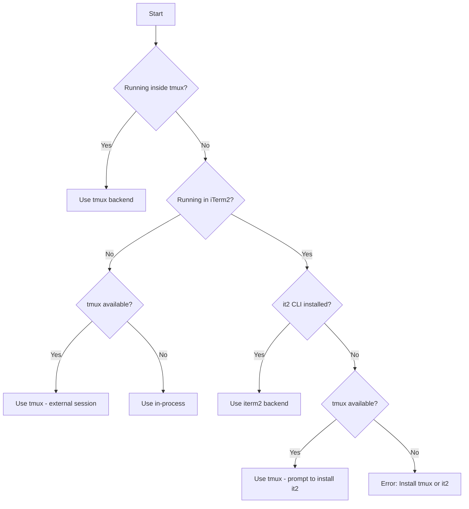

# Swarm Orchestration

> Consolidated from orchestrating-swarms. Zero-value-loss.

---

## Source: orchestrating-swarms


# Claude Code Swarm Orchestration

Master multi-agent orchestration using Claude Code's TeammateTool and Task system.


## Table of Contents

1. [Core Architecture](#core-architecture)
2. [Two Ways to Spawn Agents](#two-ways-to-spawn-agents)
3. [Built-in Agent Types](#built-in-agent-types)
4. [Plugin Agent Types](#plugin-agent-types)
5. [TeammateTool Operations](#teammatetool-operations)
6. [Task System Integration](#task-system-integration)
7. [Message Formats](#message-formats)
8. [Orchestration Patterns](#orchestration-patterns)
9. [Environment Variables](#environment-variables)
10. [Spawn Backends](#spawn-backends)
11. [Error Handling](#error-handling)
12. [Complete Workflows](#complete-workflows)


## Two Ways to Spawn Agents

### Method 1: Task Tool (Subagents)

Use Task for **short-lived, focused work** that returns a result:

```javascript
Task({
  subagent_type: "Explore",
  description: "Find auth files",
  prompt: "Find all authentication-related files in this codebase",
  model: "haiku"  // Optional: haiku, sonnet, opus
})
```

**Characteristics:**
- Runs synchronously (blocks until complete) or async with `run_in_background: true`
- Returns result directly to you
- No team membership required
- Best for: searches, analysis, focused research

### Method 2: Task Tool + team_name + name (Teammates)

Use Task with `team_name` and `name` to **spawn persistent teammates**:

```javascript
// First create a team
Teammate({ operation: "spawnTeam", team_name: "my-project" })

// Then spawn a teammate into that team
Task({
  team_name: "my-project",        // Required: which team to join
  name: "security-reviewer",      // Required: teammate's name
  subagent_type: "security-sentinel",
  prompt: "Review all authentication code for vulnerabilities. Send findings to team-lead via Teammate write.",
  run_in_background: true         // Teammates usually run in background
})
```

**Characteristics:**
- Joins team, appears in `config.json`
- Communicates via inbox messages
- Can claim tasks from shared task list
- Persists until shutdown
- Best for: parallel work, ongoing collaboration, pipeline stages

### Key Difference

| Aspect | Task (subagent) | Task + team_name + name (teammate) |
|--------|-----------------|-----------------------------------|
| Lifespan | Until task complete | Until shutdown requested |
| Communication | Return value | Inbox messages |
| Task access | None | Shared task list |
| Team membership | No | Yes |
| Coordination | One-off | Ongoing |


## Plugin Agent Types

From the `compound-engineering` plugin (examples):

### Review Agents
```javascript
// Security review
Task({
  subagent_type: "compound-engineering:review:security-sentinel",
  description: "Security audit",
  prompt: "Audit this PR for security vulnerabilities"
})

// Performance review
Task({
  subagent_type: "compound-engineering:review:performance-oracle",
  description: "Performance check",
  prompt: "Analyze this code for performance bottlenecks"
})

// Rails code review
Task({
  subagent_type: "compound-engineering:review:kieran-rails-reviewer",
  description: "Rails review",
  prompt: "Review this Rails code for best practices"
})

// Architecture review
Task({
  subagent_type: "compound-engineering:review:architecture-strategist",
  description: "Architecture review",
  prompt: "Review the system architecture of the authentication module"
})

// Code simplicity
Task({
  subagent_type: "compound-engineering:review:code-simplicity-reviewer",
  description: "Simplicity check",
  prompt: "Check if this implementation can be simplified"
})
```

**All review agents from compound-engineering:**
- `agent-native-reviewer` - Ensures features work for agents too
- `architecture-strategist` - Architectural compliance
- `code-simplicity-reviewer` - YAGNI and minimalism
- `data-integrity-guardian` - Database and data safety
- `data-migration-expert` - Migration validation
- `deployment-verification-agent` - Pre-deploy checklists
- `dhh-rails-reviewer` - DHH/37signals Rails style
- `julik-frontend-races-reviewer` - JavaScript race conditions
- `kieran-python-reviewer` - Python best practices
- `kieran-rails-reviewer` - Rails best practices
- `kieran-typescript-reviewer` - TypeScript best practices
- `pattern-recognition-specialist` - Design patterns and anti-patterns
- `performance-oracle` - Performance analysis
- `security-sentinel` - Security vulnerabilities

### Research Agents
```javascript
// Best practices research
Task({
  subagent_type: "compound-engineering:research:best-practices-researcher",
  description: "Research auth best practices",
  prompt: "Research current best practices for JWT authentication in Rails 2024-2026"
})

// Framework documentation
Task({
  subagent_type: "compound-engineering:research:framework-docs-researcher",
  description: "Research Active Storage",
  prompt: "Gather comprehensive documentation about Active Storage file uploads"
})

// Git history analysis
Task({
  subagent_type: "compound-engineering:research:git-history-analyzer",
  description: "Analyze auth history",
  prompt: "Analyze the git history of the authentication module to understand its evolution"
})
```

**All research agents:**
- `best-practices-researcher` - External best practices
- `framework-docs-researcher` - Framework documentation
- `git-history-analyzer` - Code archaeology
- `learnings-researcher` - Search docs/solutions/
- `repo-research-analyst` - Repository patterns

### Design Agents
```javascript
Task({
  subagent_type: "compound-engineering:design:figma-design-sync",
  description: "Sync with Figma",
  prompt: "Compare implementation with Figma design at [URL]"
})
```

### Workflow Agents
```javascript
Task({
  subagent_type: "compound-engineering:workflow:bug-reproduction-validator",
  description: "Validate bug",
  prompt: "Reproduce and validate this reported bug: [description]"
})
```


## Task System Integration

### TaskCreate - Create Work Items

```javascript
TaskCreate({
  subject: "Review authentication module",
  description: "Review all files in app/services/auth/ for security vulnerabilities",
  activeForm: "Reviewing auth module..."  // Shown in spinner when in_progress
})
```

### TaskList - See All Tasks

```javascript
TaskList()
```

Returns:
```
#1 [completed] Analyze codebase structure
#2 [in_progress] Review authentication module (owner: security-reviewer)
#3 [pending] Generate summary report [blocked by #2]
```

### TaskGet - Get Task Details

```javascript
TaskGet({ taskId: "2" })
```

Returns full task with description, status, blockedBy, etc.

### TaskUpdate - Update Task Status

```javascript
// Claim a task
TaskUpdate({ taskId: "2", owner: "security-reviewer" })

// Start working
TaskUpdate({ taskId: "2", status: "in_progress" })

// Mark complete
TaskUpdate({ taskId: "2", status: "completed" })

// Set up dependencies
TaskUpdate({ taskId: "3", addBlockedBy: ["1", "2"] })
```

### Task Dependencies

When a blocking task is completed, blocked tasks are automatically unblocked:

```javascript
// Create pipeline
TaskCreate({ subject: "Step 1: Research" })        // #1
TaskCreate({ subject: "Step 2: Implement" })       // #2
TaskCreate({ subject: "Step 3: Test" })            // #3
TaskCreate({ subject: "Step 4: Deploy" })          // #4

// Set up dependencies
TaskUpdate({ taskId: "2", addBlockedBy: ["1"] })   // #2 waits for #1
TaskUpdate({ taskId: "3", addBlockedBy: ["2"] })   // #3 waits for #2
TaskUpdate({ taskId: "4", addBlockedBy: ["3"] })   // #4 waits for #3

// When #1 completes, #2 auto-unblocks
// When #2 completes, #3 auto-unblocks
// etc.
```

### Task File Structure

`~/.claude/tasks/{team-name}/1.json`:
```json
{
  "id": "1",
  "subject": "Review authentication module",
  "description": "Review all files in app/services/auth/...",
  "status": "in_progress",
  "owner": "security-reviewer",
  "activeForm": "Reviewing auth module...",
  "blockedBy": [],
  "blocks": ["3"],
  "createdAt": 1706000000000,
  "updatedAt": 1706000001000
}
```


## Orchestration Patterns

### Pattern 1: Parallel Specialists (Leader Pattern)

Multiple specialists review code simultaneously:

```javascript
// 1. Create team
Teammate({ operation: "spawnTeam", team_name: "code-review" })

// 2. Spawn specialists in parallel (single message, multiple Task calls)
Task({
  team_name: "code-review",
  name: "security",
  subagent_type: "compound-engineering:review:security-sentinel",
  prompt: "Review the PR for security vulnerabilities. Focus on: SQL injection, XSS, auth bypass. Send findings to team-lead.",
  run_in_background: true
})

Task({
  team_name: "code-review",
  name: "performance",
  subagent_type: "compound-engineering:review:performance-oracle",
  prompt: "Review the PR for performance issues. Focus on: N+1 queries, memory leaks, slow algorithms. Send findings to team-lead.",
  run_in_background: true
})

Task({
  team_name: "code-review",
  name: "simplicity",
  subagent_type: "compound-engineering:review:code-simplicity-reviewer",
  prompt: "Review the PR for unnecessary complexity. Focus on: over-engineering, premature abstraction, YAGNI violations. Send findings to team-lead.",
  run_in_background: true
})

// 3. Wait for results (check inbox)
// cat ~/.claude/teams/code-review/inboxes/team-lead.json

// 4. Synthesize findings and cleanup
Teammate({ operation: "requestShutdown", target_agent_id: "security" })
Teammate({ operation: "requestShutdown", target_agent_id: "performance" })
Teammate({ operation: "requestShutdown", target_agent_id: "simplicity" })
// Wait for approvals...
Teammate({ operation: "cleanup" })
```

### Pattern 2: Pipeline (Sequential Dependencies)

Each stage depends on the previous:

```javascript
// 1. Create team and task pipeline
Teammate({ operation: "spawnTeam", team_name: "feature-pipeline" })

TaskCreate({ subject: "Research", description: "Research best practices for the feature", activeForm: "Researching..." })
TaskCreate({ subject: "Plan", description: "Create implementation plan based on research", activeForm: "Planning..." })
TaskCreate({ subject: "Implement", description: "Implement the feature according to plan", activeForm: "Implementing..." })
TaskCreate({ subject: "Test", description: "Write and run tests for the implementation", activeForm: "Testing..." })
TaskCreate({ subject: "Review", description: "Final code review before merge", activeForm: "Reviewing..." })

// Set up sequential dependencies
TaskUpdate({ taskId: "2", addBlockedBy: ["1"] })
TaskUpdate({ taskId: "3", addBlockedBy: ["2"] })
TaskUpdate({ taskId: "4", addBlockedBy: ["3"] })
TaskUpdate({ taskId: "5", addBlockedBy: ["4"] })

// 2. Spawn workers that claim and complete tasks
Task({
  team_name: "feature-pipeline",
  name: "researcher",
  subagent_type: "compound-engineering:research:best-practices-researcher",
  prompt: "Claim task #1, research best practices, complete it, send findings to team-lead. Then check for more work.",
  run_in_background: true
})

Task({
  team_name: "feature-pipeline",
  name: "implementer",
  subagent_type: "general-purpose",
  prompt: "Poll TaskList every 30 seconds. When task #3 unblocks, claim it and implement. Then complete and notify team-lead.",
  run_in_background: true
})

// Tasks auto-unblock as dependencies complete
```

### Pattern 3: Swarm (Self-Organizing)

Workers grab available tasks from a pool:

```javascript
// 1. Create team and task pool
Teammate({ operation: "spawnTeam", team_name: "file-review-swarm" })

// Create many independent tasks (no dependencies)
for (const file of ["auth.rb", "user.rb", "api_controller.rb", "payment.rb"]) {
  TaskCreate({
    subject: `Review ${file}`,
    description: `Review ${file} for security and code quality issues`,
    activeForm: `Reviewing ${file}...`
  })
}

// 2. Spawn worker swarm
Task({
  team_name: "file-review-swarm",
  name: "worker-1",
  subagent_type: "general-purpose",
  prompt: `
    You are a swarm worker. Your job:
    1. Call TaskList to see available tasks
    2. Find a task with status 'pending' and no owner
    3. Claim it with TaskUpdate (set owner to your name)
    4. Do the work
    5. Mark it completed with TaskUpdate
    6. Send findings to team-lead via Teammate write
    7. Repeat until no tasks remain
  `,
  run_in_background: true
})

Task({
  team_name: "file-review-swarm",
  name: "worker-2",
  subagent_type: "general-purpose",
  prompt: `[Same prompt as worker-1]`,
  run_in_background: true
})

Task({
  team_name: "file-review-swarm",
  name: "worker-3",
  subagent_type: "general-purpose",
  prompt: `[Same prompt as worker-1]`,
  run_in_background: true
})

// Workers race to claim tasks, naturally load-balance
```

### Pattern 4: Research + Implementation

Research first, then implement:

```javascript
// 1. Research phase (synchronous, returns results)
const research = await Task({
  subagent_type: "compound-engineering:research:best-practices-researcher",
  description: "Research caching patterns",
  prompt: "Research best practices for implementing caching in Rails APIs. Include: cache invalidation strategies, Redis vs Memcached, cache key design."
})

// 2. Use research to guide implementation
Task({
  subagent_type: "general-purpose",
  description: "Implement caching",
  prompt: `
    Implement API caching based on this research:

    ${research.content}

    Focus on the user_controller.rb endpoints.
  `
})
```

### Pattern 5: Plan Approval Workflow

Require plan approval before implementation:

```javascript
// 1. Create team
Teammate({ operation: "spawnTeam", team_name: "careful-work" })

// 2. Spawn architect with plan_mode_required
Task({
  team_name: "careful-work",
  name: "architect",
  subagent_type: "Plan",
  prompt: "Design an implementation plan for adding OAuth2 authentication",
  mode: "plan",  // Requires plan approval
  run_in_background: true
})

// 3. Wait for plan approval request
// You'll receive: {"type": "plan_approval_request", "from": "architect", "requestId": "plan-xxx", ...}

// 4. Review and approve/reject
Teammate({
  operation: "approvePlan",
  target_agent_id: "architect",
  request_id: "plan-xxx"
})
// OR
Teammate({
  operation: "rejectPlan",
  target_agent_id: "architect",
  request_id: "plan-xxx",
  feedback: "Please add rate limiting considerations"
})
```

### Pattern 6: Coordinated Multi-File Refactoring

```javascript
// 1. Create team for coordinated refactoring
Teammate({ operation: "spawnTeam", team_name: "refactor-auth" })

// 2. Create tasks with clear file boundaries
TaskCreate({
  subject: "Refactor User model",
  description: "Extract authentication methods to AuthenticatableUser concern",
  activeForm: "Refactoring User model..."
})

TaskCreate({
  subject: "Refactor Session controller",
  description: "Update to use new AuthenticatableUser concern",
  activeForm: "Refactoring Sessions..."
})

TaskCreate({
  subject: "Update specs",
  description: "Update all authentication specs for new structure",
  activeForm: "Updating specs..."
})

// Dependencies: specs depend on both refactors completing
TaskUpdate({ taskId: "3", addBlockedBy: ["1", "2"] })

// 3. Spawn workers for each task
Task({
  team_name: "refactor-auth",
  name: "model-worker",
  subagent_type: "general-purpose",
  prompt: "Claim task #1, refactor the User model, complete when done",
  run_in_background: true
})

Task({
  team_name: "refactor-auth",
  name: "controller-worker",
  subagent_type: "general-purpose",
  prompt: "Claim task #2, refactor the Session controller, complete when done",
  run_in_background: true
})

Task({
  team_name: "refactor-auth",
  name: "spec-worker",
  subagent_type: "general-purpose",
  prompt: "Wait for task #3 to unblock (when #1 and #2 complete), then update specs",
  run_in_background: true
})
```


## Spawn Backends

A **backend** determines how teammate Claude instances actually run. Claude Code supports three backends, and **auto-detects** the best one based on your environment.

### Backend Comparison

| Backend | How It Works | Visibility | Persistence | Speed |
|---------|-------------|------------|-------------|-------|
| **in-process** | Same Node.js process as leader | Hidden (background) | Dies with leader | Fastest |
| **tmux** | Separate terminal in tmux session | Visible in tmux | Survives leader exit | Medium |
| **iterm2** | Split panes in iTerm2 window | Visible side-by-side | Dies with window | Medium |

### Auto-Detection Logic

Claude Code automatically selects a backend using this decision tree:



**Detection checks:**
1. `$TMUX` environment variable → inside tmux
2. `$TERM_PROGRAM === "iTerm.app"` or `$ITERM_SESSION_ID` → in iTerm2
3. `which tmux` → tmux available
4. `which it2` → it2 CLI installed

### in-process (Default for non-tmux)

Teammates run as async tasks within the same Node.js process.

**How it works:**
- No new process spawned
- Teammates share the same Node.js event loop
- Communication via in-memory queues (fast)
- You don't see teammate output directly

**When it's used:**
- Not running inside tmux session
- Non-interactive mode (CI, scripts)
- Explicitly set via `CLAUDE_CODE_SPAWN_BACKEND=in-process`

**Characteristics:**
```
┌─────────────────────────────────────────┐
│           Node.js Process               │
│  ┌─────────┐  ┌─────────┐  ┌─────────┐ │
│  │ Leader  │  │Worker 1 │  │Worker 2 │ │
│  │ (main)  │  │ (async) │  │ (async) │ │
│  └─────────┘  └─────────┘  └─────────┘ │
└─────────────────────────────────────────┘
```

**Pros:**
- Fastest startup (no process spawn)
- Lowest overhead
- Works everywhere

**Cons:**
- Can't see teammate output in real-time
- All die if leader dies
- Harder to debug

```javascript
// in-process is automatic when not in tmux
Task({
  team_name: "my-project",
  name: "worker",
  subagent_type: "general-purpose",
  prompt: "...",
  run_in_background: true
})

// Force in-process explicitly
// export CLAUDE_CODE_SPAWN_BACKEND=in-process
```

### tmux

Teammates run as separate Claude instances in tmux panes/windows.

**How it works:**
- Each teammate gets its own tmux pane
- Separate process per teammate
- You can switch panes to see teammate output
- Communication via inbox files

**When it's used:**
- Running inside a tmux session (`$TMUX` is set)
- tmux available and not in iTerm2
- Explicitly set via `CLAUDE_CODE_SPAWN_BACKEND=tmux`

**Layout modes:**

1. **Inside tmux (native):** Splits your current window
```
┌─────────────────┬─────────────────┐
│                 │    Worker 1     │
│     Leader      ├─────────────────┤
│   (your pane)   │    Worker 2     │
│                 ├─────────────────┤
│                 │    Worker 3     │
└─────────────────┴─────────────────┘
```

2. **Outside tmux (external session):** Creates a new tmux session called `claude-swarm`
```bash
# Your terminal stays as-is
# Workers run in separate tmux session

# View workers:
tmux attach -t claude-swarm
```

**Pros:**
- See teammate output in real-time
- Teammates survive leader exit
- Can attach/detach sessions
- Works in CI/headless environments

**Cons:**
- Slower startup (process spawn)
- Requires tmux installed
- More resource usage

```bash
# Start tmux session first
tmux new-session -s claude

# Or force tmux backend
export CLAUDE_CODE_SPAWN_BACKEND=tmux
```

**Useful tmux commands:**
```bash
# List all panes in current window
tmux list-panes

# Switch to pane by number
tmux select-pane -t 1

# Kill a specific pane
tmux kill-pane -t %5

# View swarm session (if external)
tmux attach -t claude-swarm

# Rebalance pane layout
tmux select-layout tiled
```

### iterm2 (macOS only)

Teammates run as split panes within your iTerm2 window.

**How it works:**
- Uses iTerm2's Python API via `it2` CLI
- Splits your current window into panes
- Each teammate visible side-by-side
- Communication via inbox files

**When it's used:**
- Running in iTerm2 (`$TERM_PROGRAM === "iTerm.app"`)
- `it2` CLI is installed and working
- Python API enabled in iTerm2 preferences

**Layout:**
```
┌─────────────────┬─────────────────┐
│                 │    Worker 1     │
│     Leader      ├─────────────────┤
│   (your pane)   │    Worker 2     │
│                 ├─────────────────┤
│                 │    Worker 3     │
└─────────────────┴─────────────────┘
```

**Pros:**
- Visual debugging - see all teammates
- Native macOS experience
- No tmux needed
- Automatic pane management

**Cons:**
- macOS + iTerm2 only
- Requires setup (it2 CLI + Python API)
- Panes die with window

**Setup:**
```bash
# 1. Install it2 CLI
uv tool install it2
# OR
pipx install it2
# OR
pip install --user it2

# 2. Enable Python API in iTerm2
# iTerm2 → Settings → General → Magic → Enable Python API

# 3. Restart iTerm2

# 4. Verify
it2 --version
it2 session list
```

**If setup fails:**
Claude Code will prompt you to set up it2 when you first spawn a teammate. You can choose to:
1. Install it2 now (guided setup)
2. Use tmux instead
3. Cancel

### Forcing a Backend

```bash
# Force in-process (fastest, no visibility)
export CLAUDE_CODE_SPAWN_BACKEND=in-process

# Force tmux (visible panes, persistent)
export CLAUDE_CODE_SPAWN_BACKEND=tmux

# Auto-detect (default)
unset CLAUDE_CODE_SPAWN_BACKEND
```

### Backend in Team Config

The backend type is recorded per-teammate in `config.json`:

```json
{
  "members": [
    {
      "name": "worker-1",
      "backendType": "in-process",
      "tmuxPaneId": "in-process"
    },
    {
      "name": "worker-2",
      "backendType": "tmux",
      "tmuxPaneId": "%5"
    }
  ]
}
```

### Troubleshooting Backends

| Issue | Cause | Solution |
|-------|-------|----------|
| "No pane backend available" | Neither tmux nor iTerm2 available | Install tmux: `brew install tmux` |
| "it2 CLI not installed" | In iTerm2 but missing it2 | Run `uv tool install it2` |
| "Python API not enabled" | it2 can't communicate with iTerm2 | Enable in iTerm2 Settings → General → Magic |
| Workers not visible | Using in-process backend | Start inside tmux or iTerm2 |
| Workers dying unexpectedly | Outside tmux, leader exited | Use tmux for persistence |

### Checking Current Backend

```bash
# See what backend was detected
cat ~/.claude/teams/{team}/config.json | jq '.members[].backendType'

# Check if inside tmux
echo $TMUX

# Check if in iTerm2
echo $TERM_PROGRAM

# Check tmux availability
which tmux

# Check it2 availability
which it2
```


## Complete Workflows

### Workflow 1: Full Code Review with Parallel Specialists

```javascript
// === STEP 1: Setup ===
Teammate({ operation: "spawnTeam", team_name: "pr-review-123", description: "Reviewing PR #123" })

// === STEP 2: Spawn reviewers in parallel ===
// (Send all these in a single message for parallel execution)
Task({
  team_name: "pr-review-123",
  name: "security",
  subagent_type: "compound-engineering:review:security-sentinel",
  prompt: `Review PR #123 for security vulnerabilities.

  Focus on:
  - SQL injection
  - XSS vulnerabilities
  - Authentication/authorization bypass
  - Sensitive data exposure

  When done, send your findings to team-lead using:
  Teammate({ operation: "write", target_agent_id: "team-lead", value: "Your findings here" })`,
  run_in_background: true
})

Task({
  team_name: "pr-review-123",
  name: "perf",
  subagent_type: "compound-engineering:review:performance-oracle",
  prompt: `Review PR #123 for performance issues.

  Focus on:
  - N+1 queries
  - Missing indexes
  - Memory leaks
  - Inefficient algorithms

  Send findings to team-lead when done.`,
  run_in_background: true
})

Task({
  team_name: "pr-review-123",
  name: "arch",
  subagent_type: "compound-engineering:review:architecture-strategist",
  prompt: `Review PR #123 for architectural concerns.

  Focus on:
  - Design pattern adherence
  - SOLID principles
  - Separation of concerns
  - Testability

  Send findings to team-lead when done.`,
  run_in_background: true
})

// === STEP 3: Monitor and collect results ===
// Poll inbox or wait for idle notifications
// cat ~/.claude/teams/pr-review-123/inboxes/team-lead.json

// === STEP 4: Synthesize findings ===
// Combine all reviewer findings into a cohesive report

// === STEP 5: Cleanup ===
Teammate({ operation: "requestShutdown", target_agent_id: "security" })
Teammate({ operation: "requestShutdown", target_agent_id: "perf" })
Teammate({ operation: "requestShutdown", target_agent_id: "arch" })
// Wait for approvals...
Teammate({ operation: "cleanup" })
```

### Workflow 2: Research → Plan → Implement → Test Pipeline

```javascript
// === SETUP ===
Teammate({ operation: "spawnTeam", team_name: "feature-oauth" })

// === CREATE PIPELINE ===
TaskCreate({ subject: "Research OAuth providers", description: "Research OAuth2 best practices and compare providers (Google, GitHub, Auth0)", activeForm: "Researching OAuth..." })
TaskCreate({ subject: "Create implementation plan", description: "Design OAuth implementation based on research findings", activeForm: "Planning..." })
TaskCreate({ subject: "Implement OAuth", description: "Implement OAuth2 authentication according to plan", activeForm: "Implementing OAuth..." })
TaskCreate({ subject: "Write tests", description: "Write comprehensive tests for OAuth implementation", activeForm: "Writing tests..." })
TaskCreate({ subject: "Final review", description: "Review complete implementation for security and quality", activeForm: "Final review..." })

// Set dependencies
TaskUpdate({ taskId: "2", addBlockedBy: ["1"] })
TaskUpdate({ taskId: "3", addBlockedBy: ["2"] })
TaskUpdate({ taskId: "4", addBlockedBy: ["3"] })
TaskUpdate({ taskId: "5", addBlockedBy: ["4"] })

// === SPAWN SPECIALIZED WORKERS ===
Task({
  team_name: "feature-oauth",
  name: "researcher",
  subagent_type: "compound-engineering:research:best-practices-researcher",
  prompt: "Claim task #1. Research OAuth2 best practices, compare providers, document findings. Mark task complete and send summary to team-lead.",
  run_in_background: true
})

Task({
  team_name: "feature-oauth",
  name: "planner",
  subagent_type: "Plan",
  prompt: "Wait for task #2 to unblock. Read research from task #1. Create detailed implementation plan. Mark complete and send plan to team-lead.",
  run_in_background: true
})

Task({
  team_name: "feature-oauth",
  name: "implementer",
  subagent_type: "general-purpose",
  prompt: "Wait for task #3 to unblock. Read plan from task #2. Implement OAuth2 authentication. Mark complete when done.",
  run_in_background: true
})

Task({
  team_name: "feature-oauth",
  name: "tester",
  subagent_type: "general-purpose",
  prompt: "Wait for task #4 to unblock. Write comprehensive tests for the OAuth implementation. Run tests. Mark complete with results.",
  run_in_background: true
})

Task({
  team_name: "feature-oauth",
  name: "reviewer",
  subagent_type: "compound-engineering:review:security-sentinel",
  prompt: "Wait for task #5 to unblock. Review the complete OAuth implementation for security. Send final assessment to team-lead.",
  run_in_background: true
})

// Pipeline auto-progresses as each stage completes
```

### Workflow 3: Self-Organizing Code Review Swarm

```javascript
// === SETUP ===
Teammate({ operation: "spawnTeam", team_name: "codebase-review" })

// === CREATE TASK POOL (all independent, no dependencies) ===
const filesToReview = [
  "app/models/user.rb",
  "app/models/payment.rb",
  "app/controllers/api/v1/users_controller.rb",
  "app/controllers/api/v1/payments_controller.rb",
  "app/services/payment_processor.rb",
  "app/services/notification_service.rb",
  "lib/encryption_helper.rb"
]

for (const file of filesToReview) {
  TaskCreate({
    subject: `Review ${file}`,
    description: `Review ${file} for security vulnerabilities, code quality, and performance issues`,
    activeForm: `Reviewing ${file}...`
  })
}

// === SPAWN WORKER SWARM ===
const swarmPrompt = `
You are a swarm worker. Your job is to continuously process available tasks.

LOOP:
1. Call TaskList() to see available tasks
2. Find a task that is:
   - status: 'pending'
   - no owner
   - not blocked
3. If found:
   - Claim it: TaskUpdate({ taskId: "X", owner: "YOUR_NAME" })
   - Start it: TaskUpdate({ taskId: "X", status: "in_progress" })
   - Do the review work
   - Complete it: TaskUpdate({ taskId: "X", status: "completed" })
   - Send findings to team-lead via Teammate write
   - Go back to step 1
4. If no tasks available:
   - Send idle notification to team-lead
   - Wait 30 seconds
   - Try again (up to 3 times)
   - If still no tasks, exit

Replace YOUR_NAME with your actual agent name from $CLAUDE_CODE_AGENT_NAME.
`

// Spawn 3 workers
Task({ team_name: "codebase-review", name: "worker-1", subagent_type: "general-purpose", prompt: swarmPrompt, run_in_background: true })
Task({ team_name: "codebase-review", name: "worker-2", subagent_type: "general-purpose", prompt: swarmPrompt, run_in_background: true })
Task({ team_name: "codebase-review", name: "worker-3", subagent_type: "general-purpose", prompt: swarmPrompt, run_in_background: true })

// Workers self-organize: race to claim tasks, naturally load-balance
// Monitor progress with TaskList() or by reading inbox
```


## Quick Reference

### Spawn Subagent (No Team)
```javascript
Task({ subagent_type: "Explore", description: "Find files", prompt: "..." })
```

### Spawn Teammate (With Team)
```javascript
Teammate({ operation: "spawnTeam", team_name: "my-team" })
Task({ team_name: "my-team", name: "worker", subagent_type: "general-purpose", prompt: "...", run_in_background: true })
```

### Message Teammate
```javascript
Teammate({ operation: "write", target_agent_id: "worker-1", value: "..." })
```

### Create Task Pipeline
```javascript
TaskCreate({ subject: "Step 1", description: "..." })
TaskCreate({ subject: "Step 2", description: "..." })
TaskUpdate({ taskId: "2", addBlockedBy: ["1"] })
```

### Shutdown Team
```javascript
Teammate({ operation: "requestShutdown", target_agent_id: "worker-1" })
// Wait for approval...
Teammate({ operation: "cleanup" })
```


---
