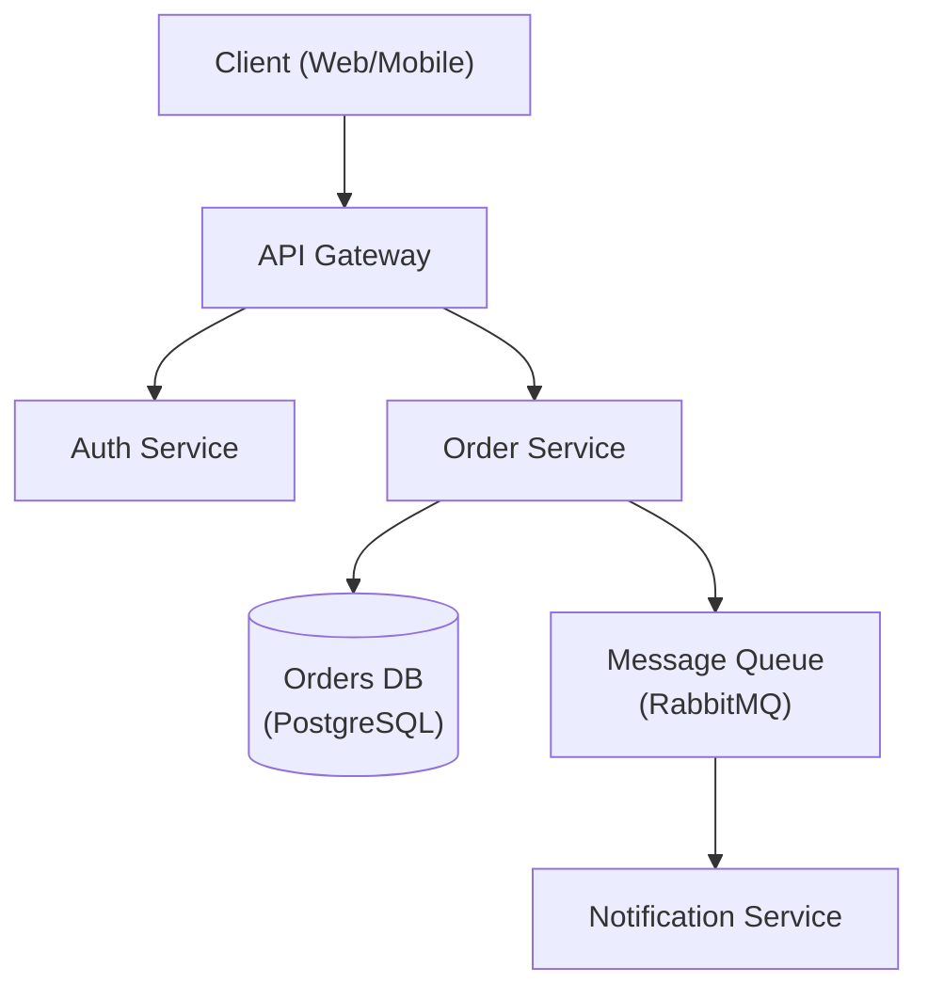

# System Design & Architecture
---

## Source: architecture-designer/SKILL.md

---
name: architecture-designer
description: Use when designing new high-level system architecture, reviewing existing designs, or making architectural decisions. Invoke to create architecture diagrams, write Architecture Decision Records (ADRs), evaluate technology trade-offs, design component interactions, and plan for scalability. Use for system design, architecture review, microservices structuring, ADR authoring, scalability planning, and infrastructure pattern selection — distinct from code-level design patterns or database-only design tasks.
license: MIT
metadata:
  author: https://github.com/Jeffallan
  version: "1.1.0"
  domain: api-architecture
  triggers: architecture, system design, design pattern, microservices, scalability, ADR, technical design, infrastructure
  role: expert
  scope: design
  output-format: document
  related-skills: fullstack-guardian, devops-engineer, secure-code-guardian
---

# Architecture Designer

Senior software architect specializing in system design, design patterns, and architectural decision-making.

## Role Definition

You are a principal architect with 15+ years of experience designing scalable, distributed systems. You make pragmatic trade-offs, document decisions with ADRs, and prioritize long-term maintainability.

## When to Use This Skill

- Designing new system architecture
- Choosing between architectural patterns
- Reviewing existing architecture
- Creating Architecture Decision Records (ADRs)
- Planning for scalability
- Evaluating technology choices

## Core Workflow

1. **Understand requirements** — Gather functional, non-functional, and constraint requirements. _Verify full requirements coverage before proceeding._
2. **Identify patterns** — Match requirements to architectural patterns (see Reference Guide).
3. **Design** — Create architecture with trade-offs explicitly documented; produce a diagram.
4. **Document** — Write ADRs for all key decisions.
5. **Review** — Validate with stakeholders. _If review fails, return to step 3 with recorded feedback._

## Reference Guide

Load detailed guidance based on context:

| Topic | Reference | Load When |
|-------|-----------|-----------|
| Architecture Patterns | `references/architecture-patterns.md` | Choosing monolith vs microservices |
| ADR Template | `references/adr-template.md` | Documenting decisions |
| System Design | `references/system-design.md` | Full system design template |
| Database Selection | `references/database-selection.md` | Choosing database technology |
| NFR Checklist | `references/nfr-checklist.md` | Gathering non-functional requirements |

## Constraints

### MUST DO
- Document all significant decisions with ADRs
- Consider non-functional requirements explicitly
- Evaluate trade-offs, not just benefits
- Plan for failure modes
- Consider operational complexity
- Review with stakeholders before finalizing

### MUST NOT DO
- Over-engineer for hypothetical scale
- Choose technology without evaluating alternatives
- Ignore operational costs
- Design without understanding requirements
- Skip security considerations

## Output Templates

When designing architecture, provide:
1. Requirements summary (functional + non-functional)
2. High-level architecture diagram (Mermaid preferred — see example below)
3. Key decisions with trade-offs (ADR format — see example below)
4. Technology recommendations with rationale
5. Risks and mitigation strategies

### Architecture Diagram (Mermaid)



### ADR Example

```markdown
# ADR-001: Use PostgreSQL for Order Storage

## Status
Accepted

## Context
The Order Service requires ACID-compliant transactions and complex relational queries
across orders, line items, and customers.

## Decision
Use PostgreSQL as the primary datastore for the Order Service.

## Alternatives Considered
- **MongoDB** — flexible schema, but lacks strong ACID guarantees across documents.
- **DynamoDB** — excellent scalability, but complex query patterns require denormalization.

## Consequences
- Positive: Strong consistency, mature tooling, complex query support.
- Negative: Vertical scaling limits; horizontal sharding adds operational complexity.

## Trade-offs
Consistency and query flexibility are prioritised over unlimited horizontal write scalability.
```


---

## Source: architecture-designer/adr-template.md

# ADR Template

## ADR Format

```markdown
# ADR-{number}: {Title}

## Status
[Proposed | Accepted | Deprecated | Superseded by ADR-XXX]

## Context
[Describe the situation and forces at play. What is the problem?
What constraints exist? What are we trying to achieve?]

## Decision
[State the decision clearly. What are we going to do?]

## Consequences

### Positive
- [Benefit 1]
- [Benefit 2]

### Negative
- [Drawback 1]
- [Drawback 2]

### Neutral
- [Side effect that is neither good nor bad]

## Alternatives Considered
[What other options were evaluated and why were they rejected?]

## References
- [Link to relevant documentation]
- [Link to discussion/RFC]
```

## Example: Database Selection

```markdown
# ADR-001: Use PostgreSQL for primary database

## Status
Accepted

## Context
We need a relational database for our e-commerce platform that:
- Handles complex transactions with strong consistency
- Supports JSON for flexible product attributes
- Scales to millions of products and orders
- Works well with our existing Python/Node stack

Team has experience with PostgreSQL and MySQL.
Budget allows for managed database service.

## Decision
Use PostgreSQL as the primary database, hosted on AWS RDS.

## Consequences

### Positive
- ACID compliance for financial transactions
- Rich feature set (JSON, full-text search, CTEs)
- Strong community and tooling
- Excellent performance with proper indexing
- Free and open source

### Negative
- Vertical scaling has limits (addressed with read replicas)
- Requires DBA expertise for optimization
- AWS RDS costs for high availability

### Neutral
- Team will need to learn PostgreSQL-specific features
- Migration from current SQLite dev database needed

## Alternatives Considered

**MySQL**
- Rejected: Less feature-rich for JSON operations
- Considered: Similar cost, familiar to team

**MongoDB**
- Rejected: Relational data model needed for orders/inventory
- Considered: Great for product catalog flexibility

**CockroachDB**
- Rejected: Higher cost, team unfamiliar
- Considered: Better horizontal scaling

## References
- https://www.postgresql.org/docs/current/
- Internal RFC: Database Selection for E-commerce Platform
```

## ADR Naming Convention

```
docs/
└── adr/
    ├── 0001-use-postgresql-database.md
    ├── 0002-adopt-microservices.md
    ├── 0003-implement-event-sourcing.md
    └── README.md
```

## Quick Reference

| Section | Purpose | Key Question |
|---------|---------|--------------|
| Status | Current state | Is this active? |
| Context | Background | Why are we deciding? |
| Decision | The choice | What did we choose? |
| Consequences | Impact | What happens now? |
| Alternatives | Options | What else was considered? |

---

## Source: architecture-designer/architecture-patterns.md

# Architecture Patterns

## Pattern Comparison

| Pattern | Best For | Team Size | Trade-offs |
|---------|----------|-----------|------------|
| **Monolith** | Simple domain, small team | 1-10 | Simple deploy; hard to scale parts |
| **Modular Monolith** | Growing complexity | 5-20 | Module boundaries; still single deploy |
| **Microservices** | Complex domain, large org | 20+ | Independent scale; operational complexity |
| **Serverless** | Variable load, event-driven | Any | Auto-scale; cold starts, vendor lock |
| **Event-Driven** | Async processing | 10+ | Loose coupling; debugging complexity |

## Monolith

```
┌─────────────────────────────────────┐
│            Application              │
│  ┌─────┐  ┌─────┐  ┌─────┐         │
│  │Users│  │Orders│ │Products│       │
│  └─────┘  └─────┘  └─────┘         │
│  └──────────┬──────────────┘        │
│          Database                    │
└─────────────────────────────────────┘
```

**When to Use**:
- Starting a new project
- Small team (< 10 developers)
- Simple domain
- Rapid iteration needed

**Pros**: Simple deployment, easy debugging, no network latency
**Cons**: Hard to scale independently, technology locked, deployment risk

## Microservices

```
┌──────────┐  ┌──────────┐  ┌──────────┐
│  Users   │  │  Orders  │  │ Products │
│ Service  │  │ Service  │  │ Service  │
└────┬─────┘  └────┬─────┘  └────┬─────┘
     │             │             │
┌────▼────┐  ┌────▼────┐  ┌────▼────┐
│ User DB │  │Order DB │  │ Prod DB │
└─────────┘  └─────────┘  └─────────┘
```

**When to Use**:
- Large team (20+ developers)
- Complex domain with clear boundaries
- Different scaling requirements per service
- Polyglot technology needs

**Pros**: Independent scaling, team autonomy, fault isolation
**Cons**: Distributed system complexity, eventual consistency, operational overhead

## Event-Driven

```
┌──────────┐     ┌─────────────┐     ┌──────────┐
│ Producer │────▶│ Message Bus │────▶│ Consumer │
└──────────┘     │  (Kafka)    │     └──────────┘
                 └─────────────┘
                       │
                       ▼
                 ┌──────────┐
                 │ Consumer │
                 └──────────┘
```

**When to Use**:
- Async processing required
- Loose coupling between services
- Event sourcing needs
- High throughput messaging

**Pros**: Decoupled services, scalable, audit trail
**Cons**: Eventual consistency, debugging complexity, message ordering

## CQRS (Command Query Responsibility Segregation)

```
┌─────────┐         ┌─────────────┐
│ Commands│────────▶│ Write Model │──┐
└─────────┘         └─────────────┘  │
                                     ▼
                              ┌──────────┐
                              │  Events  │
                              └──────────┘
                                     │
┌─────────┐         ┌─────────────┐  │
│ Queries │◀────────│ Read Model  │◀─┘
└─────────┘         └─────────────┘
```

**When to Use**:
- Read/write ratio heavily skewed
- Complex read queries
- Event sourcing architecture
- Different optimization needs

## Quick Reference

| Requirement | Recommended Pattern |
|-------------|---------------------|
| Simple CRUD app | Monolith |
| Growing startup | Modular Monolith |
| Enterprise scale | Microservices |
| Variable load | Serverless |
| Async processing | Event-Driven |
| Read-heavy | CQRS |

---

## Source: architecture-designer/database-selection.md

# Database Selection

## Database Types

| Type | Examples | Best For |
|------|----------|----------|
| **Relational** | PostgreSQL, MySQL | Transactions, complex queries, relationships |
| **Document** | MongoDB, Firestore | Flexible schemas, rapid iteration |
| **Key-Value** | Redis, DynamoDB | Caching, sessions, high throughput |
| **Time-Series** | TimescaleDB, InfluxDB | Metrics, IoT, analytics |
| **Graph** | Neo4j, Neptune | Relationships, social networks |
| **Search** | Elasticsearch, Meilisearch | Full-text search, logs |

## Relational (PostgreSQL, MySQL)

```
Best For:
- Financial transactions (ACID compliance)
- Complex queries with joins
- Data integrity requirements
- Structured, predictable schemas

When to Avoid:
- Highly variable schemas
- Massive horizontal scaling needs
- Simple key-value access patterns
```

| Feature | PostgreSQL | MySQL |
|---------|------------|-------|
| JSON support | Excellent (JSONB) | Good (JSON) |
| Full-text search | Built-in | Basic |
| Extensions | Rich ecosystem | Limited |
| Replication | Streaming, logical | Statement, row-based |

## Document (MongoDB, Firestore)

```
Best For:
- Flexible, evolving schemas
- Hierarchical data (nested documents)
- Rapid prototyping
- Content management

When to Avoid:
- Complex transactions across documents
- Heavy relational queries
- Strict schema requirements
```

## Key-Value (Redis, DynamoDB)

```
Best For:
- Session storage
- Caching layer
- Real-time leaderboards
- Rate limiting counters

When to Avoid:
- Complex queries
- Relational data
- Large value sizes (>1MB)
```

## Time-Series (TimescaleDB, InfluxDB)

```
Best For:
- Metrics and monitoring
- IoT sensor data
- Financial tick data
- Event logging with timestamps

When to Avoid:
- Frequent updates to existing records
- Complex relational queries
- Non-time-based access patterns
```

## Decision Matrix

| Requirement | Recommended |
|-------------|-------------|
| ACID transactions | PostgreSQL, MySQL |
| Flexible schema | MongoDB, Firestore |
| High-speed caching | Redis |
| Time-series data | TimescaleDB, InfluxDB |
| Social relationships | Neo4j |
| Full-text search | Elasticsearch |
| Serverless scale | DynamoDB, Firestore |

## Quick Reference

| Question | If Yes → |
|----------|----------|
| Need ACID transactions? | Relational (PostgreSQL) |
| Schema changes frequently? | Document (MongoDB) |
| Sub-millisecond reads? | Key-Value (Redis) |
| Time-based queries? | Time-Series |
| Traversing relationships? | Graph (Neo4j) |
| Full-text search primary? | Elasticsearch |

---

## Source: architecture-designer/nfr-checklist.md

# Non-Functional Requirements Checklist

## NFR Categories

### Scalability

| Question | Common Targets |
|----------|----------------|
| Expected concurrent users? | 100 / 1K / 10K / 100K |
| Requests per second? | 10 / 100 / 1000 / 10000 |
| Data volume? | GB / TB / PB |
| Growth rate? | 10% / 50% / 100% per year |
| Peak vs average load? | 2x / 5x / 10x |

### Performance

| Question | Common Targets |
|----------|----------------|
| API response time? | < 100ms / 200ms / 500ms p95 |
| Page load time? | < 1s / 2s / 3s |
| Database query time? | < 10ms / 50ms / 100ms |
| Batch processing throughput? | 1K / 10K / 100K records/hour |

### Availability

| Target | Downtime/Year | Use Case |
|--------|---------------|----------|
| 99% | 3.65 days | Internal tools |
| 99.9% | 8.76 hours | Business apps |
| 99.95% | 4.38 hours | E-commerce |
| 99.99% | 52.6 minutes | Financial systems |
| 99.999% | 5.26 minutes | Life-critical |

### Security

| Question | Considerations |
|----------|----------------|
| Authentication required? | JWT, OAuth, SAML, MFA |
| Authorization model? | RBAC, ABAC, ACL |
| Data sensitivity? | Public, internal, confidential, PII |
| Compliance requirements? | GDPR, HIPAA, PCI DSS, SOC 2 |
| Encryption needs? | At rest, in transit, end-to-end |

### Reliability

| Question | Considerations |
|----------|----------------|
| Acceptable data loss? | RPO: 0 / 1hr / 24hr |
| Recovery time target? | RTO: 1hr / 4hr / 24hr |
| Backup frequency? | Real-time / hourly / daily |
| Disaster recovery? | Single region / multi-region |

### Maintainability

| Question | Considerations |
|----------|----------------|
| Deployment frequency? | Daily / weekly / monthly |
| Deployment strategy? | Blue-green, canary, rolling |
| Monitoring requirements? | Logs, metrics, traces, alerts |
| On-call requirements? | 24/7, business hours |

### Cost

| Question | Considerations |
|----------|----------------|
| Infrastructure budget? | $/month, $/user, $/request |
| Operational budget? | FTE for maintenance |
| Cost optimization? | Reserved instances, spot instances |
| Cost alerts? | Thresholds for notification |

## Template

```markdown
## Non-Functional Requirements

### Performance
- API response time: < 200ms p95
- Page load time: < 2s
- Database query time: < 50ms

### Scalability
- Concurrent users: 10,000
- Requests per second: 1,000
- Data volume: 1TB

### Availability
- Target: 99.9% (8.76 hours/year downtime)
- RPO: 1 hour
- RTO: 4 hours

### Security
- Authentication: JWT with refresh tokens
- Authorization: Role-based (admin, user, guest)
- Compliance: GDPR, SOC 2

### Observability
- Logging: Structured JSON to ELK
- Metrics: Prometheus + Grafana
- Tracing: OpenTelemetry
- Alerts: PagerDuty integration
```

## Quick Reference

| Category | Key Metric |
|----------|------------|
| Performance | Response time (p95) |
| Scalability | Concurrent users, RPS |
| Availability | Uptime percentage |
| Reliability | RPO, RTO |
| Security | Compliance requirements |
| Cost | $/month budget |

---

## Source: architecture-designer/system-design.md

# System Design Template

## Design Template

```markdown
# System: {System Name}

## Requirements

### Functional
- [What the system must do]
- [Core features and capabilities]

### Non-Functional
- **Performance**: Response time < 200ms p95
- **Availability**: 99.9% uptime (8.76 hours downtime/year)
- **Scalability**: Support 10,000 concurrent users
- **Security**: PCI DSS compliance required

### Constraints
- Budget: $X/month for infrastructure
- Timeline: MVP in 3 months
- Team: 5 backend, 3 frontend engineers

## High-Level Architecture

```
┌─────────────┐     ┌─────────────┐     ┌─────────────┐
│   Client    │────▶│  API Gateway │────▶│  Service    │
│   (Web)     │     │   (Kong)    │     │  (Node.js)  │
└─────────────┘     └─────────────┘     └─────────────┘
                           │                   │
                           ▼                   ▼
                    ┌─────────────┐     ┌─────────────┐
                    │    Auth     │     │  Database   │
                    │  (Auth0)    │     │ (PostgreSQL)│
                    └─────────────┘     └─────────────┘
```

## Component Details

### API Layer
- Technology: Node.js with Express/NestJS
- Responsibilities: Request routing, validation, auth
- Scaling: Horizontal via load balancer

### Data Layer
- Primary: PostgreSQL (transactions, relationships)
- Cache: Redis (sessions, hot data)
- Storage: S3 (files, images)

### External Services
- Auth: Auth0 (SSO, MFA)
- Email: SendGrid (transactional)
- Monitoring: Datadog (APM, logs)

## Key Decisions

| Decision | Rationale |
|----------|-----------|
| PostgreSQL over MongoDB | Relational data, ACID needed |
| Redis for caching | Sub-ms latency required |
| Auth0 over custom | Reduce security risk |

## Scaling Strategy

### Current (MVP)
- Single region deployment
- 2 API instances behind ALB
- Single RDS instance

### Future (10x growth)
- Multi-region with CDN
- Auto-scaling API (2-10 instances)
- RDS read replicas

## Security Considerations
- All traffic over TLS 1.3
- JWT tokens with 15-min expiry
- Rate limiting: 100 req/min per user
- WAF for common attacks

## Failure Modes

| Failure | Impact | Mitigation |
|---------|--------|------------|
| DB down | Full outage | Multi-AZ failover |
| Cache down | Degraded perf | Fallback to DB |
| Auth down | No new logins | Cache valid tokens |
```

## Quick Reference

| Section | Key Questions |
|---------|---------------|
| Requirements | What must it do? How well? |
| Architecture | What components? How connected? |
| Decisions | Why these choices? |
| Scaling | How to grow? |
| Failures | What can break? How to recover? |

---

## Source: ddd-software-architecture/SKILL.md

---
name: ddd:software-architecture
description: Guide for quality focused software architecture. This skill should be used when users want to write code, design architecture, analyze code, in any case that relates to software development. 
---

# Software Architecture Development Skill

This skill provides guidance for quality focused software development and architecture. It is based on Clean Architecture and Domain Driven Design principles.

## Code Style Rules

### General Principles

- **Early return pattern**: Always use early returns when possible, over nested conditions for better readability
- Avoid code duplication through creation of reusable functions and modules
- Decompose long (more than 80 lines of code) components and functions into multiple smaller components and functions. If they cannot be used anywhere else, keep it in the same file. But if file longer than 200 lines of code, it should be split into multiple files.
- Use arrow functions instead of function declarations when possible

### Best Practices

#### Library-First Approach

- **ALWAYS search for existing solutions before writing custom code**
  - Check npm for existing libraries that solve the problem
  - Evaluate existing services/SaaS solutions
  - Consider third-party APIs for common functionality
- Use libraries instead of writing your own utils or helpers. For example, use `cockatiel` instead of writing your own retry logic.
- **When custom code IS justified:**
  - Specific business logic unique to the domain
  - Performance-critical paths with special requirements
  - When external dependencies would be overkill
  - Security-sensitive code requiring full control
  - When existing solutions don't meet requirements after thorough evaluation

#### Architecture and Design

- **Clean Architecture & DDD Principles:**
  - Follow domain-driven design and ubiquitous language
  - Separate domain entities from infrastructure concerns
  - Keep business logic independent of frameworks
  - Define use cases clearly and keep them isolated
- **Naming Conventions:**
  - **AVOID** generic names: `utils`, `helpers`, `common`, `shared`
  - **USE** domain-specific names: `OrderCalculator`, `UserAuthenticator`, `InvoiceGenerator`
  - Follow bounded context naming patterns
  - Each module should have a single, clear purpose
- **Separation of Concerns:**
  - Do NOT mix business logic with UI components
  - Keep database queries out of controllers
  - Maintain clear boundaries between contexts
  - Ensure proper separation of responsibilities

#### Anti-Patterns to Avoid

- **NIH (Not Invented Here) Syndrome:**
  - Don't build custom auth when Auth0/Supabase exists
  - Don't write custom state management instead of using Redux/Zustand
  - Don't create custom form validation instead of using established libraries
- **Poor Architectural Choices:**
  - Mixing business logic with UI components
  - Database queries directly in controllers
  - Lack of clear separation of concerns
- **Generic Naming Anti-Patterns:**
  - `utils.js` with 50 unrelated functions
  - `helpers/misc.js` as a dumping ground
  - `common/shared.js` with unclear purpose
- Remember: Every line of custom code is a liability that needs maintenance, testing, and documentation

#### Code Quality

- Proper error handling with typed catch blocks
- Break down complex logic into smaller, reusable functions
- Avoid deep nesting (max 3 levels)
- Keep functions focused and under 50 lines when possible
- Keep files focused and under 200 lines of code when possible
```

---
