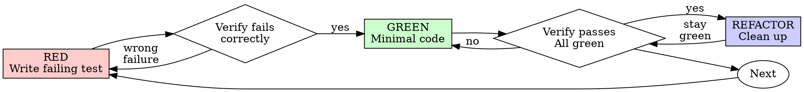

# TDD Methodology
> Consolidated from tdd-workflow, tdd-fix-tests, tdd-test-driven-development, tdd-write-tests, test-driven-development. Zero-value-loss.
---

## Source: tdd-workflow


# Test-Driven Development Workflow

This skill ensures all code development follows TDD principles with comprehensive test coverage.

## When to Activate

- Writing new features or functionality
- Fixing bugs or issues
- Refactoring existing code
- Adding API endpoints
- Creating new components

## Core Principles

### 1. Tests BEFORE Code
ALWAYS write tests first, then implement code to make tests pass.

### 2. Coverage Requirements
- Minimum 80% coverage (unit + integration + E2E)
- All edge cases covered
- Error scenarios tested
- Boundary conditions verified

### 3. Test Types

#### Unit Tests
- Individual functions and utilities
- Component logic
- Pure functions
- Helpers and utilities

#### Integration Tests
- API endpoints
- Database operations
- Service interactions
- External API calls

#### E2E Tests (Playwright)
- Critical user flows
- Complete workflows
- Browser automation
- UI interactions

## TDD Workflow Steps

### Step 1: Write User Journeys
```
As a [role], I want to [action], so that [benefit]

Example:
As a user, I want to search for markets semantically,
so that I can find relevant markets even without exact keywords.
```

### Step 2: Generate Test Cases
For each user journey, create comprehensive test cases:

```typescript
describe('Semantic Search', () => {
  it('returns relevant markets for query', async () => {
    // Test implementation
  })

  it('handles empty query gracefully', async () => {
    // Test edge case
  })

  it('falls back to substring search when Redis unavailable', async () => {
    // Test fallback behavior
  })

  it('sorts results by similarity score', async () => {
    // Test sorting logic
  })
})
```

### Step 3: Run Tests (They Should Fail)
```bash
npm test
# Tests should fail - we haven't implemented yet
```

### Step 4: Implement Code
Write minimal code to make tests pass:

```typescript
// Implementation guided by tests
export async function searchMarkets(query: string) {
  // Implementation here
}
```

### Step 5: Run Tests Again
```bash
npm test
# Tests should now pass
```

### Step 6: Refactor
Improve code quality while keeping tests green:
- Remove duplication
- Improve naming
- Optimize performance
- Enhance readability

### Step 7: Verify Coverage
```bash
npm run test:coverage
# Verify 80%+ coverage achieved
```

## Testing Patterns

### Unit Test Pattern (Jest/Vitest)
```typescript
import { render, screen, fireEvent } from '@testing-library/react'
import { Button } from './Button'

describe('Button Component', () => {
  it('renders with correct text', () => {
    render(<Button>Click me</Button>)
    expect(screen.getByText('Click me')).toBeInTheDocument()
  })

  it('calls onClick when clicked', () => {
    const handleClick = jest.fn()
    render(<Button onClick={handleClick}>Click</Button>)

    fireEvent.click(screen.getByRole('button'))

    expect(handleClick).toHaveBeenCalledTimes(1)
  })

  it('is disabled when disabled prop is true', () => {
    render(<Button disabled>Click</Button>)
    expect(screen.getByRole('button')).toBeDisabled()
  })
})
```

### API Integration Test Pattern
```typescript
import { NextRequest } from 'next/server'
import { GET } from './route'

describe('GET /api/markets', () => {
  it('returns markets successfully', async () => {
    const request = new NextRequest('http://localhost/api/markets')
    const response = await GET(request)
    const data = await response.json()

    expect(response.status).toBe(200)
    expect(data.success).toBe(true)
    expect(Array.isArray(data.data)).toBe(true)
  })

  it('validates query parameters', async () => {
    const request = new NextRequest('http://localhost/api/markets?limit=invalid')
    const response = await GET(request)

    expect(response.status).toBe(400)
  })

  it('handles database errors gracefully', async () => {
    // Mock database failure
    const request = new NextRequest('http://localhost/api/markets')
    // Test error handling
  })
})
```

### E2E Test Pattern (Playwright)
```typescript
import { test, expect } from '@playwright/test'

test('user can search and filter markets', async ({ page }) => {
  // Navigate to markets page
  await page.goto('/')
  await page.click('a[href="/markets"]')

  // Verify page loaded
  await expect(page.locator('h1')).toContainText('Markets')

  // Search for markets
  await page.fill('input[placeholder="Search markets"]', 'election')

  // Wait for debounce and results
  await page.waitForTimeout(600)

  // Verify search results displayed
  const results = page.locator('[data-testid="market-card"]')
  await expect(results).toHaveCount(5, { timeout: 5000 })

  // Verify results contain search term
  const firstResult = results.first()
  await expect(firstResult).toContainText('election', { ignoreCase: true })

  // Filter by status
  await page.click('button:has-text("Active")')

  // Verify filtered results
  await expect(results).toHaveCount(3)
})

test('user can create a new market', async ({ page }) => {
  // Login first
  await page.goto('/creator-dashboard')

  // Fill market creation form
  await page.fill('input[name="name"]', 'Test Market')
  await page.fill('textarea[name="description"]', 'Test description')
  await page.fill('input[name="endDate"]', '2025-12-31')

  // Submit form
  await page.click('button[type="submit"]')

  // Verify success message
  await expect(page.locator('text=Market created successfully')).toBeVisible()

  // Verify redirect to market page
  await expect(page).toHaveURL(/\/markets\/test-market/)
})
```

## Test File Organization

```
src/
├── components/
│   ├── Button/
│   │   ├── Button.tsx
│   │   ├── Button.test.tsx          # Unit tests
│   │   └── Button.stories.tsx       # Storybook
│   └── MarketCard/
│       ├── MarketCard.tsx
│       └── MarketCard.test.tsx
├── app/
│   └── api/
│       └── markets/
│           ├── route.ts
│           └── route.test.ts         # Integration tests
└── e2e/
    ├── markets.spec.ts               # E2E tests
    ├── trading.spec.ts
    └── auth.spec.ts
```

## Mocking External Services

### Supabase Mock
```typescript
jest.mock('@/lib/supabase', () => ({
  supabase: {
    from: jest.fn(() => ({
      select: jest.fn(() => ({
        eq: jest.fn(() => Promise.resolve({
          data: [{ id: 1, name: 'Test Market' }],
          error: null
        }))
      }))
    }))
  }
}))
```

### Redis Mock
```typescript
jest.mock('@/lib/redis', () => ({
  searchMarketsByVector: jest.fn(() => Promise.resolve([
    { slug: 'test-market', similarity_score: 0.95 }
  ])),
  checkRedisHealth: jest.fn(() => Promise.resolve({ connected: true }))
}))
```

### OpenAI Mock
```typescript
jest.mock('@/lib/openai', () => ({
  generateEmbedding: jest.fn(() => Promise.resolve(
    new Array(1536).fill(0.1) // Mock 1536-dim embedding
  ))
}))
```

## Test Coverage Verification

### Run Coverage Report
```bash
npm run test:coverage
```

### Coverage Thresholds
```json
{
  "jest": {
    "coverageThresholds": {
      "global": {
        "branches": 80,
        "functions": 80,
        "lines": 80,
        "statements": 80
      }
    }
  }
}
```

## Common Testing Mistakes to Avoid

### ❌ WRONG: Testing Implementation Details
```typescript
// Don't test internal state
expect(component.state.count).toBe(5)
```

### ✅ CORRECT: Test User-Visible Behavior
```typescript
// Test what users see
expect(screen.getByText('Count: 5')).toBeInTheDocument()
```

### ❌ WRONG: Brittle Selectors
```typescript
// Breaks easily
await page.click('.css-class-xyz')
```

### ✅ CORRECT: Semantic Selectors
```typescript
// Resilient to changes
await page.click('button:has-text("Submit")')
await page.click('[data-testid="submit-button"]')
```

### ❌ WRONG: No Test Isolation
```typescript
// Tests depend on each other
test('creates user', () => { /* ... */ })
test('updates same user', () => { /* depends on previous test */ })
```

### ✅ CORRECT: Independent Tests
```typescript
// Each test sets up its own data
test('creates user', () => {
  const user = createTestUser()
  // Test logic
})

test('updates user', () => {
  const user = createTestUser()
  // Update logic
})
```

## Continuous Testing

### Watch Mode During Development
```bash
npm test -- --watch
# Tests run automatically on file changes
```

### Pre-Commit Hook
```bash
# Runs before every commit
npm test && npm run lint
```

### CI/CD Integration
```yaml
# GitHub Actions
- name: Run Tests
  run: npm test -- --coverage
- name: Upload Coverage
  uses: codecov/codecov-action@v3
```

## Best Practices

1. **Write Tests First** - Always TDD
2. **One Assert Per Test** - Focus on single behavior
3. **Descriptive Test Names** - Explain what's tested
4. **Arrange-Act-Assert** - Clear test structure
5. **Mock External Dependencies** - Isolate unit tests
6. **Test Edge Cases** - Null, undefined, empty, large
7. **Test Error Paths** - Not just happy paths
8. **Keep Tests Fast** - Unit tests < 50ms each
9. **Clean Up After Tests** - No side effects
10. **Review Coverage Reports** - Identify gaps

## Success Metrics

- 80%+ code coverage achieved
- All tests passing (green)
- No skipped or disabled tests
- Fast test execution (< 30s for unit tests)
- E2E tests cover critical user flows
- Tests catch bugs before production

---

## Source: tdd-fix-tests


# Fix Tests

## User Arguments

User can provide to focus on specific tests or modules:

```
$ARGUMENTS
```

If nothing is provided, focus on all tests.

## Context

After business logic changes, refactoring, or dependency updates, tests may fail because they no longer match the current behavior or implementation. This command orchestrates automated fixing of all failing tests using specialized agents.

## Goal

Fix all failing tests to match current business logic and implementation.

## Important Constraints

- **Focus on fixing tests** - avoid changing business logic unless absolutely necessary
- **Preserve test intent** - ensure tests still validate the expected behavior
- "Analyse complexity of changes" - 
  - if there 2 or more changed files, or one file with complex logic, then **Do not write tests yourself** - only orchestrate agents!
  - if there is only one changed file, and it's a simple change, then you can write tests yourself.

## Workflow Steps

### Preparation

1. **Read sadd skill if available**
   - If available, read the sadd skill to understand best practices for managing agents

2. **Discover test infrastructure**
   - Read @README.md and package.json (or equivalent project config)
   - Identify commands to run tests and coverage reports
   - Understand project structure and testing conventions

3. **Run all tests**
   - Execute full test suite to establish baseline

4. **Identify all failing test files**
   - Parse test output to get list of failing test files
   - Group by file for parallel agent execution

### Analysis

5. **Verify single test execution**
   - Choose any test file
   - Launch haiku agent with instructions to find proper command to run this only test file
     - Ask him to iterate until you can reliably run individual tests
   - After he complete try running a specific test file if it exists
   - This ensures agents can run tests in isolation

### Test Fixing

6. **Launch `developer` agents (parallel)**
   - Launch one agent per failing test file
   - Provide each agent with clear instructions:
     * **Context**: Why this test needs fixing (business logic changed)
     * **Target**: Which specific file to fix
     * **Guidance**: Read TDD skill (if available) for best practices how to write tests.
     * **Resources**: Read README and relevant documentation
     * **Command**: How to run this specific test file
     * **Goal**: Iterate until test passes
     * **Constraint**: Fix test, not business logic (unless clearly broken)

7. **Verify all fixes**
   - After all agents complete, run full test suite again
   - Verify all tests pass

8. **Iterate if needed**
   - If any tests still fail: Return to step 5
   - Launch new agents only for remaining failures
   - Continue until 100% pass rate

## Success Criteria

- All tests pass ✅
- Test coverage maintained
- Test intent preserved
- Business logic unchanged (unless bugs found)

## Agent Instructions Template

When launching agents, use this template:

```
The business logic has changed and test file {FILE_PATH} is now failing.

Your task:
1. Read the test file and understand what it's testing
2. Read TDD skill (if available) for best practices on writing tests.
3. Read @README.md for project context
4. Run the test: {TEST_COMMAND}
5. Analyze the failure - is it:
   - Test expectations outdated? → Fix test assertions
   - Test setup broken? → Fix test setup/mocks
   - Business logic bug? → Fix logic (rare case)
6. Fix the test and verify it passes
7. Iterate until test passes
```
---

## Source: tdd-test-driven-development


# Test-Driven Development (TDD)

## Overview

Write the test first. Watch it fail. Write minimal code to pass.

**Core principle:** If you didn't watch the test fail, you don't know if it tests the right thing.

**Violating the letter of the rules is violating the spirit of the rules.**

## When to Use

**Always:**

- New features
- Bug fixes
- Refactoring
- Behavior changes

**Exceptions (ask your human partner):**

- Throwaway prototypes
- Generated code
- Configuration files

Thinking "skip TDD just this once"? Stop. That's rationalization.

## The Iron Law

```
NO PRODUCTION CODE WITHOUT A FAILING TEST FIRST
```

Write code before the test? Delete it. Start over.

**No exceptions:**

- Don't keep it as "reference"
- Don't "adapt" it while writing tests
- Don't look at it
- Delete means delete

Implement fresh from tests. Period.

## Red-Green-Refactor



### RED - Write Failing Test

Write one minimal test showing what should happen.

<Good>
```typescript
test('retries failed operations 3 times', async () => {
  let attempts = 0;
  const operation = () => {
    attempts++;
    if (attempts < 3) throw new Error('fail');
    return 'success';
  };

  const result = await retryOperation(operation);

  expect(result).toBe('success');
  expect(attempts).toBe(3);
});

```
Clear name, tests real behavior, one thing
</Good>

<Bad>
```typescript
test('retry works', async () => {
  const mock = jest.fn()
    .mockRejectedValueOnce(new Error())
    .mockRejectedValueOnce(new Error())
    .mockResolvedValueOnce('success');
  await retryOperation(mock);
  expect(mock).toHaveBeenCalledTimes(3);
});
```

Vague name, tests mock not code
</Bad>

**Requirements:**

- One behavior
- Clear name
- Real code (no mocks unless unavoidable)

### Verify RED - Watch It Fail

**MANDATORY. Never skip.**

```bash
npm test path/to/test.test.ts
```

Confirm:

- Test fails (not errors)
- Failure message is expected
- Fails because feature missing (not typos)

**Test passes?** You're testing existing behavior. Fix test.

**Test errors?** Fix error, re-run until it fails correctly.

### GREEN - Minimal Code

Write simplest code to pass the test.

<Good>
```typescript
async function retryOperation<T>(fn: () => Promise<T>): Promise<T> {
  for (let i = 0; i < 3; i++) {
    try {
      return await fn();
    } catch (e) {
      if (i === 2) throw e;
    }
  }
  throw new Error('unreachable');
}
```
Just enough to pass
</Good>

<Bad>
```typescript
async function retryOperation<T>(
  fn: () => Promise<T>,
  options?: {
    maxRetries?: number;
    backoff?: 'linear' | 'exponential';
    onRetry?: (attempt: number) => void;
  }
): Promise<T> {
  // YAGNI
}
```
Over-engineered
</Bad>

Don't add features, refactor other code, or "improve" beyond the test.

### Verify GREEN - Watch It Pass

**MANDATORY.**

```bash
npm test path/to/test.test.ts
```

Confirm:

- Test passes
- Other tests still pass
- Output pristine (no errors, warnings)

**Test fails?** Fix code, not test.

**Other tests fail?** Fix now.

### REFACTOR - Clean Up

After green only:

- Remove duplication
- Improve names
- Extract helpers

Keep tests green. Don't add behavior.

### Repeat

Next failing test for next feature.

## Good Tests

| Quality | Good | Bad |
|---------|------|-----|
| **Minimal** | One thing. "and" in name? Split it. | `test('validates email and domain and whitespace')` |
| **Clear** | Name describes behavior | `test('test1')` |
| **Shows intent** | Demonstrates desired API | Obscures what code should do |

## Why Order Matters

**"I'll write tests after to verify it works"**

Tests written after code pass immediately. Passing immediately proves nothing:

- Might test wrong thing
- Might test implementation, not behavior
- Might miss edge cases you forgot
- You never saw it catch the bug

Test-first forces you to see the test fail, proving it actually tests something.

**"I already manually tested all the edge cases"**

Manual testing is ad-hoc. You think you tested everything but:

- No record of what you tested
- Can't re-run when code changes
- Easy to forget cases under pressure
- "It worked when I tried it" ≠ comprehensive

Automated tests are systematic. They run the same way every time.

**"Deleting X hours of work is wasteful"**

Sunk cost fallacy. The time is already gone. Your choice now:

- Delete and rewrite with TDD (X more hours, high confidence)
- Keep it and add tests after (30 min, low confidence, likely bugs)

The "waste" is keeping code you can't trust. Working code without real tests is technical debt.

**"TDD is dogmatic, being pragmatic means adapting"**

TDD IS pragmatic:

- Finds bugs before commit (faster than debugging after)
- Prevents regressions (tests catch breaks immediately)
- Documents behavior (tests show how to use code)
- Enables refactoring (change freely, tests catch breaks)

"Pragmatic" shortcuts = debugging in production = slower.

**"Tests after achieve the same goals - it's spirit not ritual"**

No. Tests-after answer "What does this do?" Tests-first answer "What should this do?"

Tests-after are biased by your implementation. You test what you built, not what's required. You verify remembered edge cases, not discovered ones.

Tests-first force edge case discovery before implementing. Tests-after verify you remembered everything (you didn't).

30 minutes of tests after ≠ TDD. You get coverage, lose proof tests work.

## Common Rationalizations

| Excuse | Reality |
|--------|---------|
| "Too simple to test" | Simple code breaks. Test takes 30 seconds. |
| "I'll test after" | Tests passing immediately prove nothing. |
| "Tests after achieve same goals" | Tests-after = "what does this do?" Tests-first = "what should this do?" |
| "Already manually tested" | Ad-hoc ≠ systematic. No record, can't re-run. |
| "Deleting X hours is wasteful" | Sunk cost fallacy. Keeping unverified code is technical debt. |
| "Keep as reference, write tests first" | You'll adapt it. That's testing after. Delete means delete. |
| "Need to explore first" | Fine. Throw away exploration, start with TDD. |
| "Test hard = design unclear" | Listen to test. Hard to test = hard to use. |
| "TDD will slow me down" | TDD faster than debugging. Pragmatic = test-first. |
| "Manual test faster" | Manual doesn't prove edge cases. You'll re-test every change. |
| "Existing code has no tests" | You're improving it. Add tests for existing code. |

## Red Flags - STOP and Start Over

- Code before test
- Test after implementation
- Test passes immediately
- Can't explain why test failed
- Tests added "later"
- Rationalizing "just this once"
- "I already manually tested it"
- "Tests after achieve the same purpose"
- "It's about spirit not ritual"
- "Keep as reference" or "adapt existing code"
- "Already spent X hours, deleting is wasteful"
- "TDD is dogmatic, I'm being pragmatic"
- "This is different because..."

**All of these mean: Delete code. Start over with TDD.**

## Example: Bug Fix

**Bug:** Empty email accepted

**RED**

```typescript
test('rejects empty email', async () => {
  const result = await submitForm({ email: '' });
  expect(result.error).toBe('Email required');
});
```

**Verify RED**

```bash
$ npm test
FAIL: expected 'Email required', got undefined
```

**GREEN**

```typescript
function submitForm(data: FormData) {
  if (!data.email?.trim()) {
    return { error: 'Email required' };
  }
  // ...
}
```

**Verify GREEN**

```bash
$ npm test
PASS
```

**REFACTOR**
Extract validation for multiple fields if needed.

## Verification Checklist

Before marking work complete:

- [ ] Every new function/method has a test
- [ ] Watched each test fail before implementing
- [ ] Each test failed for expected reason (feature missing, not typo)
- [ ] Wrote minimal code to pass each test
- [ ] All tests pass
- [ ] Output pristine (no errors, warnings)
- [ ] Tests use real code (mocks only if unavoidable)
- [ ] Edge cases and errors covered

Can't check all boxes? You skipped TDD. Start over.

## When Stuck

| Problem | Solution |
|---------|----------|
| Don't know how to test | Write wished-for API. Write assertion first. Ask your human partner. |
| Test too complicated | Design too complicated. Simplify interface. |
| Must mock everything | Code too coupled. Use dependency injection. |
| Test setup huge | Extract helpers. Still complex? Simplify design. |

## Debugging Integration

Bug found? Write failing test reproducing it. Follow TDD cycle. Test proves fix and prevents regression.

Never fix bugs without a test.

## Final Rule

```
Production code → test exists and failed first
Otherwise → not TDD
```

No exceptions without your human partner's permission.

---

## Source: tdd-write-tests


# Cover Local Changes with Tests

## User Arguments

User can provide a what tests or modules to focus on:

```
$ARGUMENTS
```

If nothing is provided, focus on all changes in current git diff that not commited. If everything is commited, then will cover latest commit.

## Context

After implementing new features or refactoring existing code, it's critical to ensure all business logic changes are covered by tests. This command orchestrates automated test creation for local changes using coverage analysis and specialized agents.

## Goal

Achieve comprehensive test coverage for all critical business logic in local code changes.

## Important Constraints

- **Focus on critical business logic** - not every line needs 100% coverage
- **Preserve existing tests** - only add new tests, don't modify existing ones
- "Analyse complexity of changes" - 
  - if there 2 or more changed files, or one file with complex logic, then **Do not write tests yourself** - only orchestrate agents!
  - if there is only one changed file, and it's a simple change, then you can write tests yourself.

## Workflow Steps

### Preparation

1. **Read sadd skill if available**
   - If available, read the sadd skill to understand best practices for managing agents

2. **Discover test infrastructure**
   - Read @README.md and package.json (or equivalent project config)
   - Identify commands to run tests and coverage reports
   - Understand project structure and testing conventions

3. **Run all tests**
   - Execute full test suite to establish baseline

### Analysis

Do steps 4-5 in parallel using haiku agents:

4. **Verify single test execution**
   - Choose any passing test file
   - Launch haiku agent with instructions to find proper command to run this only test file
     - Ask him to iterate until you can reliably run individual tests
   - After he complete try running a specific test file if it exists
   - This ensures agents can run tests in isolation

5. **Analyze local changes**
   - Run `git status -u` to identify all changed files (including untracked files)
     - If there no uncommited changes, then run `git show --name-status` to get the list of files that were changed in the latest commit.
   - Filter out non-code files (docs, configs, etc.)
   - Launch separate haikue agent per changed file to analyze file itself, and the complexity of the changes, and prepare short summary of it.
   - Extract list of files with actual logic changes

### Test Writing

#### Simple Single File Flow

If there is only one changed file, and it's a simple change, then you can write tests yourself. Following this guidline:

1. Read TDD skill for best practices on writing tests
2. Read the target file {FILE_PATH} and understand the logic
3. Review existing test files for patterns and style, if not exists then create it.
4. Analyse which tests cases should be added to cover the changes.
5.  Create comprehensive tests for all identified cases
6.  Run the test command identified before.
7.  Iterate and fix any issues until all tests pass

Ensure tests are:
  - Clear and maintainable
  - Follow project conventions
  - Test behavior, not implementation
  - Cover edge cases and error paths

#### Multiple Files or Complex File Flow

If there are multiple changed files, or one file with complex logic, then you need to use specialized agents to cover the changes. Following this guidline:

6. **Launch `code-review:test-coverage-reviewer` agents (parallel)** (Sonnet or Opus models)
   - Launch one coverage-reviewer agent per changed file
   - Provide each agent with:
     - **Context**: What changed in this file (git diff)
     - **Target**: Which specific file to analyze
     - **Resources**: Read README and relevant documentation
     - **Goal**: Identify what test suites need to be added
     - **Output**: List of test cases needed for critical business logic
   - Collect all coverage review reports

7. **Launch `developer` agents for test file (parallel)** (Sonnet or Opus models)
   - Launch one developer agent per changed file that needs tests
   - Provide each agent with:
     - **Context**: Coverage review report for this file
     - **Target**: Which specific file to create tests for
     - **Test cases**: List from coverage-reviewer agent
     - **Guidance**: Read TDD skill (if available) for best practices on writing tests.
     - **Resources**: Read README and test examples
     - **Command**: How to run tests for this file
     - **Goal**: Create comprehensive tests for all identified cases
     - **Constraint**: Add new tests, don't modify existing logic (unless clearly broken)

8. **Verify coverage (iteration)** (Sonnet or Opus models)
   - Launch `code-review:test-coverage-reviewer` agents again per file
   - Provide:
     - **Context**: Original changes + new tests added
     - **Goal**: Verify all critical business logic is covered
     - **Output**: Confirmation or list of missing coverage

9.  **Iterate if needed**
   - If any files still lack coverage: Return to step 5
   - Launch new developer agents only for files with gaps
   - Provide specific instructions on what's still missing
   - Continue until all critical business logic is covered

10.  **Final verification**

- Run full test suite to ensure all tests pass
- Generate coverage report if available
- Verify no regressions in existing tests

## Success Criteria

- All critical business logic in changed files has test coverage ✅
- All tests pass (new and existing) ✅
- Test quality verified by coverage-reviewer agents ✅

## Agent Instructions Templates

### Coverage Review Agent (Initial Analysis)

```
Analyze the file {FILE_PATH} for test coverage needs.

Context: This file was modified in local changes:
{GIT_DIFF_OUTPUT}

Your task:
1. Read the changed file and understand the business logic
2. Identify all critical code paths that need testing:
   - New functions/methods added
   - Modified business logic
   - Edge cases and error handling
   - Integration points
3. Review existing tests (if any) to avoid duplication
4. Create a list of test cases needed, prioritized by importance:
   - CRITICAL: Core business logic, data mutations
   - IMPORTANT: Error handling, validations
   - NICE_TO_HAVE: Edge cases, performance

Output format:
- List of test cases with descriptions
- Priority level for each
- Suggested test file location
```

### Developer Agent (Test Creation)

```
Create tests for file {FILE_PATH} based on coverage analysis.

Coverage review identified these test cases:
{TEST_CASES_LIST}

Your task:
1. Read TDD skill (if available) for best practices on writing tests
2. Read @README.md for project context and testing conventions
3. Read the target file {FILE_PATH} and understand the logic
4. Review existing test files for patterns and style
5. Create comprehensive tests for all identified cases
6. Run the tests: {TEST_COMMAND}
7. Iterate until all tests pass
8. Ensure tests are:
   - Clear and maintainable
   - Follow project conventions
   - Test behavior, not implementation
   - Cover edge cases and error paths

Test command: {TEST_COMMAND}
```

### Coverage Review Agent (Verification)

```
Verify test coverage for file {FILE_PATH}.

Context: Tests were added to cover local changes in this file.

Your task:
1. Read the changed file {FILE_PATH}
2. Read the new test file(s) created
3. Verify all critical business logic is covered:
   - All new functions have tests
   - All modified logic has tests
   - Edge cases are tested
   - Error handling is tested
4. Identify any gaps in coverage
5. Confirm test quality (clear, maintainable, follows TDD principles)

Output:
- PASS: All critical business logic is covered ✅
- GAPS: List specific missing test cases that need to be added
```
---

## Source: test-driven-development


# Test-Driven Development (TDD)

## Overview

Write the test first. Watch it fail. Write minimal code to pass.

**Core principle:** If you didn't watch the test fail, you don't know if it tests the right thing.

**Violating the letter of the rules is violating the spirit of the rules.**

## When to Use

**Always:**
- New features
- Bug fixes
- Refactoring
- Behavior changes

**Exceptions (ask your human partner):**
- Throwaway prototypes
- Generated code
- Configuration files

Thinking "skip TDD just this once"? Stop. That's rationalization.

## The Iron Law

```
NO PRODUCTION CODE WITHOUT A FAILING TEST FIRST
```

Write code before the test? Delete it. Start over.

**No exceptions:**
- Don't keep it as "reference"
- Don't "adapt" it while writing tests
- Don't look at it
- Delete means delete

Implement fresh from tests. Period.

## Red-Green-Refactor


### RED - Write Failing Test

Write one minimal test showing what should happen.

<Good>
```typescript
test('retries failed operations 3 times', async () => {
  let attempts = 0;
  const operation = () => {
    attempts++;
    if (attempts < 3) throw new Error('fail');
    return 'success';
  };

  const result = await retryOperation(operation);

  expect(result).toBe('success');
  expect(attempts).toBe(3);
});
```
Clear name, tests real behavior, one thing
</Good>

<Bad>
```typescript
test('retry works', async () => {
  const mock = jest.fn()
    .mockRejectedValueOnce(new Error())
    .mockRejectedValueOnce(new Error())
    .mockResolvedValueOnce('success');
  await retryOperation(mock);
  expect(mock).toHaveBeenCalledTimes(3);
});
```
Vague name, tests mock not code
</Bad>

**Requirements:**
- One behavior
- Clear name
- Real code (no mocks unless unavoidable)

### Verify RED - Watch It Fail

**MANDATORY. Never skip.**

```bash
npm test path/to/test.test.ts
```

Confirm:
- Test fails (not errors)
- Failure message is expected
- Fails because feature missing (not typos)

**Test passes?** You're testing existing behavior. Fix test.

**Test errors?** Fix error, re-run until it fails correctly.

### GREEN - Minimal Code

Write simplest code to pass the test.

<Good>
```typescript
async function retryOperation<T>(fn: () => Promise<T>): Promise<T> {
  for (let i = 0; i < 3; i++) {
    try {
      return await fn();
    } catch (e) {
      if (i === 2) throw e;
    }
  }
  throw new Error('unreachable');
}
```
Just enough to pass
</Good>

<Bad>
```typescript
async function retryOperation<T>(
  fn: () => Promise<T>,
  options?: {
    maxRetries?: number;
    backoff?: 'linear' | 'exponential';
    onRetry?: (attempt: number) => void;
  }
): Promise<T> {
  // YAGNI
}
```
Over-engineered
</Bad>

Don't add features, refactor other code, or "improve" beyond the test.

### Verify GREEN - Watch It Pass

**MANDATORY.**

```bash
npm test path/to/test.test.ts
```

Confirm:
- Test passes
- Other tests still pass
- Output pristine (no errors, warnings)

**Test fails?** Fix code, not test.

**Other tests fail?** Fix now.

### REFACTOR - Clean Up

After green only:
- Remove duplication
- Improve names
- Extract helpers

Keep tests green. Don't add behavior.

### Repeat

Next failing test for next feature.

## Good Tests

| Quality | Good | Bad |
|---------|------|-----|
| **Minimal** | One thing. "and" in name? Split it. | `test('validates email and domain and whitespace')` |
| **Clear** | Name describes behavior | `test('test1')` |
| **Shows intent** | Demonstrates desired API | Obscures what code should do |

## Why Order Matters

**"I'll write tests after to verify it works"**

Tests written after code pass immediately. Passing immediately proves nothing:
- Might test wrong thing
- Might test implementation, not behavior
- Might miss edge cases you forgot
- You never saw it catch the bug

Test-first forces you to see the test fail, proving it actually tests something.

**"I already manually tested all the edge cases"**

Manual testing is ad-hoc. You think you tested everything but:
- No record of what you tested
- Can't re-run when code changes
- Easy to forget cases under pressure
- "It worked when I tried it" ≠ comprehensive

Automated tests are systematic. They run the same way every time.

**"Deleting X hours of work is wasteful"**

Sunk cost fallacy. The time is already gone. Your choice now:
- Delete and rewrite with TDD (X more hours, high confidence)
- Keep it and add tests after (30 min, low confidence, likely bugs)

The "waste" is keeping code you can't trust. Working code without real tests is technical debt.

**"TDD is dogmatic, being pragmatic means adapting"**

TDD IS pragmatic:
- Finds bugs before commit (faster than debugging after)
- Prevents regressions (tests catch breaks immediately)
- Documents behavior (tests show how to use code)
- Enables refactoring (change freely, tests catch breaks)

"Pragmatic" shortcuts = debugging in production = slower.

**"Tests after achieve the same goals - it's spirit not ritual"**

No. Tests-after answer "What does this do?" Tests-first answer "What should this do?"

Tests-after are biased by your implementation. You test what you built, not what's required. You verify remembered edge cases, not discovered ones.

Tests-first force edge case discovery before implementing. Tests-after verify you remembered everything (you didn't).

30 minutes of tests after ≠ TDD. You get coverage, lose proof tests work.

## Common Rationalizations

| Excuse | Reality |
|--------|---------|
| "Too simple to test" | Simple code breaks. Test takes 30 seconds. |
| "I'll test after" | Tests passing immediately prove nothing. |
| "Tests after achieve same goals" | Tests-after = "what does this do?" Tests-first = "what should this do?" |
| "Already manually tested" | Ad-hoc ≠ systematic. No record, can't re-run. |
| "Deleting X hours is wasteful" | Sunk cost fallacy. Keeping unverified code is technical debt. |
| "Keep as reference, write tests first" | You'll adapt it. That's testing after. Delete means delete. |
| "Need to explore first" | Fine. Throw away exploration, start with TDD. |
| "Test hard = design unclear" | Listen to test. Hard to test = hard to use. |
| "TDD will slow me down" | TDD faster than debugging. Pragmatic = test-first. |
| "Manual test faster" | Manual doesn't prove edge cases. You'll re-test every change. |
| "Existing code has no tests" | You're improving it. Add tests for existing code. |

## Red Flags - STOP and Start Over

- Code before test
- Test after implementation
- Test passes immediately
- Can't explain why test failed
- Tests added "later"
- Rationalizing "just this once"
- "I already manually tested it"
- "Tests after achieve the same purpose"
- "It's about spirit not ritual"
- "Keep as reference" or "adapt existing code"
- "Already spent X hours, deleting is wasteful"
- "TDD is dogmatic, I'm being pragmatic"
- "This is different because..."

**All of these mean: Delete code. Start over with TDD.**

## Example: Bug Fix

**Bug:** Empty email accepted

**RED**
```typescript
test('rejects empty email', async () => {
  const result = await submitForm({ email: '' });
  expect(result.error).toBe('Email required');
});
```

**Verify RED**
```bash
$ npm test
FAIL: expected 'Email required', got undefined
```

**GREEN**
```typescript
function submitForm(data: FormData) {
  if (!data.email?.trim()) {
    return { error: 'Email required' };
  }
  // ...
}
```

**Verify GREEN**
```bash
$ npm test
PASS
```

**REFACTOR**
Extract validation for multiple fields if needed.

## Verification Checklist

Before marking work complete:

- [ ] Every new function/method has a test
- [ ] Watched each test fail before implementing
- [ ] Each test failed for expected reason (feature missing, not typo)
- [ ] Wrote minimal code to pass each test
- [ ] All tests pass
- [ ] Output pristine (no errors, warnings)
- [ ] Tests use real code (mocks only if unavoidable)
- [ ] Edge cases and errors covered

Can't check all boxes? You skipped TDD. Start over.

## When Stuck

| Problem | Solution |
|---------|----------|
| Don't know how to test | Write wished-for API. Write assertion first. Ask your human partner. |
| Test too complicated | Design too complicated. Simplify interface. |
| Must mock everything | Code too coupled. Use dependency injection. |
| Test setup huge | Extract helpers. Still complex? Simplify design. |

## Debugging Integration

Bug found? Write failing test reproducing it. Follow TDD cycle. Test proves fix and prevents regression.

Never fix bugs without a test.

## Testing Anti-Patterns

When adding mocks or test utilities, read @testing-anti-patterns.md to avoid common pitfalls:
- Testing mock behavior instead of real behavior
- Adding test-only methods to production classes
- Mocking without understanding dependencies

## Final Rule

```
Production code → test exists and failed first
Otherwise → not TDD
```

No exceptions without your human partner's permission.
---
